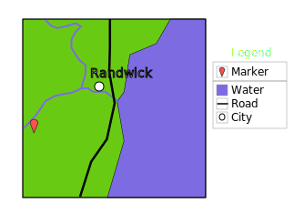
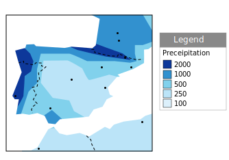
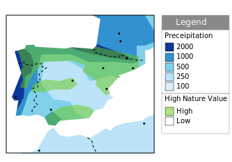

Symbology
=========

In cartography, **symbology is the practice of representing information using shapes, colors and symbols on a map**.

A map legend, offers a quick summary of the symbology used for a map.
   
The symbology for each layer should be distinct, allowing readers to clearly understand the information being presented. Care should be taken to consider the situation in which the map will be used, such as:
  
* Screen size of the output device
* Ability of target device to reproduce color
* Allowances for disabilities such as color blindness

Theme
-----

For thematic maps, the symbology is changed on a feature-by-feature basis in order to illustrate the attribute values being presented.

The same data set may be represented in different maps, themed by a different attribute each time.  

Using Multiple Themes
^^^^^^^^^^^^^^^^^^^^^

A single map can be produced showing two datasets (each themed by a different attribute) allowing readers to look for any interesting patterns.

As an example there may be a relationship between a country's growing region and annual rainfall.

Map Icons
---------

The use of map icons (pictograms, glyphs or symbology sets) is a special case where we have a gap in terminology between Cartography and GIS.

.. image:: img/layer_symbolset.svg

As an example we may wish to represent a point-of-interest data set with each location marked by a different symbol.
   
In cartography, each "type" is presented to the user as a clearly distinct data set with its own visual representation in the map legend.

This is contrasted with GIS, where the "points of interest" are managed as a single layer and complex styling is used to produce the desired cartographic output.

Technically the data set is themed by an attribute to produce this effect:

* Often an attribute named **type** is introduced, and styling rules are used to associated each value with a distinct graphic mark.
* Another common solution is to distribute the "symbology set" as TrueType font. A character attribute is introduced, the value of which is the appropriate letter to draw.

Map Design
-----------

The choice of how to present content is the subject of map design. Cartography, like any venue for design, is a human endeavor between art and science. In this exercise we are going to explore the trade offs in the use of color for effective communication.

It is a challenge to explore cartography without getting stuck in the details of configuring style (which we will cover next). In order to side-step these details, we will be using a web application for this section: **Color Brewer** by Cynthia Brewer of Pennsylvania State University.

Selection of an appropriate color palette is difficult, with a tension between what looks good and what can be understood. The research project that produced the color palettes used by Color Brewer was based on comprehension tests.
  
#. Navigate to: http://colorbrewer2.org/

   The website provides a generic data set which we can use to determine how effective each choice is in communicating attribute differences. We will be using this website to explore how to effectively theme an attribute.
  
   .. figure:: img/color_01_brewer.png

      Color Brewer
  
#. The decisions we make when theming depend entirely on what point we are trying to communicate.

   In this scenario, we are going to communicate a vaccination schedule, county by county. Care should be taken to ensure each county appears equally important, and we should stay clear of red for anyone squeamish about needles. We need to ensure readers can quickly locate their county and look at the appropriate calendar entry.
  
#. The first step is determining how many attribute values you are looking to communicate. Set :guilabel:`Number of data classes` to :kbd:`5`.
  
   .. figure:: img/color_02_classes.png

      Number of data classes
  
#. Color brewer offers palettes using three different color schemes:
  
   =============== =============================
   Sequential      |sequential|
   --------------- -----------------------------
   Diverging       |diverging|
   --------------- -----------------------------
   Qualitative     |qualitative|
   =============== =============================
  
   .. |sequential| image:: img/color_sequential.png
                   :class: inline
                   
   .. |diverging| image:: img/color_diverging.png
                  :class: inline
                 
   .. |qualitative| image:: img/color_qualatative.png
                  :class: inline
  
   The nature of our data is qualitative (each attribute value is attached an equal importance, and there is no implied order that wish to communicate with color).

#. Set :guilabel:`Nature of your data` to :kbd:`Qualitative`. This change drastically reduces the number of color schemes listed.
  
   .. figure:: img/color_03_qualitative.png

      Qualitative color scheme
  
#. The initial **5-class Accent** color scheme does reasonably well.
  
   .. figure:: img/color_04_accent.png

      5-class accent
  
#. One of our requirements is to help readers locate their county. To assist with that let's turn on roads and cities.
  
   .. figure:: img/color_05_context.png

      Adding context
  
#. The map is now starting to look a little busy:
  
   .. figure:: img/color_06_context.png

      Lots of context
  
#. Now that we have seen what we are up against, we can try a strategy to help the text and roads stand out while still communicating our vaccination schedule. Change to one of the pastel color schemes.
    
   .. figure:: img/color_06_pastel1.png

      Pastel color scheme
  
#. Change the borders and roads to gray.
    
   .. figure:: img/color_07_context.png

      Gray borders and roads  
  
#. The result is fairly clear symbology and provides context.
  
   .. figure:: img/color_08_done.png

      Finished with context

#. Using our current "pastel" design, set the :guilabel:`Number of data classes` to :kbd:`9`. At values larger than this, the distinctions between colors becomes so subtle that readers will have trouble clearly distinguishing the content.

#. Make a note of these colors (we will be using them in the exercise on styling next).

   ========= =========   
   Category  Color
   ========= =========
   1         #fbb4ae
   2         #b3cde3
   3         #ccebc5
   4         #decbe4
   5         #fed9a6
   6         #ffffcc
   7         #e5d8bd
   8         #fddaec
   9         #f2f2f2
   ========= =========
  
   .. figure:: img/color_09_color.png

      Color palette

Bonus
-----

Finished early? While waiting take a moment to explore this topic in more detail, and if you are feeling creative there is a challenge to try.

.. note::
   
   In a classroom setting please divide the challenges between teams.
   
   This allows us to work through all the material in the time available.

.. admonition:: Explore Device Differences
       
   #. Different output devices provide limitations in the amount of color information they can portray.
   
   #. **Explore:** How does changing to a printed map affect the number of classes you can communicate using the current "pastel" approach? 
     
     .. only:: instructor
   
        .. admonition:: Instructor Notes
         
           The answer is five, but to be really sure four. Read the tool tips to determine fitness for purpose.

.. admonition:: Explore Accessibility 
  
   #. Communication is a two way street, both in presenting information through design choices, and also perceiving information.
   
      Disabled readers will have a diminished ability to comprehend maps based on color.
   
   #. **Explore:** What approach can be used to cater to color-blind map readers?
     
     .. only:: instructor
   
        .. admonition:: Instructor Notes
         
           Select a color-blind-safe palette, or make use of texture or pattern to communicate attribute changes.
  
.. admonition:: Explore Color Choice

   #. The Color Brewer application provides a lot of helpful information using the small "information" icons in each section.
     
      .. figure:: img/color_09_info.png

         Information icons
     
   #. **Explore:** Using this information which color scheme would you choose for a digital elevation model?
     
     .. only:: instructor
   
        .. admonition:: Instructor Notes
         
           Sequential scheme to communicate elevation differences with equal emphasis. If a reader wants to use diverging to emphasis the extremes, that is fine as long as they are doing it on purpose.

.. admonition:: Challenge Adjusted Colour Scheme

   #. Some datasets included a critical value or threshold that should be communicated clearly.
   
   #. **Challenge:** How would you adjust a diverging color scheme to be suitable for a digital elevation model that includes bathymetry information (ocean depth)?
      
      Hint: For a target audience of humans sea-level would be considered a critical value.
     
     .. only:: instructor
   
        .. admonition:: Instructor Notes
         
           The answer is provided by a **Learn more** link in the application:
         
           * http://colorbrewer2.org/js/learnmore/schemes_full.html#diverging
         
           Remove colors until the critical value is at sea-level.

