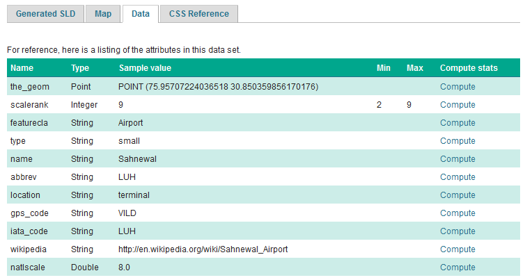

# MBStyle Quickstart

In the last section, we saw how the OGC defines style using XML documents (called SLD files).

We will now explore GeoServer styling in greater detail using a tool to generate our SLD files. The **MBStyle** GeoServer extension is used to generate SLD files using the **MabBox Style** styling language. Styles written in this language can also be used to style [vector tiles](../../../extensions/vectortiles/index.md) in client-side applications.

Using the MBStyle extension to define styles results in shorter examples that are easier to understand. At any point we will be able to review the generated SLD file.

Reference:

-   [MBStyle Reference](../../mbstyle/reference/index.md)

## MBStyle Syntax

This section provides a quick introduction to MBStyle syntax for mapping professionals who may not be familiar with JSON.

### JSON Syntax

All MBStyles consist of a JSON document. There are three types of structures in a JSON document:

1.  Object, a collection of key-value pairs. All JSON documents are JSON objects.
2.  Array, a collection of values.
3.  Value, the value in a key-value pair, or an entry in an array. Values can be objects, arrays, strings, numbers, ``true``, ``false``, or ``null``.

|         |                                                                                                                                                         |
|---------|---------------------------------------------------------------------------------------------------------------------------------------------------------|
| Object  | A collection of key-value pairs, enclosed by curly braces and delimited by commas. Keys are surrounded by quotes and seperarted from values by a colon. |
| Array   | A collection values, enclosed by square brackets and delimited by commas.                                                                               |
| String  | Text value. Must be surrounded by quotes.                                                                                                               |
| Number  | Numerical value. Must not be surrounded by quotes.                                                                                                      |
| Boolean | ``true`` or ``false``.                                                                                                              |
| Null    | ``null``. Represents an undefined or unset value.                                                                                             |

### MBStyle Specification

The [Mapbox Style specification](https://www.mapbox.com/mapbox-gl-js/style-spec/) defines a number of additional rules that MBStyles must follow.

#### Root-level Properties

Root level properties of a Mapbox style specify the map's layers, tile sources and other resources, and default values for the initial camera position when not specified elsewhere.

The following root-level properties are required for all MBStyles. Additional root-level properties which are supported but not required can be found in the spec.

|                       |                                                                                       |
|-----------------------|---------------------------------------------------------------------------------------|
| ``version`` | The version of the Mapbox Style specification to use. Must be set to ``8``. |
| ``name``    | The name of the style.                                                                |
| ``sources`` | An object defining the source data. Not used by GeoServer.                            |
| ``layers``  | An array of layer style objects                                                       |

For example: :

    {
        "version": 8,
        "name": "Streets",
        "sources": {...},
        "layers": [...]
    }

#### Sources

The sources parameter consists of a collection of named sources which define vector tile data the style is to be applied to. This is only used for MBStyles used in client-side applications, and is ignored by GeoServer. If you are only using MBStyles to style your layers within GeoServer, you don't need a sources parameter. However, if you also want to use your MBStyles for client-side styling, you will need the sources parameter.

A GeoServer vector tile source would be defined like this:

> ``` json
> {
>   "cookbook": {
>     "type": "vector",
>     "tiles": [
>       "http://localhost:8080/geoserver/gwc/service/wmts?REQUEST=GetTile&SERVICE=WMTS&VERSION=1.0.0&LAYER=cookbook&STYLE=&TILEMATRIX=EPSG:900913:{z}&TILEMATRIXSET=EPSG:900913&FORMAT=application/vnd.mapbox-vector-tile&TILECOL={x}&TILEROW={y}"
>     ],
>     "minZoom": 0,
>     "maxZoom": 14
>   }
> }
> ```

#### Layers

The layers parameter contains the primary layout and styling information in the MBStyle. Each layer in the layers list is a self-contained block of styling information. Layers are applied in order, so the last layer in the layers list will be rendered at the top of the image.

<Example>

Reference:

-   [MBStyle Styling](../../mbstyle/index.md) (User Guide)
-   [Mapbox Style specification](https://www.mapbox.com/mapbox-gl-js/style-spec/)

## Compare MBStyle to SLD

The MBStyle extension is built with the same GeoServer rendering engine in mind, providing access to most of the functionality of SLD. The two approaches use slightly different terminology: SLD uses terms familiar to mapping professionals, while MBStyle uses ideas more familiar to web developers.

### SLD Style

Here is an example [SLD file](../files/airports0.sld) for reference:

~~~xml

~~~

### MBStyle Style

Here is the same example as [MBStyle](../files/airports0.json):

~~~json

~~~

We use a point symbolizer to indicate we want this content drawn as a **Point** (line 16 in the SLD, line 8 in the MBStyle). The point symbolizer declares an external graphic, which contains the URL ``airports.svg`` indicating the image that should be drawn (line 20 in the SLD, line 10 in the MBStyle).

!!! note

    Rather than refer to many diffferent icons separately, MBStyles use a single sprite-sheet containing all the necessary icons for the style. This is defined by the `sprite` property at the top-level of the style.

## Tour

To confirm everything works, let's reproduce the airports style above.

1.  Navigate to the **Styles** page.

2.  Each time we edit a style, the contents of the associated SLD file are replaced. Rather than disrupt any of our existing styles we will create a new style. Click **Add a new style** and choose the following:

    Name:

    :   ``airports0``

    Workspace:

    :   (leave empty)

    Format:

    :   ``MBStyle``

3.  Replace the initial MBStyle definition with our airport MBStyle example and click **Apply**:

    > ~~~json
    > 
    > ~~~

4.  Click the **Layer Preview** tab to preview the style. We want to preview on the airports layer, so click the name of the current layer and select ``ne:airports`` from the list that appears. You can use the mouse buttons to pan and scroll wheel to change scale.

    
    *Choosing the airports layer*

    
    *Layer preview*

5.  Click **Layer Data** for a summary of the selected data.

    
    *Layer attributes*

## Bonus

Finished early? For now please help your neighbour so we can proceed with the workshop.

If you are really stuck please consider the following challenge rather than skipping ahead.

### Explore Data

1.  Return to the **Data** tab and use the **Compute** link to determine the minimum and maximum for the **scalerank** attribute.

    !!! abstract "Instructor Notes"

        Should be 2 and 9 respectively.

### Challenge Compare SLD Generation

1.  The rest API can be used to review your YAML file directly.

> Browser:
>
> -   <view-source:http://localhost:8080/geoserver/rest/styles/airport0.json>
>
> Command line:
>
>     curl -v -u admin:geoserver -XGET http://localhost:8080/geoserver/rest/styles/airports0.json

1.  The REST API can also be used generate an SLD file:

    Browser:

    -   <view-source:http://localhost:8080/geoserver/rest/styles/airport0.sld?pretty=true>

> Command line:
>
>     curl -v -u admin:geoserver -XGET http://localhost:8080/geoserver/rest/styles/airports0.sld?pretty=true

1.  Compare the generated SLD differ above with the handwritten [SLD file](../files/airports0.sld) used as an example?

    **Challenge:** What differences can you spot?

    !!! abstract "Instructor Notes"

        Generated SLD does not include name or title information; this can of course be added. Please check the MBStyle reference for details.
    
        The second difference is with the use of a fallback Mark when defining a PointSymbolizer.
