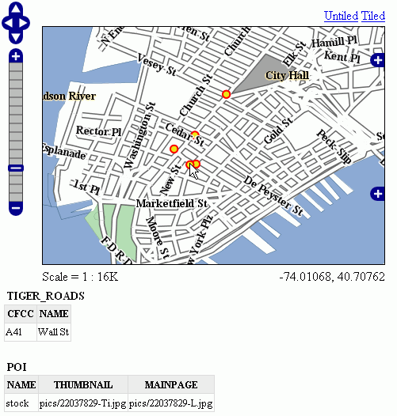
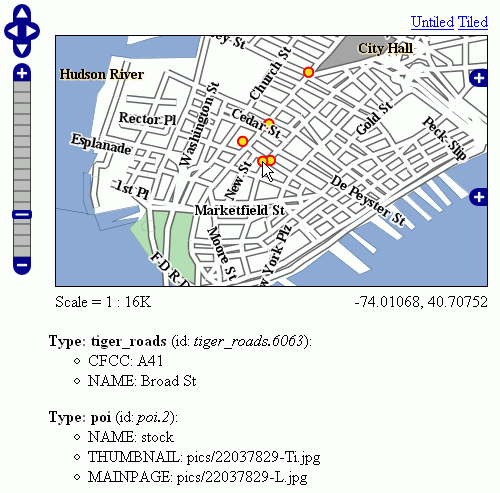

.. _tutorials_getfeatureinfo_html:

HTML output format
===================

The default HTML output is a sequence of titled tables, each one for a different layer. The following example shows the default output for the tiger-ny basemap (included in the above cited releases, and onwards).



   *Default Output*

Standard Templates
``````````````````
The following assumes you're already up to speed with FreeMarker templates. If you're not, read the :ref:`tutorial_freemarkertemplate` tutorial, and the :ref:`getutorial_kmlplacemark` page, which has simple examples.

The default output is generated by the standard templates, which are three:

* ``header.ftl``
* ``content.ftl``
* ``footer.ftl``

The *header template* is invoked just once, and usually contains the start of the HTML page, along with some CSS. The default header template looks like this (as you can see, it's completely static, and it's in fact not provided with any variable you could expand)::

	<#-- 
	Header section of the GetFeatureInfo HTML output. Should have the <head> section, and
	a starter of the <body>. It is advised that eventual css uses a special class for featureInfo,
	since the generated HTML may blend with another page changing its aspect when using generic classes
	like td, tr, and so on. 
	-->
	<html>
	  <head>
	    <title>GeoServer GetFeatureInfo output</title>
	  </head>
	  <style type="text/css">
		table.featureInfo, table.featureInfo td, table.featureInfo th {
			border:1px solid #ddd;
			border-collapse:collapse;
			margin:0;
			padding:0;
			font-size: 90%;
			padding:.2em .1em;
		}
		table.featureInfo th{
		    padding:.2em .2em;
			text-transform:uppercase;
			font-weight:bold;
			background:#eee;
		}
		table.featureInfo td{
			background:#fff;
		}
		table.featureInfo tr.odd td{
			background:#eee;
		}
		table.featureInfo caption{
			text-align:left;
			font-size:100%;
			font-weight:bold;
			text-transform:uppercase;
			padding:.2em .2em;
		}
	  </style>
	  <body>
	
The *footer template* is similar, a static template used to close the HTML document properly::

	<#-- 
	Footer section of the GetFeatureInfo HTML output. Should close the body and the html tag.
	-->
	  </body>
	</html>
	
The *content template* is the one that turns feature objects into actual HTML tables. The template is called multiple times: each time it's fed with a different feature collection, whose features all have the same type. In the above example, the template has been called once for the roads, and once for the points of interest (POI).  Here is the template source::

	<#-- 
	Body section of the GetFeatureInfo template, it's provided with one feature collection, and
	will be called multiple times if there are various feature collections
	-->
	<table class="featureInfo">
	  <caption class="featureInfo">${type.name}</caption>
	  <tr>
	<#list type.attributes as attribute>
	  <#if !attribute.isGeometry>
	    <th >${attribute.name}</th>
	  </#if>
	</#list>
	  </tr>

	<#assign odd = false>
	<#list features as feature>
	  <#if odd>
	    <tr class="odd">
	  <#else>
	    <tr>
	  </#if>
	  <#assign odd = !odd>

	  <#list feature.attributes as attribute>
	    <#if !attribute.isGeometry>
	      <td>${attribute.value}</td>
	    </#if>
	  </#list>
	  </tr>
	</#list>
	</table>
	<br/>
	
As you can see, there is a first loop scanning type and outputting its attributes into the table header, then a second loop going over each feature in the collection (features).  From each feature, the attribute collections are accessed to dump the attribute value. In both cases, geometries are skipped, since there is not much point in including them in the tabular report.  In the table building code you can also see how odd rows are given the "odd" class, so that their background colors improve readability.
	
Custom Templates
````````````````		
So, what do you have to do if you want to override the custom templates? Well, it depends on which template you want to override.

``header.ftl`` and ``footer.ftl`` are type independent, so if you want to override them you have to place a file named ``header.ftl`` or ``footer.ftl`` in the ``templates`` directory, located in your GeoServer :ref:`datadir`.  On the contrary, ``content.ftl`` may be generic, or specific to a feature type.

For example, let's say you would prefer a bulleted list appearance for your feature info output, and you want this to be applied to all GetFeatureInfo HTML output. In that case you would drop the following ``content.ftl`` in the templates directory::

	<ul>
	<#list features as feature>
	  <li><b>Type: ${type.name}</b> (id: <em>${feature.fid}</em>):
	  <ul>
	  <#list feature.attributes as attribute>
	    <#if !attribute.isGeometry>
	      <li>${attribute.name}: ${attribute.value}</li>
	    </#if>
	  </#list>
	  </ul>
	  </li>
	</#list>
	</ul>
	
With this template in place, the output would be:



   *Bulleted List Output*
	
Looking at the output we notice that point of interest features refer to image files, which we know are stored inside the default GeoServer distribution in the ``demo_app/pics`` path. So, we could provide a POI specific override that actually loads the images. 
	
This is easy: just put the following template in the feature type folder, which in this case is ``workspaces/topp/DS_poi/poi`` (you should refer to your Internet visible server address instead of localhost, or its IP if you have fixed IPs)::

	<ul>
	<#list features as feature>
	  <li><b>Point of interest, "${feature.NAME.value}"</b>: <br/>
	  
	  </li>
	</#list>
	</ul>
	
With this additional template, the output is:
	
.. figure:: thumb.png
   :align: center

   *Output with Thumbnail Image*
	
As you can see, roads are still using the generic template, whilst POI is using its own custom template.

Advanced Formatting
```````````````````
The ``value`` property of Feature attribute values are given by geoserver in ``String`` form, using a sensible default depending on the actual type of the attribute value.  If you need to access the raw attribute value in order to apply a custom format (for example, to output ``"Enabled"`` or ``"Disabled"`` for a given boolean property, instead of the default ``true/false``, you can just use the ``rawValue`` property instead of ``value``.  For example: ``${attribute.rawValue?string("Enabled", "Disabled")}`` instead of just ``${attribute.value}``.

Auto-Escaping
`````````````
Auto-escaping can be used to escape special characters so that they are displayed correctly in clients and to prevent injection. GeoServer administrators can enable or disable auto-escaping for FreeMarker template values for the HTML output format on a global or per virtual service basis. Template authors are able to override the WMS service setting to enable or disable escaping on a per template, per block or per value basis. See `Auto-escaping <https://freemarker.apache.org/docs/dgui_misc_autoescaping.html>` for more information.

Accessing static methods
````````````````````````
It is possible to call static methods and variables from within Freemarker templates to enable more sophisticated templates. 
But please be aware that generally static method calls are a security liability, which can be used to make harmful things, especially when template authors can not be fully trusted. So by default this feature is disabled. The configuration parameter ``org.geoserver.htmlTemplates.staticMemberAccess`` has to specified to enabled it, for example as system property. The parameter takes a comma separated list of fully qualified class names. GeoServer allows access to static member of these classes from within templates using their simple, unqualified class name as the example below demonstrates.

The following system property enables selective access::

	-Dorg.geoserver.htmlTemplates.staticMemberAccess=java.lang.String

This exposes the static members of ``java.lang.String`` using the variable name ``String`` in the template, which can be used in templates as follows::

	<ul>
	<#list features as feature>
	  <li>${feature.NAME.value}: ${String.format("%.2f €", feature.AMOUNT.rawValue)}
	  </li>
	</#list>
	</ul>

In case of granting access to multiple classes with the same simple name, the later specified classes will be exposed with a number suffix. For example when specifying ``-Dorg.geoserver.htmlTemplates.staticMemberAccess=java.lang.String,com.acme.String``, the statics of ``java.lang.String`` will be exposed as ``String`` while the statics of ``com.acme.String`` will be exposed as ``String2`` and so on.

You can also enable unrestricted access by specifying a ``*`` as the next example demonstrates.

The following system property enables unrestricted access::

	-Dorg.geoserver.htmlTemplates.staticMemberAccess=*

In this case GeoServer exposes a ``statics`` variable you can use in templates to access static members as follows::

	<#assign String=statics['java.lang.String']>
	<ul>
	<#list features as feature>
	  <li>${feature.NAME.value}: ${String.format("%.2f €", feature.AMOUNT.rawValue)}
	  </li>
	</#list>
	</ul>

.. note::
	Unrestricted access as shown above is only recommended if you can fully trust your template authors.
