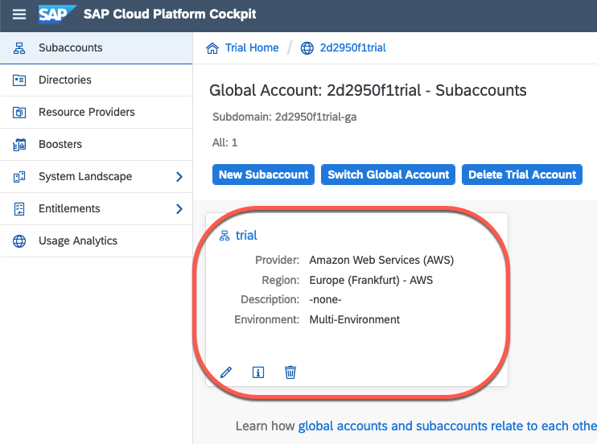

.. _run_cf:

Running GeoServer in Cloud Foundry
==================================

Many organizations are moving applications and databases workload to cloud providers. One target platform for apps is `Cloud Foundry <https://www.cloudfoundry.org/>`_.
While it is not the best environment for intense usage of GeoServer, it is sufficient for simple usage. This tutorial is a simple guide on a basic deployment. 

For more advanced deployments, refer to section `Advanced Topics`_

Java Environment
----------------
Cloud Foundry runs micro services written in multiple languages using the abstraction concept of language buildpacks. The `java buildpack <https://github.com/cloudfoundry/java-buildpack>`_ supports OpenJDK and proprietary JREs and tomcat from version `6.0.0 to 9.x.y <http://download.pivotal.io.s3.amazonaws.com/tomcat/index.yml>`_   

Cloud Foundry client
--------------------
To interact with Cloud Foundry, install the `command line tool <https://docs.cloudfoundry.org/cf-cli/install-go-cli.html>`_ for your platform.

Get a Cloud Foundry trial account (or use your organization paid plan)
----------------------------------------------------------------------
Register for a free trial account with `SAP <https://www.sap.com/cmp/td/sap-cloud-platform-trial.html>`_ or IBM. 

**Warning** At this time, `IBM <https://www.ibm.com/cloud/free>`_ doesn't allow more 64 MB of memory in free instances which prevents from starting the geoserver. The tutorial will be updated if this changes, however, the Cloud Foundry commands and manifest files are identical because Cloud Foundry truly is multi cloud!

Cloud Foundry on SAP Cloud Platform
~~~~~~~~~~~~~~~~~~~~~~~~~~~~~~~~~~~
`Logon to your cockpit <https://account.hanatrial.ondemand.com/cockpit/>`_ and select your trial organization

Notice the field **organization name** and the Cloud Foundry **API endpoint**.

.. image:: ./sap_cp_trial2.png

Use those 2 values to login with the command line::

    $ cf login -a https://api.cf.eu10.hana.ondemand.com -o your_org_name_trial
    API endpoint: https://api.cf.eu10.hana.ondemand.com

    Email: your.email@here.com

    Password: 
    Authenticating...
    OK

    Targeted org your_org_name_trial

    Targeted space dev

    API endpoint:   https://api.cf.eu10.hana.ondemand.com (API version: 3.88.0)
    User:           your.email@here.com
    Org:            your_org_name_trial
    Space:          dev

And now that you are logged in, you can list the apps::

    cf apps
    Getting apps in org your_org_name_trial / space dev as your.email@here.com...
    OK

    No apps found

Publish GeoServer
-----------------

Now that you are logged in to a Cloud Foundry space, you can publish GeoServer as a servlet.
Download GeoServer as a war file.
Create a deployment configuration file called **manifest.yml**:

.. code-block:: YAML 

    ---
    applications:
    - name: geoserver
    path: ./geoserver.war
    health-check-type: process
    random-route: true
    buildpacks:
        - java_buildpack

The default behavior is to use the latest OpenJRE and tomcat versions. And *voilà*, you're ready to publish GeoServer!::

    $ cf push -f manifest.yml
    Pushing from manifest to org your.email@here.com / space dev as your.email@here.com...
    Using manifest file manifest.yml
    Getting app info...
    [...]
    Packaging files to upload...
    Uploading files...
        45.38 MiB / 45.38 MiB [=================================================================] 100.00% 3m59s
    [...]
    Waiting for app to start...
    [...]
    
This should take two minutes the first time then you can check your application status by running::

    $ cf apps
    Getting apps in org 2d2950f1trial / space dev as your.email@here.com...
    OK

    name        requested state   instances   memory   disk   urls
    geoserver   started           1/1         1G       1G     geoserver-humble-puku-pi.cfapps.eu10.hana.ondemand.com

You can open the url in your browser. HTTP is automatically redirected to HTTPS and traffic is encrypted using the Cloud Foundry platform certificates which are trusted by most browsers.

Advanced Topics
---------------

Changing the memory limit
~~~~~~~~~~~~~~~~~~~~~~~~~

Use the command **cf scale**, for instance to set the limit at 2Gigabytes, execute::

    $cf scale geoserver -m 2G -f
    Scaling app geoserver in org 2d2950f1trial / space dev as your.email@here.com...

This restarts the application and displays the new limit::

         state     since                    cpu    memory         disk           details
    #0   running   2020-11-13 01:54:56 PM   0.4%   470.8M of 2G   250.2M of 1G

As for most parameters, resource limits can also be set in the manifest file

Changing the manifest file
~~~~~~~~~~~~~~~~~~~~~~~~~~

The manifest file allows you to configure:
 * Resource limits (memory and cpu)
 * configure the route URL
 * Set environment variables, for instance to set a specific tomcat version

.. code-block:: YAML 

    ---
    applications:
    - name: geoserver
    path: ./geoserver.war
    health-check-type: process
    random-route: true
    buildpacks:
        - https://github.com/cloudfoundry/java-buildpack.git
    env:
        JBP_CONFIG_TOMCAT: '{ tomcat: { version: 8.0.+ } }'

Scaling challenges
~~~~~~~~~~~~~~~~~~

Total Memory limit of 8 GB.
The goal of Cloud Foundry as a micro service platform is to break a monolithic application into smaller blocks. The containers are restricted to 8 GB in IBM and SAP platforms. 
