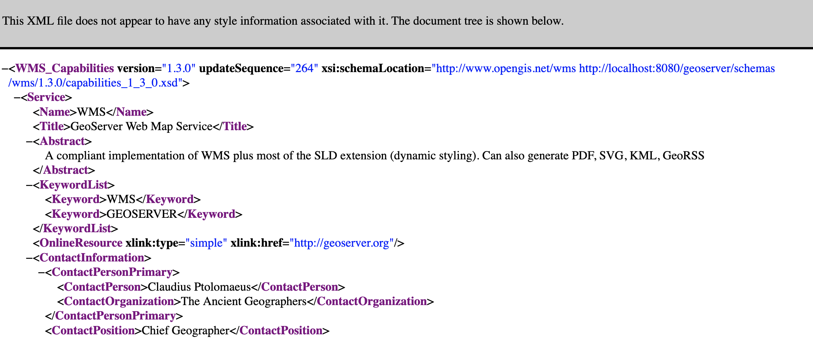
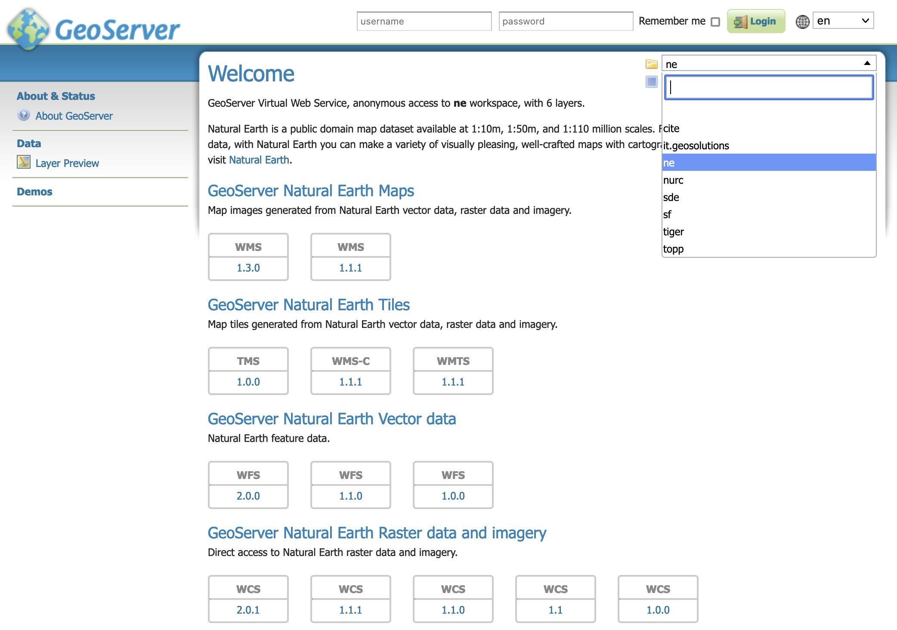
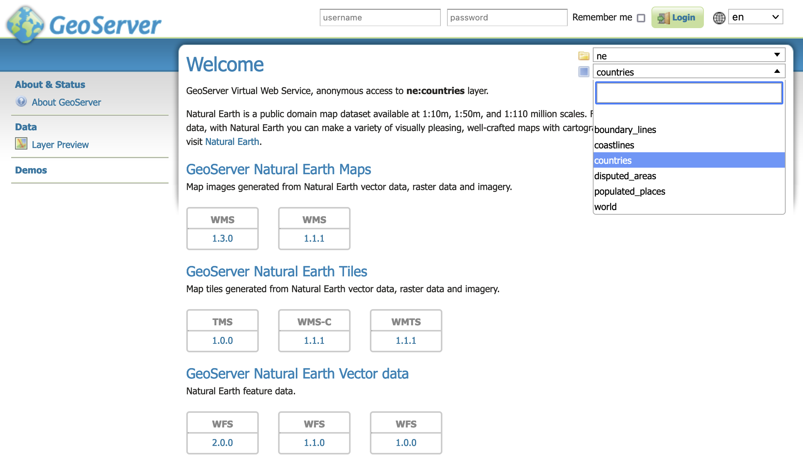
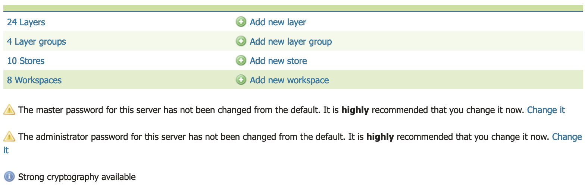

.. _welcome:

Welcome
=======

The :guilabel:`Welcome Page` lists the web services published by GeoServer for mapping, data access and processing.

.. _welcome_webservices:

Web Services
------------

The welcome page lists the global web services (accessing the complete list of layers).

.. figure:: images/web-admin.png
   
   Welcome Page Global Services

To use copy-and-paste the web services URLs into your Desktop GIS or web mapping application.

.. figure:: images/qgis-global-wms.png
   :width: 50%
   
   QGIS Desktop GIS WMS Connection

.. figure:: images/qgis-global-wms-add.png
   :width: 50%
   
   QGIS Desktop GIS Add WMS Layer

.. figure:: images/qgis-map.png
   :width: 50%
   
   QGIS Desktop GIS Map

Opening these URLs in the browser download or display machine readable the service description.

   
   WMS 1.3.0 GetCapabilities Document

If global web services are disabled the initial welcome page web services will not be available.

Workspace Web Services
----------------------

Use :guilabel:`workspace` select at the top of the welcome page to choose a workspace. The welcome page contact information and web services are updated to match the workspace selected.

   
   Welcome Workspace Web Services

The web service links provided may be used in your Desktop GIS or web mapping application to access the workspace layers.

Layer Web Services
------------------

Use the :guilabel:`layer` select at the top of the welcome page to choose a layer or layer group.

   
   Welcome Workspace Web Services   

The :guilabel:`workspace` select, along with the page contact information and web services are updated to match the layer selected.

Server Overview (Administrators)
--------------------------------

When logged in with administrative credentials a configuration overview is provided, along with any information or warning notifications.

   
   Welcome Administrator Feedback

Click :guilabel:`Layers summary` link to navigate to the :ref:`Layers page <data_webadmin_layers>`, press :ref:`Add layers <data_webadmin_layers_add_a_layer>` to create a new layer.

Click :guilabel:`Stores summary` link to navigate to the :ref:`Stores page <data_webadmin_stores>`, press :ref:`Add stores <data_webadmin_stores_add_a_store>` to create a new store.

Click :guilabel:`Workspaces summary` link to navigate to the :ref:`Workspaces page <data_webadmin_workspaces>`, press :ref:`Add workspaces <data_webadmin_workspaces_add_workspace>` to create a new workspace.

Information and Warnings
^^^^^^^^^^^^^^^^^^^^^^^^

GeoServer status information messages provide feedback on normal operation.

Warnings describe configuration issues to be addressed, often with a short-cut to the configuration page used to address the issue.