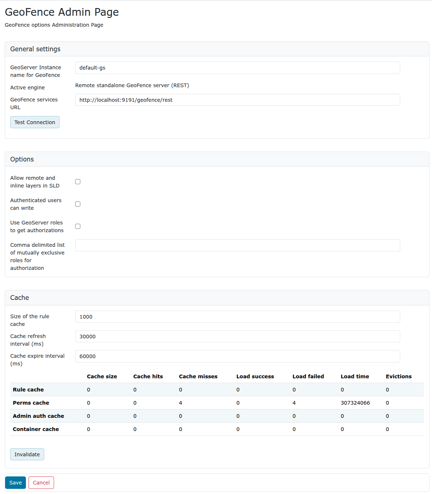

# GeoFence Admin GUI

The GeoFence Admin Page is a component of the GeoServer web interface. You can access it from the GeoServer web interface by clicking the **GeoFence** link, found under the "security" entry in the top menu after logging in.

## General Settings

Configure the following settings here:

- GeoServer instance name: the name under which this GeoServer is known by the GeoFence server. This is useful when you use an external GeoFence server with multiple GeoServer servers.
- Active engine (read-only field): the current engine GeoServer is talking to. Using the `geofence` plugin, it's "*Remote standalone GeoFence server (REST)*". 
- GeoServer services URL: this is how GeoServer knows how to connect to the external GeoFence server. When using an internal GeoFence server, this is not configurable. For example "http://localhost:9191/geofence/rest" for an external GeoFence server on localhost.

The **Test connection** button will check whether GeoServer is able to can communicate to GeoFence using the current URL.

## Options

Configure the following settings here:

- Allow remote and inline layers in SLD

- Authenticated users can write

- Use GeoServer roles to get authorizations

    - Disabled: For each authorization request, GeoServer sends only the user info to GeoFence.

    GeoFence will retrieve all the roles associated with the user, and will merge the permissions granted for each role.

    - Enabled: For each authorization request, GeoServer sends to GeoFence the user info AND the roles assigned in the current request session.

    GeoFence will retrieve all the roles associated to the user, and will only consider the requested roles that are really associated to the user.

- Comma delimited list of mutually exclusive roles for authorization

    - This field is mandatory when the previous option is enabled.

    GeoServer will send to GeoFence the roles in the current request session which match the entries in this list. You can use the '*' symbol to match any session role. When using "*", you can use the format "`-ROLENAME`" to exclude one or more roles from the session roles list.

## Cache

Configure the following settings here:

- Size of the rule cache (number of entries)
- Cache refresh interval (ms)
- Cache expire interval (ms)

Collected data about the cache can be retrieved here. Per cache (rules, admin rules and users) we retrieve the cache size, hits, misses, load successes, load failures, load times and evictions. The cache can be manually invalidated (cleared).

