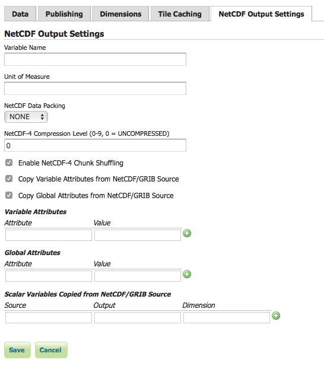
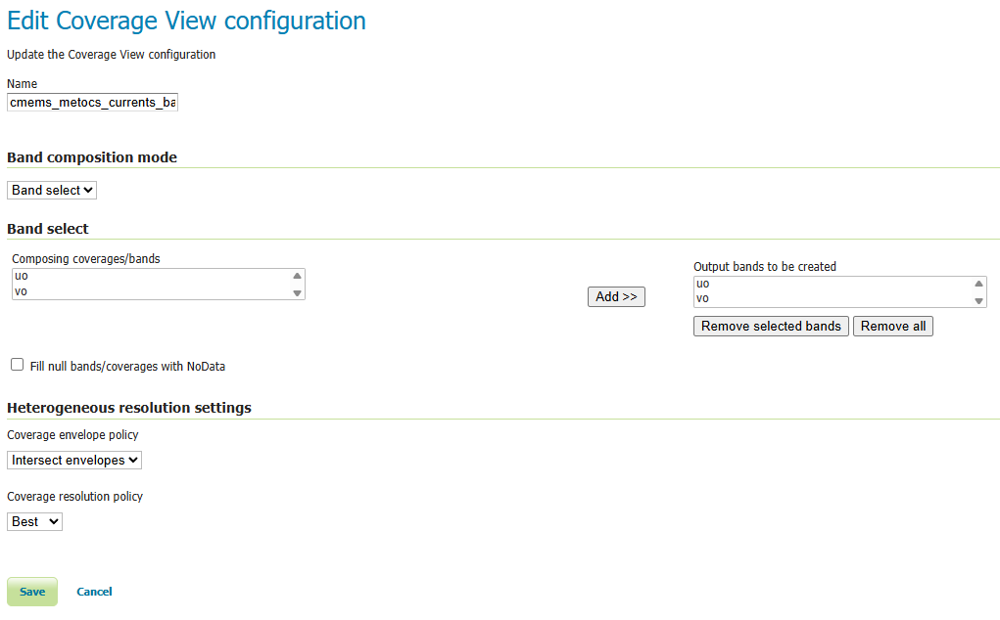
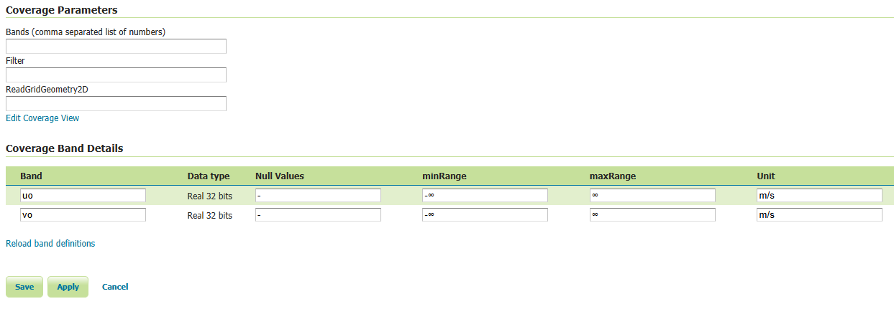
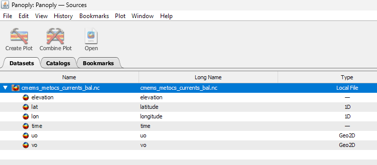
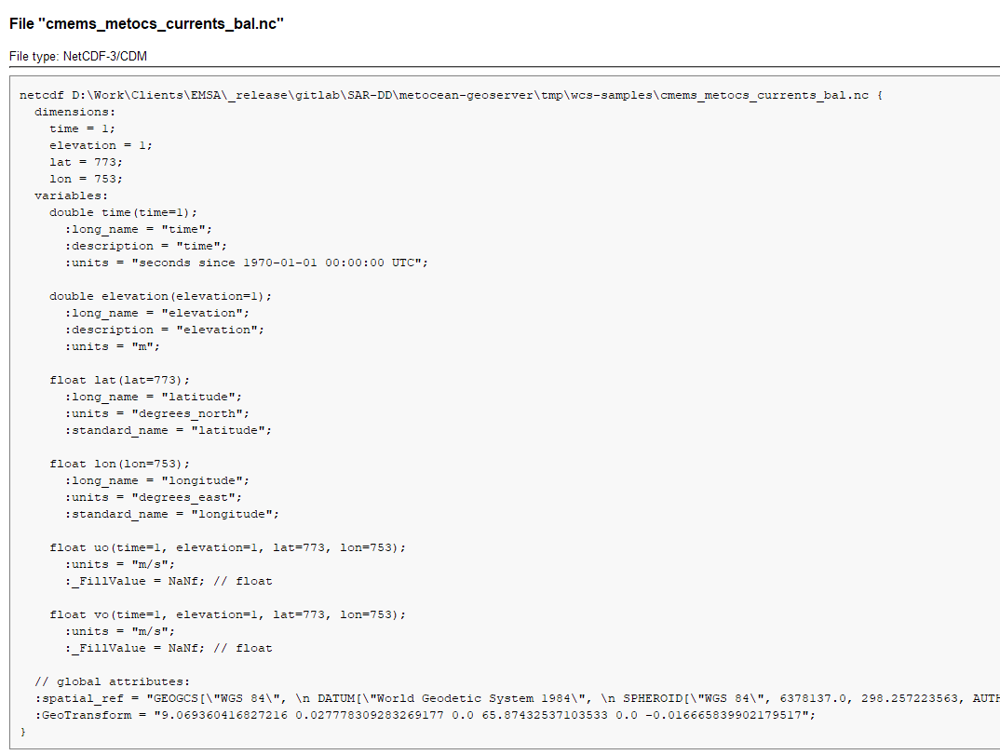
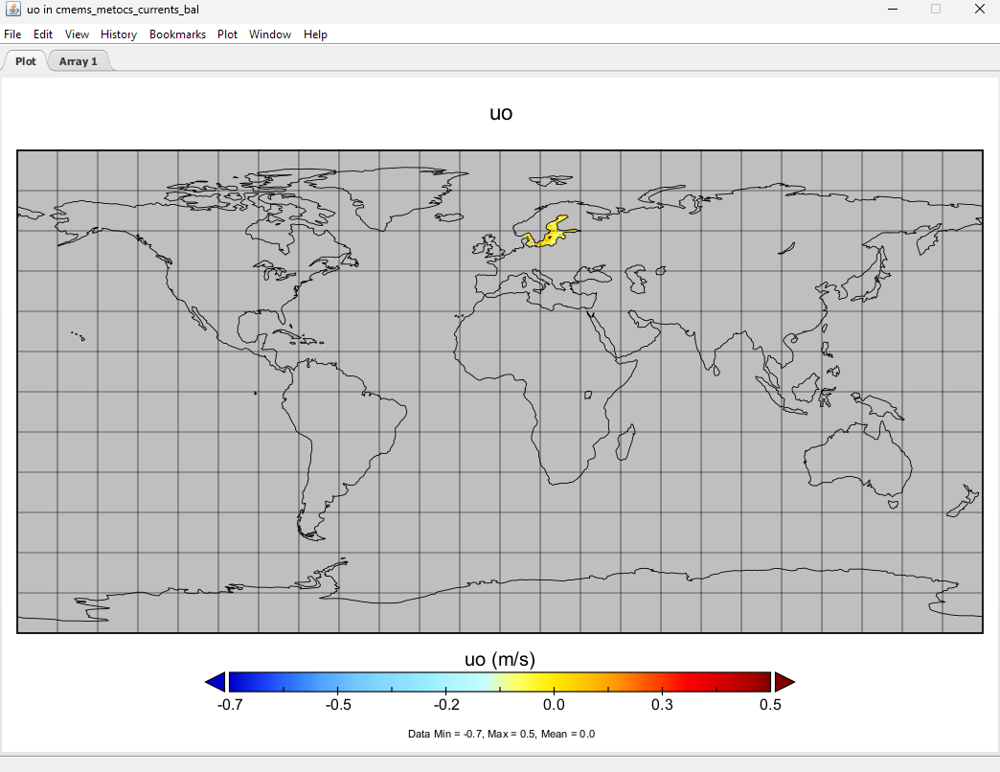
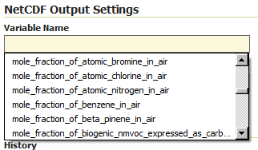
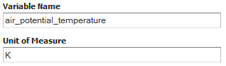

# NetCDF Output Format

This plugin adds the ability to encode WCS 2.0.1 multidimensional output as a NetCDF file using the Unidata NetCDF Java library.

## Getting a NetCDF output file

Request NetCDF output by specifying `format=application/x-netcdf` in a `GetCoverage` request:

    http://localhost:8080/geoserver/wcs?service=WCS&version=2.0.1&request=GetCoverage&coverageid=it.geosolutions__V&format=application/x-netcdf...

## Current limitations

- Input coverages/slices should share the same bounding box (lon/lat coordinates are the same for the whole ND cube).
- NetCDF output will be produced only when input coverages come from a StructuredGridCoverage2D reader (this allows to query the GranuleSource to get the list of granules in order to setup dimensions slices for each sub-coverage).

## NetCDF-4

NetCDF-4 output is supported but requires native libraries (see [Installing required NetCDF-4 Native libraries](nc4.md)). NetCDF-4 adds support for compression. Use `format=application/x-netcdf4` to request NetCDF-4 output.

## Settings

NetCDF output settings can be configured for each raster layer. The similar section in the *Global Settings* page configures the default settings used for newly created raster layers.

- Variable Name (optional)

  - Sets the NetCDF variable name.
      - Does not change the layer name, which can be configured in the Data tab.

- Variable Unit of Measure (optional)

  - Sets the NetCDF `uom` attribute.

- Data Packing

  - Lossy compression by storing data in reduced precision.
      - One of *NONE*, *BYTE*, *SHORT*, or *INT*.

- NetCDF-4 Compression Level

  - Lossless compression.
      - Level is an integer from 0 (no compression, fastest) to 9 (most compression, slowest).

- NetCDF-4 Chunk Shuffling

  - Lossless byte reordering to improve compression.

- Copy Variable Attributes from NetCDF/GRIB Source

  - Most attributes are copied from the source NetCDF/GRIB variable.
      - Some attributes such as `coordinates` and `missing_value` are skipped as these may no longer be valid.
      - For an ImageMosaic, one granule is chosen as the source.

- Copy Global Attributes from NetCDF/GRIB Source

  - Attributes are copied from the source NetCDF/GRIB global attributes.
      - For an ImageMosaic, one granule is chosen as the source.

- Variable Attributes

  - Values are encoded as integers or doubles if possible, otherwise strings.
      - Values set here overwrite attributes set elsewhere, such as those copied from a source NetCDF/GRIB variable.

- Global Attributes

  - Values are encoded as integers or doubles if possible, otherwise strings.

- Scalar Variables Copied from NetCDF/GRIB Source

  - Source specifies the name of the source variable in a NetCDF file or the `toolsUI` view of a GRIB file; only scalar source variables are supported.
      - Output specifies the name of the variable in the output NetCDF file.
      - If only one of Source or Output is given, the other is taken as the same.
      - Dimension is either blank to simply copy the source scalar from one granule, or the name of one output NetCDF dimension to cause values to be copied from multiple granules (such as those from an ImageMosaic over a non-spatial dimension) into a one-dimensional variable. The example above copies a single value from multiple `reftime` scalars into `forecast_reference_time` dimensioned by `time` in an ImageMosaic over time.
      - For an ImageMosaic, one granule is chosen as the source for variable attributes.

## Multi-band output

Coverages with more than one sample dimension — typically built via WCS
`COVERAGE_VIEW` with `BAND_SELECT` entries — are written as **one
output variable per band**, rather than collapsed to a single variable
named after the layer. Each output variable's name is resolved with
the following precedence:

1. The corresponding entry from the `bandSettings` list in the
   layer's NetCDF Output configuration, if any (see *Per-band
   settings* below);
2. The source band's `GridSampleDimension` description, which equals
   the `<definition>` value when the source coverage is a
   `COVERAGE_VIEW` with `BAND_SELECT` bands;
3. As a last-resort fallback, `<coverageName>_<bandIndex>`.

Single-band coverages — the historical and most common case — are
unaffected and continue to write a single output variable named after
the layer (or after `Variable Name` from the settings panel, when
set).

The example below uses a Coverage View built with `Band select` that
composes the source bands `uo` and `vo` into output bands of the same
names:

*Coverage View edit page — `Band select` composition mode with two
output bands `uo` and `vo`, sourced from the underlying NetCDF's
eastward / northward sea-water-velocity variables.*

The resulting band layout is visible on the Coverage configuration's
Band Details section, which is what feeds the precedence rules above
(rule #2: the per-band sample-dimension description and unit shown
here are the defaults the NetCDF writer falls back to when no explicit
`BandSetting` override is present):

*Coverage Band Details — two `Real 32 bits` bands `uo` and `vo`, each
declared with unit `m/s`. Without per-band overrides, these names and
units flow straight through to the output NetCDF variables.*

### Per-band settings

For each source band, a `BandSetting` entry can override:

- **Name** — the output NetCDF variable name (defaults to the source
  band's sample dimension description).
- **Unit of Measure** — the output `units` attribute (defaults to the
  source band's unit). When both an input unit and an explicit output
  unit are declared, values are converted at write time using the
  Unidata unit framework.
- **Variable Attributes** — additional `Attribute`s applied to this
  band's output variable. These are *additive* with respect to the
  container-level *Variable Attributes* list and **take precedence on
  key collisions** — so per-band CF `standard_name` overrides the
  container-level one, for instance.

`BandSetting` entries are positional: the entry at index `i` applies
to the i-th source band. When the list is shorter than the band count,
trailing bands fall through to the auto-derived defaults; entries
beyond the band count are silently ignored.

### Example: vector field as two CF variables

A `COVERAGE_VIEW` with `BAND_SELECT` bands `uo` (band 0) and `vo`
(band 1) — built from a NetCDF source's eastward / northward
sea-water-velocity variables — is configured with the following
`bandSettings`:

| Index | Name | UoM | Variable Attributes |
|---|---|---|---|
| 0 | `uo` | `m s-1` | `standard_name=eastward_sea_water_velocity` |
| 1 | `vo` | `m s-1` | `standard_name=northward_sea_water_velocity` |

The resulting NetCDF carries two CF-compliant variables — `uo` and
`vo`, both shaped `(time, lat, lon)` — that downstream simulation
engines such as
[OpenDrift](https://opendrift.github.io/)'s
`reader_netCDF_CF_generic` can locate by CF `standard_name` lookup
without any additional client-side preparation.

Inspecting the WCS output in [Panoply](https://www.giss.nasa.gov/tools/panoply/)
confirms the per-band split. The Sources tree exposes `uo` and `vo`
as two independent `Geo2D` variables alongside the shared `time`,
`elevation`, `lat`, `lon` coordinate axes:

*Panoply Sources tab — `uo` and `vo` listed as separate `Geo2D`
variables rather than collapsed into a single layer-named variable.*

The CDL view shows the two variables share dimensions and carry their
own `units` attribute, exactly as the `BandSetting` table prescribes:

*Panoply CDL view of the output file — `uo` and `vo` are emitted as
distinct `float` variables of shape `(time, elevation, lat, lon)`,
each with `units = "m/s"` and a `_FillValue` of `NaNf`. The
coordinate axes `time`, `elevation`, `lat`, `lon` and the global
`spatial_ref` / `GeoTransform` attributes are written once and
shared.*

Each variable plots independently — here the eastward component `uo`
rendered over the Baltic region:

*Panoply geo plot of `uo` — values within the data extent (-0.7 to
0.5 m/s) read directly off the output variable; the per-variable
colourbar uses the CF-conformant `units` attribute.*

## CF Standard names support

Note that the output name can also be chosen from the list of CF Standard names. Check [CF standard names](http://cfconventions.org/standard-names.md) page for more info on it.

Once you click on the dropdown, you may choose from the set of available standard names.

*NetCDF CF Standard names list*

Note that once you specify the standard name, the unit will be automatically configured, using the canonical unit associated with that standard name.

*NetCDF CF Standard names and canonical unit*

The list of standard names is populated by taking the entries from a standard name table xml. At time of writing, a valid example is available [Here](http://cfconventions.org/Data/cf-standard-names/27/src/cf-standard-name-table.xml)

You have three ways to provide it to GeoServer.

1.  Add a `-DNETCDF_STANDARD_TABLE=/path/to/the/table/tablename.xml` property to the startup script.
2.  Put that xml file within the `NETCDF_DATA_DIR` which is the folder where all NetCDF auxiliary files are located. ([More info](http://geoserver.geo-solutions.it/multidim/en/mosaic_config/netcdf_mosaic.md#customizing-netcdf-ancillary-files-location))
3.  Put that xml file within the `GEOSERVER_DATA_DIR`.

!!! note
    Note that for the 2nd and 3rd case, file name must be **cf-standard-name-table.xml**.
