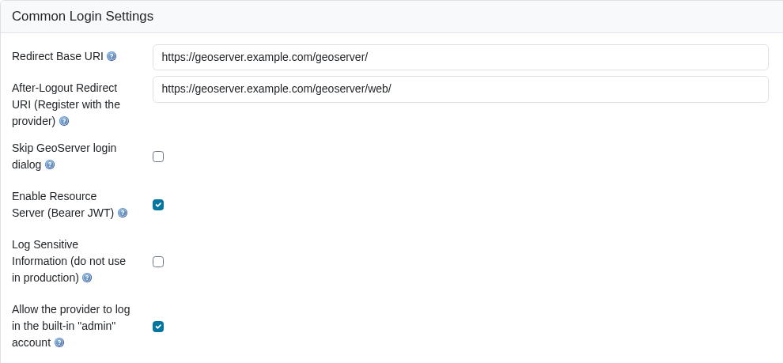

# OAUTH2/OIDC configuration

The basic steps are:

1.  Configure your IDP
2.  In GeoServer, add the OIDC filter and select your provider from the **Provider** dropdown (configured for your IDP)
3.  In GeoServer, configure the "roles source" (if needed)
4.  In GeoServer, add your OIDC filter to the "web" filter Chain

For more details, here are detailed examples for different OIDC server types:

- [Google](oauth2/google.md)
- [GitHub](oauth2/github.md)
- [Keycloak](oauth2/keycloak.md)
- [MS Azure and Entra](oauth2/azure.md)
- [Generic OpenID Connect](oauth2/generic.md)

## Common Login Settings {: #oidc_common_settings }

When creating or editing an OIDC filter, the top of the configuration form contains settings that apply to all providers.



*Common Login Settings section of the OIDC filter configuration.*

The following table describes each field:

| Field | Description | Notes |
|----|----|----|
| Name | A unique name for this filter (e.g. `keycloak-oidc`). | Used internally and in the filter chain configuration. |
| Provider | Select the OAuth2 / OpenID Connect provider type from the dropdown. | Choose **OpenID Connect Provider** for generic OIDC IDPs, or a specific provider (Google, GitHub, Microsoft) to pre-fill well-known endpoints. |
| Redirect Base URI | The public base URL of your GeoServer instance, ending with the context path (e.g. `https://geoserver.example.com/geoserver`). | Automatically resolved --- see [Redirect Base URI](#oidc_redirect_base_uri) below. |
| After-Logout Redirect URI | The URI the user is sent to after the IDP completes a logout. | Must be registered with the IDP as a permitted redirect URI. See [Logout Behavior](#oidc_logout_behavior). |
| Redirect URI | The full OAuth2 callback URL that GeoServer uses to receive the authorization code from the IDP. | **Read-only.** Automatically calculated from the Redirect Base URI. Copy this value when registering GeoServer with your IDP. |
| Skip GeoServer login dialog | When checked and only one provider is active, unauthenticated users are redirected directly to the IDP login page. | Bypasses the GeoServer login form entirely. Use with caution --- local administrator login will no longer be available through the web UI. |
| Enable Resource Server (Bearer JWT) | When checked, the same filter also accepts machine-to-machine requests using an `Authorization: Bearer <JWT>` header. | Enabled by default. Disable if you only need browser-based interactive login. |
| Allow the provider to log in the built-in "admin" account | When checked, an identity whose principal is `admin` is treated like any other user and receives whatever roles the role source assigns it. | Enabled by default. Uncheck it when the local `admin` account is managed inside GeoServer and must never be assertable by the IDP. See [Built-in administrator accounts](#oidc_admin_accounts). |

### Redirect Base URI {: #oidc_redirect_base_uri }

The Redirect Base URI determines the public-facing URL that your IDP will redirect users back to after authentication. GeoServer resolves this value automatically using the following priority order:

1.  **PROXY_BASE_URL environment variable** (or Java system property) --- highest priority. This is the recommended approach for Docker and container deployments.
2.  **Proxy Base URL from GeoServer's Global Settings** --- the value configured in **Server > Global Settings** (stored in `global.xml`).
3.  **Current HTTP request context** --- derived from the incoming request when no proxy base URL is configured.

!!! note
    The Redirect Base URI is resolved **dynamically**. If the administrator changes the global Proxy Base URL or the `PROXY_BASE_URL` environment variable, the OIDC filter will pick up the change automatically without requiring a re-save of the filter configuration.
    
    If the Redirect Base URI is manually edited in the filter configuration form, the explicit value takes precedence for that session. After a GeoServer restart (or config reload from XML), dynamic resolution resumes.

For Docker and container deployments, always set the `PROXY_BASE_URL` environment variable to the externally accessible URL:

```bash
docker run -e PROXY_BASE_URL=https://geoserver.example.com/geoserver ...
```

Without this, GeoServer may resolve the redirect URI to an internal hostname that the user's browser cannot reach.

### Redirect URI (Read-Only)

The **Redirect URI** field is calculated automatically from the Redirect Base URI and cannot be edited directly. It has the form:

```xml
<Redirect Base URI>/web/login/oauth2/code/<filterName>__<provider>
```

For example, an OIDC filter named `keycloak-prod` produces:

    https://geoserver.example.com/geoserver/web/login/oauth2/code/keycloak-prod__oidc

This is the callback URL that must be registered with your IDP as a permitted redirect URI. Copy it from the form and paste it into your IDP's client configuration.

!!! note "Per-filter scoped registration ID"
    The Redirect URI includes the GeoServer filter name as a prefix (e.g. `keycloak-prod__oidc`) so that several OIDC filters of the same provider type can coexist without colliding on their callback endpoints. Each filter registers with the IDP under its own redirect URI. Many IDPs accept a wildcard such as `https://geoserver.example.com/geoserver/web/login/oauth2/code/*` for convenience.

### Multiple OIDC filters {: #oidc_multiple_filters }

GeoServer can run several OAuth2 / OpenID Connect filters at the same time --- for example one filter per identity provider (Keycloak, Auth0, custom Entra), each with its own client credentials and scopes. Each filter is configured independently in **Security -> Authentication -> Filters** and bound to the relevant request chain (typically `web/**`).

When two or more OIDC filters are bound to the same chain, the GeoServer user dropdown shows **one login button per filter**. Each button is a deep link to that filter's scoped authorization endpoint (`/web/oauth2/authorization/<filterName>__<provider>`) so that Spring's OAuth2 filter chain routes the click to the matching `ClientRegistration`.

!!! tip "No restart needed when adding a filter"
    Saving a new OIDC filter through the UI registers the matching login button on the next page render --- no container restart required. The button is removed automatically when the filter is deleted or disabled.

### Logout Behavior {: #oidc_logout_behavior }

When a user clicks **Log out** in GeoServer, two things can happen depending on how the **After-Logout Redirect URI** is configured:

#### Global logout (default)

:   If the After-Logout Redirect URI points to the IDP's logout endpoint (e.g. Keycloak's `/protocol/openid-connect/logout`), the user is signed out of both GeoServer **and** the IDP. This terminates the IDP session entirely, affecting all applications that share the same IDP session.

#### GeoServer-only logout

:   If the After-Logout Redirect URI is changed to GeoServer's own URL (e.g. `http://localhost:8080/geoserver/web/`), the user is only signed out of GeoServer. The IDP session remains active, so the user can re-authenticate without entering credentials again.

Choose the appropriate behavior for your deployment:

- **Shared IDP across many applications** --- GeoServer-only logout may be preferred so that users are not unexpectedly signed out of other applications.
- **Dedicated IDP or security-sensitive environment** --- global logout is the safer default, ensuring no stale sessions remain.

!!! tip
    The After-Logout Redirect URI must be registered with your IDP as a permitted post-logout redirect URI. Check your IDP's client configuration.

## Built-in administrator accounts {: #oidc_admin_accounts }

GeoServer ships with two built-in accounts whose names carry special weight: `admin`, the default administrator held in the user/group service, and `root`, the emergency account backed by the master password. An identity provider is free to issue a token for a user called `admin`, and without a rule for it that token would silently take over the local administrator identity.


*The option as it appears on a newly created filter, enabled by default.*

The OIDC filter therefore applies one rule, consistently, to all three of the paths that can turn an identity-provider principal into a GeoServer identity --- the interactive browser login, a bearer JWT, and a bearer opaque token validated by introspection:

- **`root` is never assertable.** A token naming `root` authenticates but is granted no roles at all, so it can read and write nothing. There is no setting for this: `root` is defined by the master password and cannot have an external identity.
- **`admin` is governed by the checkbox**, *Allow the provider to log in the built-in "admin" account*, which is **enabled by default**. When enabled, `admin` is an ordinary principal and gets the roles your role source assigns to it. When disabled, a token naming `admin` authenticates but is granted no roles, exactly like `root`.

Both comparisons ignore case, so `ADMIN` and `Root` are treated the same as `admin` and `root`.

!!! note
    "Granted no roles" is not the same as "rejected". The request is still authenticated; it simply carries no authorities, so every secured resource refuses it. This is deliberate --- it keeps the failure visible in the logs rather than looking like a bad password.

### When to leave it enabled

Leave it enabled when the identity provider is the authority for administrators. This is the normal arrangement when GeoServer is driven by an external platform that provisions its own `admin` user and expects GeoServer to honour it; the IDP asserts the account, your role source maps it to `ROLE_ADMINISTRATOR`, and GeoServer follows.

### When to disable it

Disable it when the local `admin` account is managed inside GeoServer and the IDP has no business asserting it. With the option off, someone who can create a user named `admin` at the identity provider gains nothing in GeoServer.


*The same setting with the option turned off.*

!!! warning "Name-based role sources"
    The consequence is sharpest when the filter's [role source](role-config.md) is **User Group Service** or **Role Service**, because those resolve roles by looking the principal name up in GeoServer's own database. With the option enabled, an identity provider that asserts a user called `admin` is handed the local `admin` account's roles --- normally `ROLE_ADMINISTRATOR` --- without the IDP having asserted any role at all. If you use one of those role sources, and the local `admin` account exists, turn this option off.

    With an IDP-asserted role source (ID Token, Access Token, UserInfo, MS Graph, Keycloak Admin API), and on both bearer-token paths, roles come from the token and no local lookup happens, so the option only decides whether the roles the IDP asserted are honoured.

!!! warning "Upgrading from an earlier GeoServer 3.x"
    Earlier releases refused roles to `admin` unconditionally; the option did not exist. It defaults to **enabled**, so after the upgrade an IDP-asserted `admin` **will** receive roles where it previously received none. If your deployment relied on that refusal as a security control, open each OIDC filter and uncheck the option.

    A filter saved before the option existed has no `allowAdminLogin` entry in its `config.xml`, and GeoServer reads that absence as enabled. The checkbox shown above is what such a filter displays when you open it, so what you see in the form is what the filter is actually doing --- there is no hidden state to reason about. The entry is written to `config.xml` the first time you save the filter.
