# Configure the Microsoft Azure authentication provider

We will use Microsoft Entra (Microsoft Azure) for login and either the Azure/Entra ID Token or Microsoft Graph to provide roles.

This page covers both ways of setting the provider up:

* **Single tenant** --- only accounts in your own Entra directory can use GeoServer. This is what most deployments want.
* **Multi tenant** --- accounts from any Entra directory can use GeoServer. Choose this only if you deliberately serve users from other organizations.

The choice has to be made consistently in two places: in the Azure application registration, and in the **Microsoft Entra Tenant ID** field in GeoServer. Getting them out of step is the most common way this configuration goes wrong, so each section below says what to do for each case.

!!! note
    All identifiers shown on this page are examples. Wherever you see `11111111-2222-3333-4444-555555555555` substitute your own Directory (tenant) ID, and wherever you see `aaaaaaaa-bbbb-cccc-dddd-eeeeeeeeeeee` substitute your own Application (client) ID. Identifiers have been obscured in the Azure screenshots for the same reason.

## Choose the tenant scope

Filling in the **Microsoft Entra Tenant ID** field changes two things.

**Interactive sign-in** is directed at that tenant's authorization endpoint rather than the shared `common` one, so Entra itself turns away accounts it does not recognize in the tenant:

```
https://login.microsoftonline.com/<tenant>/oauth2/v2.0/authorize     tenant configured
https://login.microsoftonline.com/common/oauth2/v2.0/authorize       tenant left empty
```

**Bearer tokens** presented to GeoServer's REST API are checked on two claims:

* `iss` must name the configured tenant --- either `https://login.microsoftonline.com/<tenant>/v2.0` or the v1.0 equivalent `https://sts.windows.net/<tenant>/`. Signature verification alone would not establish this, because Microsoft serves the same v2.0 signing keys from every tenant path.
* `aud` must name this GeoServer application, by its Client ID or by the default `api://<client id>` application ID URI. A tenant normally hosts many app registrations, and without this check a token minted for a *different* application in the same tenant would authenticate here.

Leaving the field empty applies neither check, because tokens obtained through the shared `common` endpoint legitimately carry their own tenant's issuer and there is no single value to match against.

| | Tenant ID filled in | Tenant ID empty |
|---|---|---|
| Azure "Supported account types" | Accounts in this organizational directory only | Accounts in any organizational directory |
| Sign-in endpoint | tenant-scoped | `common` |
| Foreign account can sign in | no | yes |
| Bearer token from another tenant | rejected, `401` | accepted |
| Bearer token for another app in your tenant | rejected, `401` | accepted |

!!! note
    The field takes the Directory (tenant) ID as a GUID. The `contoso.onmicrosoft.com` domain form and the reserved values `organizations` and `consumers` are rejected, because Entra's issuer always spells the tenant as a GUID and those forms would leave nothing to match the issuer against.

!!! tip
    If you have given the application a **custom** application ID URI --- anything other than `api://<client id>` --- enable **Validate token audience** and enter that URI as the expected value. Doing so replaces the built-in audience check with yours; the tenant check on `iss` still applies.

## Configure Microsoft Entra

1.  Go to [Microsoft Entra](https://entra.microsoft.com/) and login

2.  Click on "App Registration" (left column), then "+ New Registration" (top bar)

    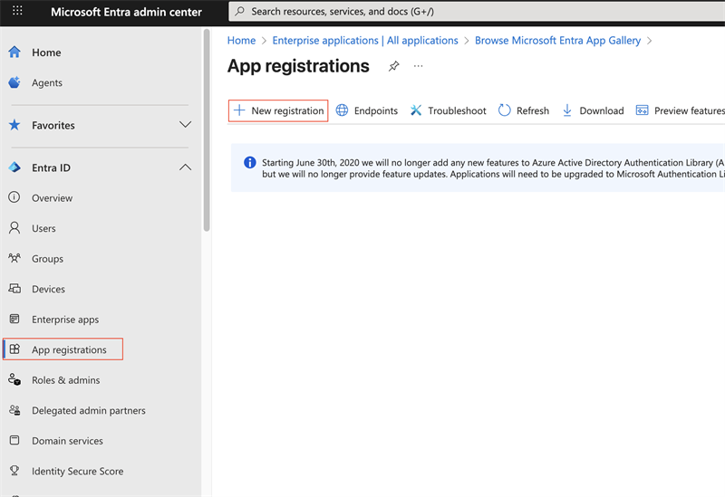

3.  Give the application a name ("gs-azure-app") and choose the **Supported account types** for the case you are setting up:

    * **Single tenant** --- the first option, *"Accounts in this organizational directory only (<your domain> only - Single tenant)"*.
    * **Multi tenant** --- the second option, *"Accounts in any organizational directory (Any Microsoft Entra ID tenant - Multitenant)"*.

    Use the Redirect URI shown in the GeoServer filter configuration as the "Web" Redirect URI --- it has the form `http://localhost:8080/geoserver/web/login/oauth2/code/<filterName>__microsoft` where `<filterName>` is the name of the GeoServer OIDC filter. Press "Register".

    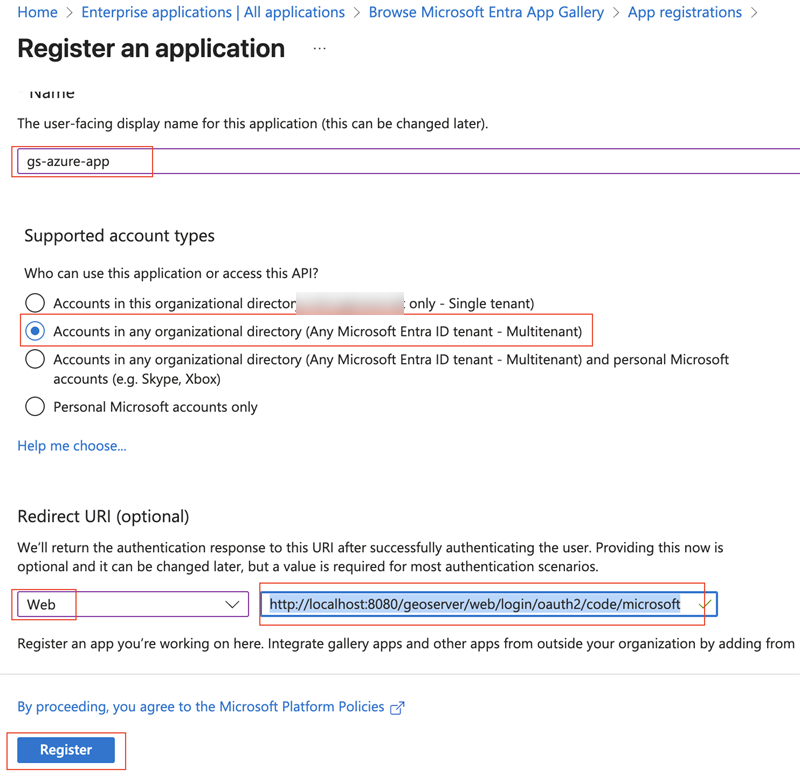

    !!! note
        The screenshot shows the **multi-tenant** choice selected, which is the second radio button. For a single-tenant application pick the first one instead --- it names your own directory, and that name is obscured in the screenshot above. The two options are otherwise identical to fill in.

    !!! tip
        The exact redirect URI that GeoServer will use is shown as the read-only **Redirect URI** field in the filter configuration form --- copy it verbatim. In production, use that value instead of `localhost`. The filter-name prefix lets several OIDC filters share an IDP without colliding on their redirect URIs. See [Redirect Base URI](../configuring.md#oidc_redirect_base_uri).

4.  On the app summary screen, press "Certificates & Secrets", "+ New client secret", then press "Add".

    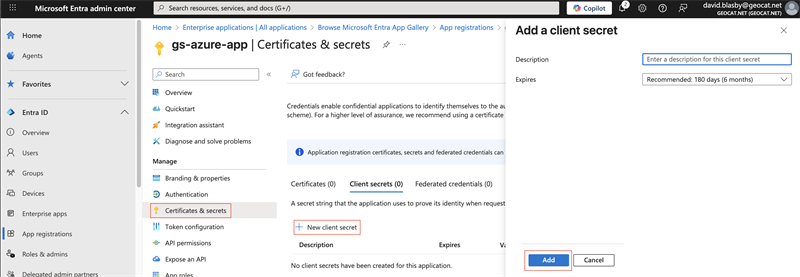

5.  Make sure you copy-and-paste the created Client Secret - you will need this later and you can only access now. Ensure you got the "Value" (not the ID).

    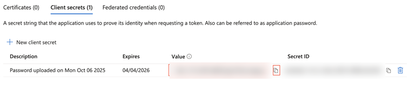

6.  Press "Overview" (left column) and record the "Application (client) ID" and the "Directory (tenant) ID" --- you will need the first in both cases, and the second only for a single-tenant setup.

    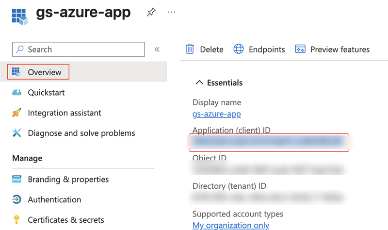

    !!! note
        Both values are in the same Essentials panel, two rows apart. The "Supported account types" line at the bottom of that panel is worth checking here: it should read *"My organization only"* for a single-tenant application, and *"Multiple organizations"* for a multi-tenant one. If it does not match what you intended, change it under "Authentication" before going further.

7.  Press "Manifest" (left column), and change `"groupMembershipClaims":null,` to `"groupMembershipClaims": "ApplicationGroup",` and press "Save". This puts the roles in the ID Token.

    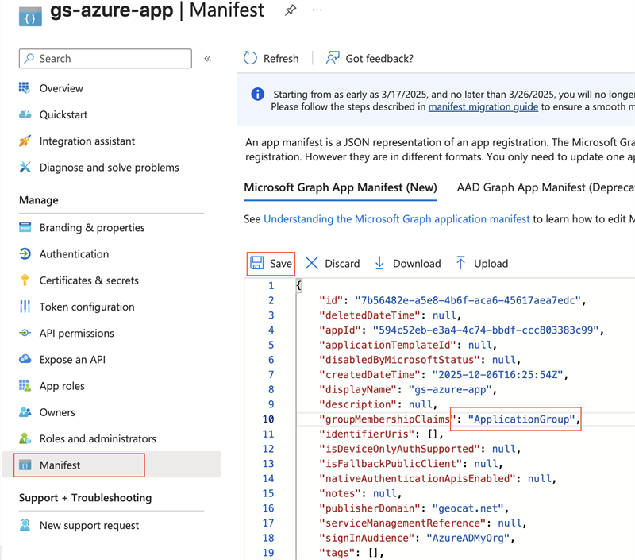

8.  Press "Add roles" (left column), then "+ Create App role", set the "Display name" and "Value" to "geoserverAdmin" and press "Apply".

    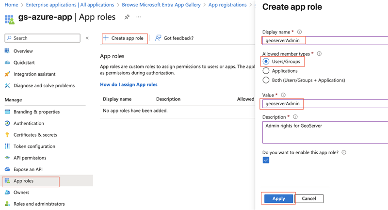

9.  Press "Enterprise Apps" (far left column), choose your application ("gs-azure-app"), and press "Assign users and groups".

    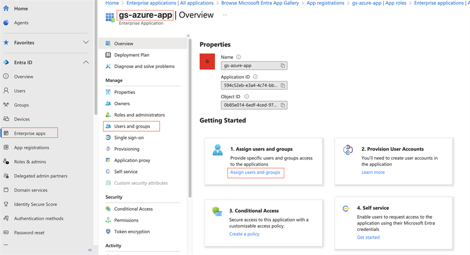

10. At the top press "+ Add user/group". Under "Users", press "None Selected" and then choose your account. Under "Select a role", keep the selection as "geoserverAdmin". Press "Assign".

    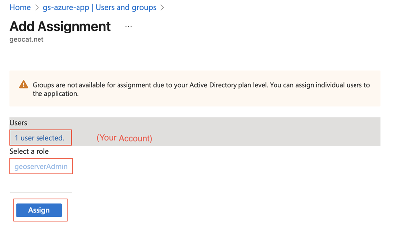

    !!! note
        In a multi-tenant application this assignment only covers users in your own directory. Users from other tenants must be granted access in their own directory once an administrator there has consented to the application.

## Configure GeoServer

Ensure you have the following:

1.  Your Client ID ("Application (client) ID"). This is a GUID.
2.  Your Client Secret. This is the "Value" copied in step 5, not the Secret ID.
3.  Your Tenant ID ("Directory (tenant) ID"), a GUID --- for a single-tenant setup only.
4.  Name of the GeoServer admin Role ("geoserverAdmin")

### Create the OIDC Filter

1.  Login to GeoServer as an Admin

2.  On the left bar under "Security", click "Authentication", and then "OpenID Connect Login"

    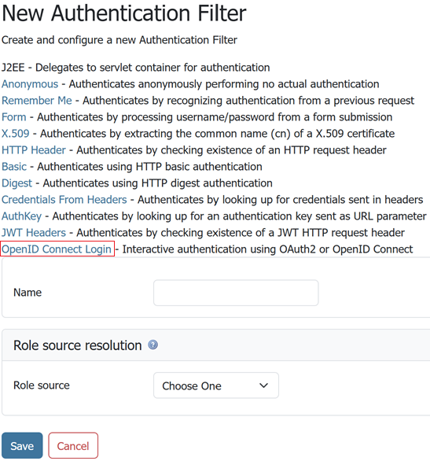

3.  Give it a name, then from the **Provider** dropdown select **Microsoft Azure**.

4.  Fill in the required information:

    - "Client Id" is the Azure "Application (client) ID"
    - "Client Secret" which was copied from Azure when you created it
    - "Microsoft Entra Tenant ID" --- the Azure "Directory (tenant) ID" for a single-tenant application, or left empty for a multi-tenant one

**Single tenant.** The Tenant ID field holds the Directory (tenant) ID:

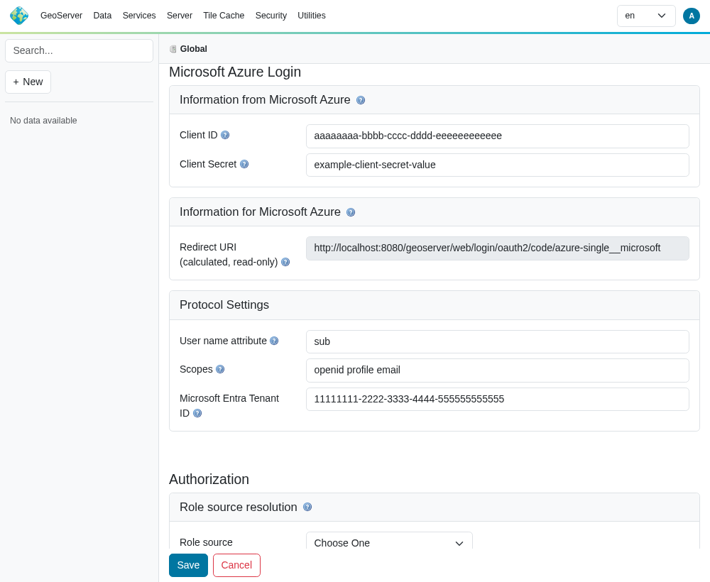

**Multi tenant.** The same form with the Tenant ID field left empty:

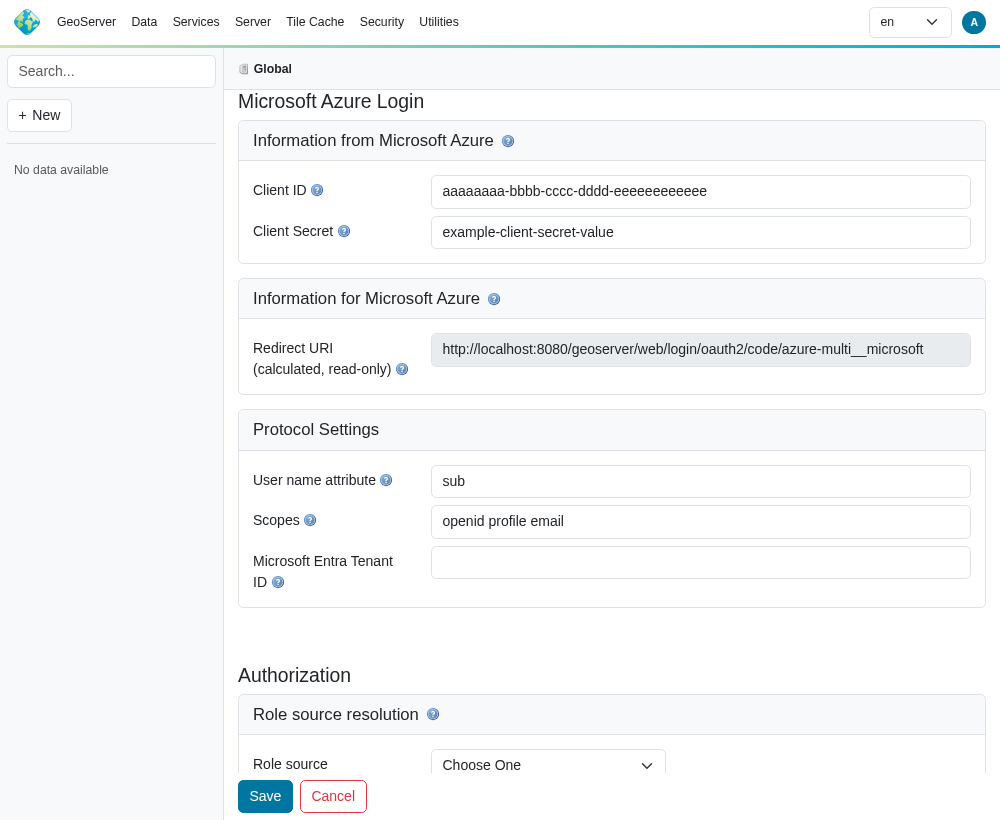

5.  Press Save.

### Allow Web Access (Filter Chain)

Creating the filter is not enough --- it has to be placed on the "Web" filter chain before the login button appears.

* On the left bar under "Security", click "Authentication", and then click "Web" under "Filter Chains"
* Move your new filter from "Available" to "Selected" with the "⇒" button, and position it above "anonymous" with the "⇑" button
* Press "Close", then "Save"

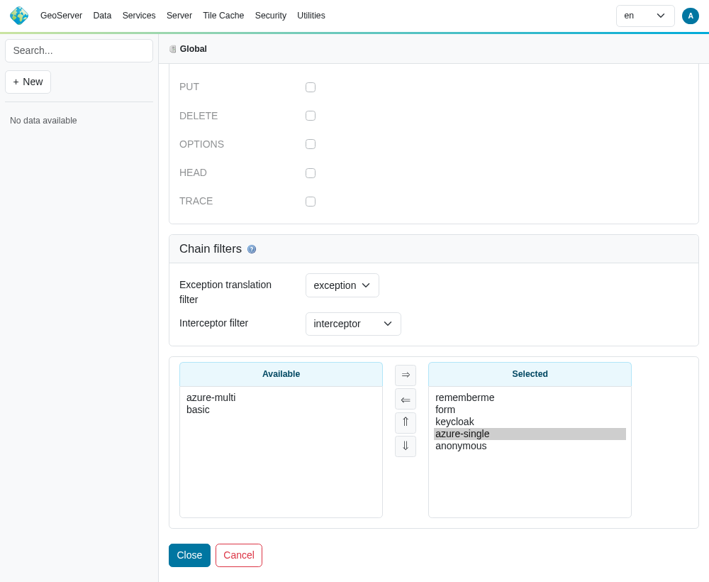

## What correct behaviour looks like

Signing in successfully does not on its own prove the Tenant ID took effect: a single-tenant **Azure application** already turns foreign accounts away at the shared `common` endpoint, so that test passes whether the GeoServer field is filled in or left empty. The checks below distinguish the two.

**Check where GeoServer sends users.** Log out, press the Microsoft login button, and read the address bar before signing in.

| Configuration | Expected address |
|---|---|
| Tenant ID filled in | `https://login.microsoftonline.com/11111111-2222-3333-4444-555555555555/oauth2/v2.0/authorize?...` |
| Tenant ID empty | `https://login.microsoftonline.com/common/oauth2/v2.0/authorize?...` |

If you configured a Tenant ID and still see `/common`, the value did not save --- re-open the filter and check the field.

**Check what GeoServer received.** Sign in, then look at the ID token in the GeoServer log (see [troubleshooting](../advanced.md#oidc_troubleshooting) for enabling that logging). Its `iss` claim should be `https://login.microsoftonline.com/<your tenant id>/v2.0`. That claim is the one GeoServer enforces; the `tid` claim beside it is informative only.

**Check the REST API**, if you use it with Bearer tokens and have left hybrid resource-server mode enabled (the default). With a Tenant ID configured, a token minted by a different Entra tenant --- or minted for a different application in your own tenant --- is rejected with `401`. With the field empty, both are accepted. This is the check that has no equivalent on the Azure side.

## Troubleshooting

| Symptom | Cause | Fix |
|---|---|---|
| Saving the filter fails with *"Microsoft Entra Tenant ID must be a valid UUID"* | The field contains something other than a GUID --- commonly the `contoso.onmicrosoft.com` domain form | Use the Directory (tenant) ID from the Overview page |
| Entra rejects the sign-in with `AADSTS50011` (redirect URI mismatch) | The Redirect URI registered in Azure does not match the one GeoServer sends | Copy the read-only **Redirect URI** from the filter form verbatim into the Azure app registration |
| Entra rejects the sign-in with `AADSTS50020` (user account from a different tenant) | A foreign account tried to sign in to a single-tenant application | Expected. Use a multi-tenant application if foreign accounts should be allowed |
| Login completes but the user has no privileges | No role source is configured, or the role converter does not match | See [Configure Role Source](#configure-role-source) below |
| Log shows *"The ID Token contains invalid claims: {iss=...}"* | The id_token came from a different tenant than the one configured | Check that the Tenant ID matches the directory the user signs in to |
| REST call returns `401`, log shows *"Token was not issued by the configured Microsoft Entra tenant"* | A Bearer token from another tenant | Expected with a Tenant ID configured. Use a token from the configured tenant |
| REST call returns `401`, log shows *"Token was not issued for this GeoServer application"* | A Bearer token minted for a different app registration in the same tenant, or an application ID URI that is not `api://<client id>` | Request the token for this application, or enable **Validate token audience** and enter your custom application ID URI |

The tenant-ID validation error appears at the top of the filter page when you press Save:

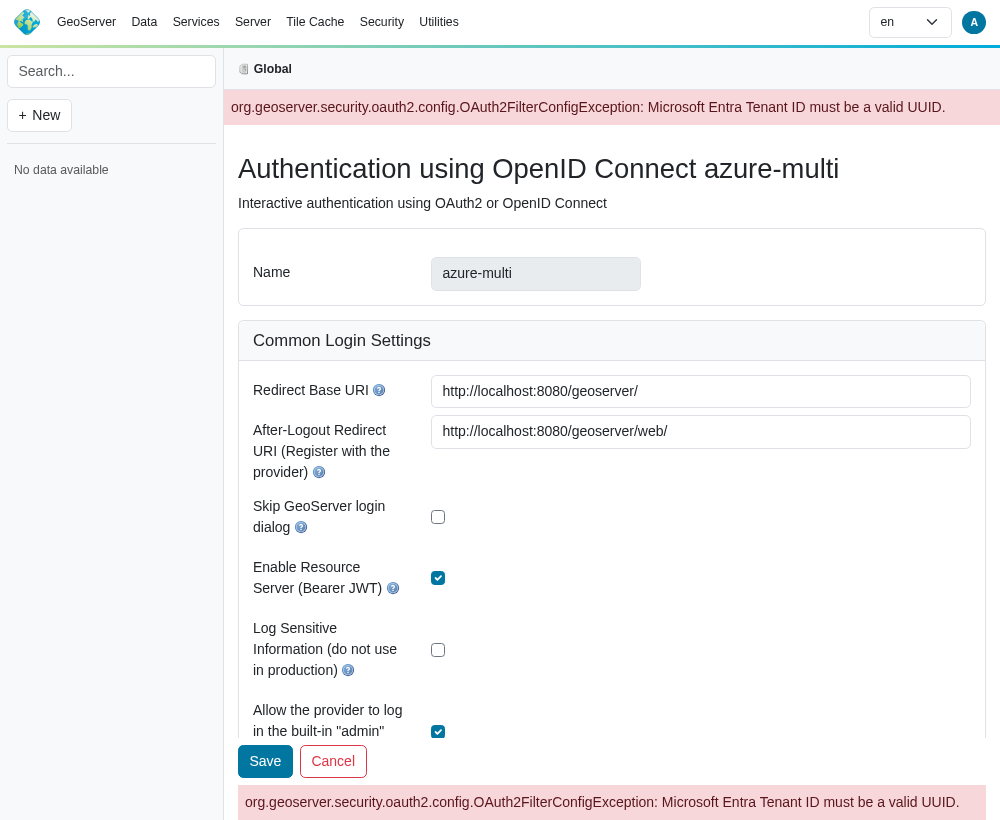

### Configure Role Source

You have two options:

* ID Token
* Microsoft Graph API (Entra ID)

ID Token appears to be simpler.

#### ID Token

When we configured Azure, we had it attach the roles to the ID token. We can use that to assign roles inside GeoServer.

1.  Edit your Azure security filter.

2.  At the bottom, under "Authorization/Role source", choose "ID Token".

    - Use "roles" as the JSON Path
    - Use "geoserverAdmin=ROLE_ADMINISTRATOR" as the Role Converter
    - Tick the "Only allow External Roles that are explicitly named above"
    - Press Save

#### Microsoft Graph API (Entra ID)

Before you can use the MS Graph for permissions, you must give the Entra App you created more permissions.

##### Setting up Azure

We need to setup Azure so GeoServer can access the MSGraph and get the roles/groups the user is assigned to.

**NOTE:** in the ID token, the roles name is used (i.e. "geoserverAdmin"). However, in MSGraph, the role's ID is used (a GUID).

1.  Login in to <https://entra.microsoft.com/>

2.  Go to "App registration" (far left column), choose your application ("gs-azure-app"), choose "API Permissions" (left column), then press "+ Add a permission".

    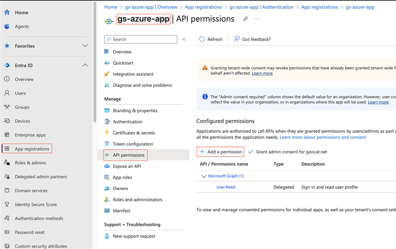

3.  Choose "Microsoft Graph"

    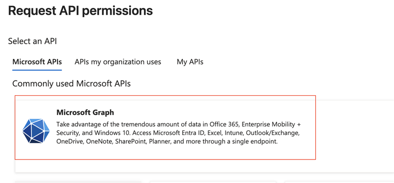

4.  Then add the "GroupMember.Read.All" and "RoleManagement.Read.Directory" permissions and press "Add permissions"

    - At the top, select "Delegated permissions"
    - Scroll down to "GroupMember" and select "GroupMember.Read.All"
    - Scroll down to "RoleManagement" and select "RoleManagement.Read.Directory"

    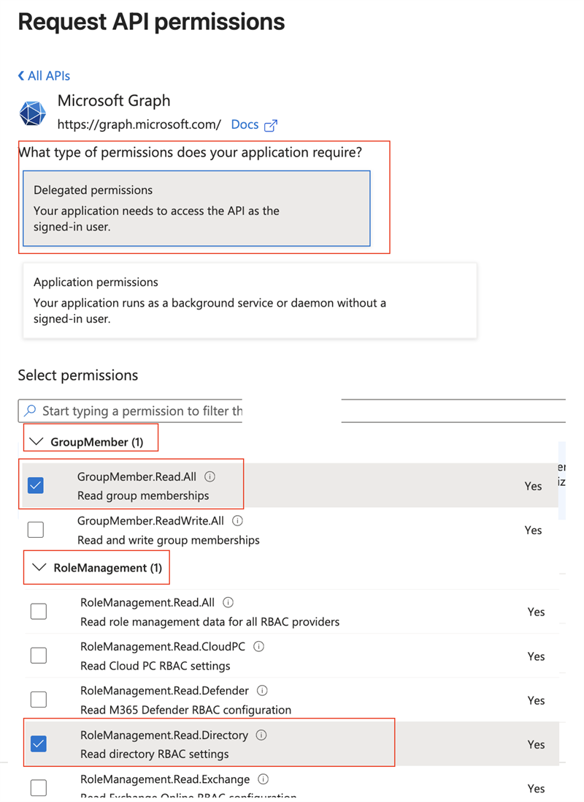

5.  On the "API permissions" screen, press "Grant admin consent for ..."

    - This will pop-up a confirmation - press "Yes"

    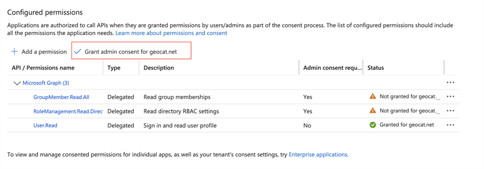

6.  On the left column, press "App roles" and copy the ID for the "geoserverAdmin" role (a GUID, obscured in the screenshot). You will need this in the next step.

    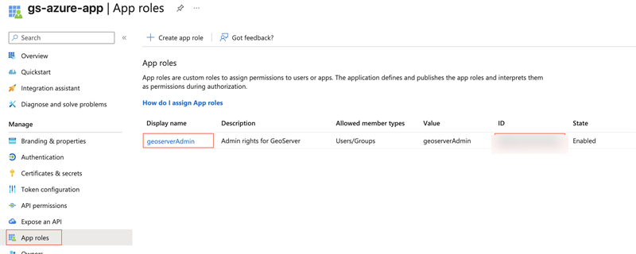

7.  On the far left column, press "Enterprise Apps", choose your application ("gs-azure-app"), and copy the "Object ID" (**not** the Application ID). You will need this in the next step.

    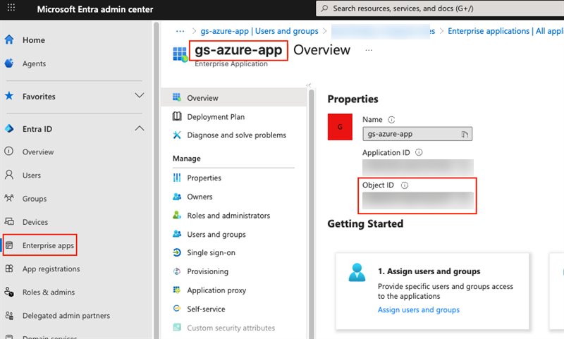

##### Setting up GeoServer

You will need:

- "geoserverAdmin" role id (GUID)
- Your enterprise application's Object ID (GUID). This is **NOT** the Client ID.

1.  Login into GeoServer as the ROLE_ADMINISTRATOR
2.  On the left, go to "Security"->"Authentication", and click on your Azure OIDC filter

3.  Scroll down to the "Authorization" section

    - Choose "Microsoft Graph API (Entra ID)"
    - Turn on "Get Roles from the User's Application Roles (MSGraph appRoleAssignments endpoint)". GeoServer will retrieve the user's roles from the MSGraph's "appRoleAssignments". These roles are the Role ID (GUID) **not** the name of the role.
    - In the "Object Id for the Azure Enterprise Application (NOT the Client Id)" box, put in your enterprise application's Object ID (GUID).
    - In the converter map, use the role id (GUID) for "geoserverAdmin" (found above) and put in "<your geoserverAdmin GUID>=ROLE_ADMINISTRATOR"
    - Press Save

    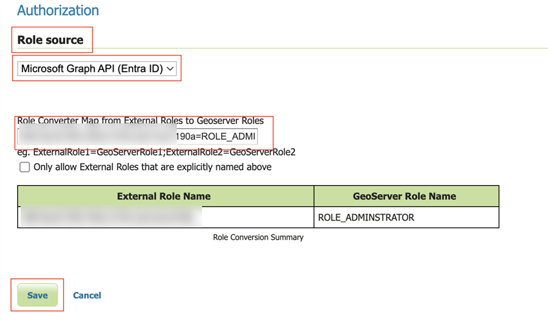

## Notes

See [troubleshooting](../advanced.md#oidc_troubleshooting).

1.  Typical MS ID Token. Note that the roles have been put in the "roles" claim, and that `iss` carries the tenant GeoServer matches against.

    ``` json
    {
        "aud": "aaaaaaaa-bbbb-cccc-dddd-eeeeeeeeeeee",
        "iss": "https://login.microsoftonline.com/11111111-2222-3333-4444-555555555555/v2.0",
        "iat": 1759773505,
        "nbf": 1759773505,
        "exp": 1759777405,
        "email": "jane.doe@example.org",
        "name": "Jane Doe",
        "nonce": "m3HsvD9JqU4uWbP1oPzP3Wb-n5u-aXdJAd",
        "oid": "22222222-3333-4444-5555-666666666666",
        "preferred_username": "jane.doe@example.org",
        "roles": [
            "geoserverAdmin"
        ],
        "sub": "oV3o_mu_PccTipAPJSpLJxzdzV2LKZv8mDQauGnY",
        "tid": "11111111-2222-3333-4444-555555555555",
        "ver": "2.0"
    }
    ```
