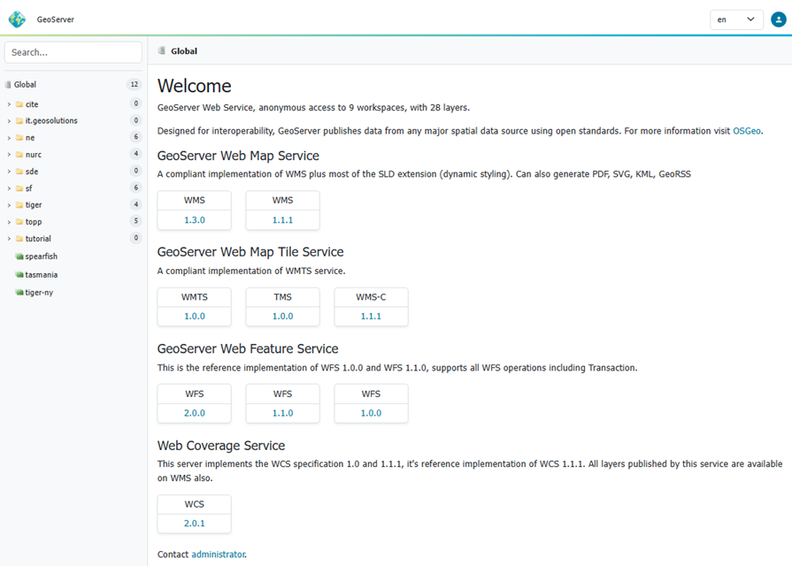

# Docker Container

GeoServer is also packaged as a Docker Container. For more details, see the [GeoServer Docker Container Project](https://github.com/geoserver/docker).

See the [README.md](https://github.com/geoserver/docker/blob/master/README.md) file for more technical information.

## Quick Start

This will run the container, with the data directory included with the container:

1.  Make sure you have [Docker](https://www.docker.com/) installed.

2.  Download the container:


    These instructions are for GeoServer {{ release }}.

    ```text
    docker pull docker.osgeo.org/geoserver:{{ release }}
    ```

    These instructions are for GeoServer {{ version }}-SNAPSHOT which is provided as a [Nightly](https://geoserver.org/release/main) release. Testing a Nightly release is a great way to try out new features, and test community modules. Nightly releases change on an ongoing basis and are not suitable for a production environment.

    ```text
    docker pull docker.osgeo.org/geoserver:{{ version }}.x
    ```


3.  Run the container


    ```text
    docker run -it -p 8080:8080 docker.osgeo.org/geoserver:{{ release }}
    ```

    ```text
    docker run -it -p 8080:8080 docker.osgeo.org/geoserver:{{ version }}.x
    ```


4.  In a web browser, navigate to `http://localhost:8080/geoserver`.

    If you see the GeoServer Welcome page, then GeoServer is successfully installed.

    

    *GeoServer Welcome Page*

5.  This setup is a quick test to ensure the software is working, but is difficult to use as file data can only be transferred to the data directory included with the container via the REST API.

## Using your own Data Directory {: #installation_docker_data }

This will run the container with a local data directory. The data directory will be [mounted](https://docs.docker.com/storage/bind-mounts/) into the docker container.

!!! note
    Change ``/MY/DATADIRECTORY`` to your data directory. If this directory is empty it will be populated with the standard GeoServer Sample Data Directory.

1.  Make sure you have [Docker](https://www.docker.com/) installed.

2.  Download the container


    ```text
    docker pull docker.osgeo.org/geoserver:{{ release }}
    ```

    ```text
    docker pull docker.osgeo.org/geoserver:{{ version }}.x
    ```


3.  Run the container


    ```text
    docker run  -it -p 8080:8080 \
      --mount type=bind,src=/MY/DATADIRECTORY,target=/opt/geoserver_data \
      docker.osgeo.org/geoserver:{{ release }}
    ```

    ```text
    docker run -it -p 8080:8080 \
      --mount type=bind,src=/MY/DATADIRECTORY,target=/opt/geoserver_data \
      docker.osgeo.org/geoserver:{{ version }}.x
    ```


4.  In a web browser, navigate to `http://localhost:8080/geoserver`.

    If you see the GeoServer Welcome page, then GeoServer is successfully installed.

    

    *GeoServer Welcome Page*

5.  This setup allows direct management of the file data shared with the container. This setup is also easy to update to use the latest container.

## Adding GeoServer Extensions

You can add GeoServer Extensions - the container will download them during startup.


```text
docker run -it -p 8080:8080 \
  --env INSTALL_EXTENSIONS=true \
  --env STABLE_EXTENSIONS="ysld,ogcapi-features" \
  docker.osgeo.org/geoserver:{{ release }}
```

```text
docker run -it -p 8080:8080 \
  --env INSTALL_EXTENSIONS=true \
  --env STABLE_EXTENSIONS="ysld,ogcapi-features" \
  docker.osgeo.org/geoserver:{{ version }}.x
```


This will download and install the [YSLD](../styling/ysld/index.md) and [OGCAPI - Features](../services/features/index.md) extension.

Here is a list of available extensions (taken from the [build server](https://build.geoserver.org/geoserver/main/ext-latest/)):


|   |   |   |
|---|---|---|
| app-schema | authkey | cas |
| charts | control-flow | css |
| csw | csw-iso | datadir-catalog-loader |
| db2 | dxf | excel |
| feature-pregeneralized | gdal | geofence |
| geofence-server-h2 | geofence-server-postgres | geofence-wps |
| geopkg-output | grib | gwc-s3 |
| iau | importer | inspire |
| jp2k | kml | libjpeg-turbo |
| mapml | mbstyle | metadata |
| mongodb | monitor | mysql |
| netcdf | netcdf-out | ogcapi-features |
| ogr-wfs | ogr-wps | oracle |
| params-extractor | printing | pyramid |
| querylayer | rat | sldservice |
| sqlserver | vectortiles | wcs2_0-eo |
| web-resource | wmts-multi-dimensional | wps |
| wps-cluster-hazelcas | wps-download | wps-jdbc |
| ysld |  |  |

## Testing GeoServer Community modules

Working with a Nightly build is a good way to test community modules and provide feedback to developers working on new functionality.


Community modules are shared as part GeoServer {{ release }} source code bundle to be compiled for testing and feedback by the developer community.

When the developer has met the documentation and quality assurance standards for GeoServer they may ask for the module to be included in GeoServer.

If you are interested in helping out, please make contact via the [developer forum](https://discourse.osgeo.org/c/geoserver/developer/63).

Reference:

- [community modules](../../../developer/policies/community-modules.md) (Developer Guide)

To work with community modules you must be using the GeoServer {{ version }}.x nightly build that matches the community module build:

```text
docker run -it -p 8080:8080 \
  --env INSTALL_EXTENSIONS=true \
  --env STABLE_EXTENSIONS="ysld,h2" \
  --env COMMUNITY_EXTENSIONS="ogcapi-images,ogcapi-maps,ogcapi-styles,ogcapi-tiles" \
  docker.osgeo.org/geoserver:{{ version }}.x
```


For the current list see GeoServer [build server](https://build.geoserver.org/geoserver/main/community-latest/).

|   |   |   |
|---|---|---|
| acl | backup-restore | cog-azure |
| cog-google | cog-http | cog-s3 |
| colormap | cov-json | dds |
| elasticsearch | features-autopopulate | features-templating |
| flatgeobuf | gdal-wcs | gdal-wps |
| geopkg | gpx | graticule |
| gsr | gwc-azure-blobstore | gwc-mbtiles |
| gwc-sqlite | hz-cluster | importer-jdbc |
| jdbcconfig | jdbcstore | jms-cluster |
| libdeflate | mbtiles | mbtiles-store |
| mongodb-schemaless | monitor-kafka | ncwms |
| netcdf-ghrsst | notification | ogcapi-coverages |
| ogcapi-dggs | ogcapi-images | ogcapi-maps |
| ogcapi-styles | ogcapi-tiled-features | ogcapi-tiles |
| ogr-datastore | opensearch-eo | proxy-base-ext |
| s3-geotiff | sec-keycloak | sec-oauth2-geonode |
| sec-oauth2-github | sec-oauth2-google | sec-oauth2-openid |
| smart-data-loader | solr | spatialjson |
| stac-datastore | taskmanager-core | taskmanager-s3 |
| vector-mosaic | vsi | webp |
| wfs-freemarker | wps-longitudinal-profile |  |
