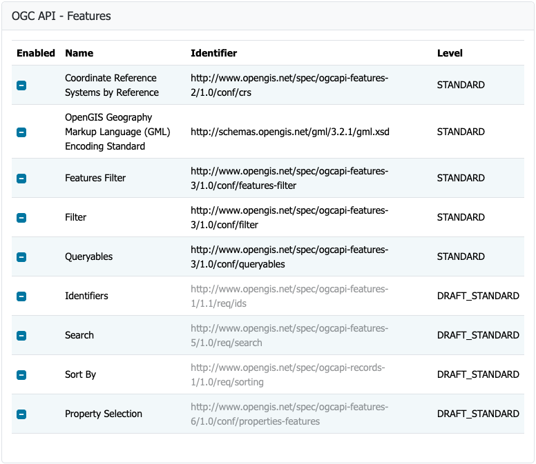
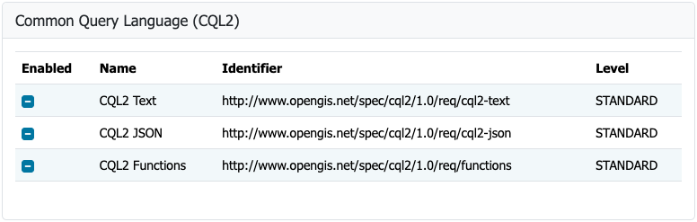
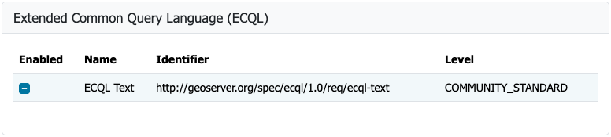
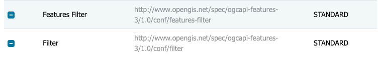

# Configuration of OGC API - Features module

The service operates as an additional protocol for sharing vector data alongside Web Feature Service.

## Service configuration

The service is configured using the **Vector Services** page:

 -  Shared [Service metadata](../../configuration/service-metadata/index.md) to define title, abstract, and keywords.

    !!! note

        The service title is shared with WFS, so when upgrading from GeoServer 2.28 configuration it will read
        `GeoServer Web Feature Service` until you change it.

 -  Configuration shared by [Web Feature Service (WFS)](../wfs/index.md) for output formats.

 -  Contact information defined in [Contact Information](../../configuration/contact.md).

 -  Extra links can be added on a per-service or per-collection basis as indicated in [OGC API Service Configuration](../../configuration/ogc-api-services/index.md).

## Feature Service Conformances

The OGC API Feature Service is modular, with supported functionality listed in a `conformance` document.

Use the provided [Conformance tables](../../configuration/ogc-api-services/index.md#conformance) to manage each group of standards:

 -  OGC API Feature conformances.

    Disabling a class removes it from the `conformance` document. What else changes depends on the kind of class:
    some manage the contents of the API document, while others add resources or request parameters to the service.

    **Standard**:

    -  `crsByReference`: when disabled, the `filter-crs` parameter is removed from the API document, and a `crs`
       parameter is ignored, returning features in `EPSG:4326`.

    -  `gml321`: when disabled, GML 3.2.1 output is no longer advertised in the API document.

    -  `queryables`: when disabled, the queryables resource is removed from the API document.

    -  `featuresFilter` and `filter`: require a filter language, see below.

    **Draft standard**, disabled by default:

    -  `ids`, `sortBy` and `propertySelection`: when enabled, the `ids`, `sortby`, `properties` and
       `exclude-properties` parameters are added to the API document and used when handling a request. When disabled,
       they are not included in the API document, and are ignored if used.

    -  `search`: when enabled, the `/search` resource is listed in the API document. When disabled, it is not listed
       and answers with a `404` status.

      
    *Feature Service Configuration*

 -  CQL2 Filter conformances.

    Both the Text and JSON formats for CQL2 are available and may be enabled or disabled.

    The CQL2 capabilities implemented by GeoServer (basic, advanced comparison, arithmetic, property-property, and
    spatial operators) are built-in, and included in the `conformance` document when CQL2 Text or CQL2 JSON is
    enabled.

    CQL2 Functions provides the `/functions` resource, listing the functions available for use in a filter.

      
    *CQL2 Filter configuration*

 -  Control of ECQL Filter conformances

      
    *ECQL Filter configuration*

 -  The enabled filter languages are listed in the `filter-lang` parameter of the API document, and the first one is
    its default. A request using any other language gets a `400` status.
  
    With every language disabled the filter parameters are not available at all: the filter conformance classes are no longer included in the `conformance` document, the parameters are removed from the API document, and a `filter` sent anyway is ignored.
  
    In the tables this shows as **Filter** and **Features Filter** in light gray when every filter language is disabled. **Features Filter** also needs **Filter**.

      
    *Filter and Features Filter require a filter language to be enabled*

For more information see [Status](status.md) and [Conformance table](../../configuration/ogc-api-services/index.md#conformance).
