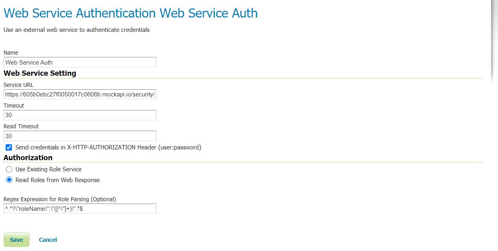

.. _authbasic_configuration:

HTTP Based Authorization configuration
======================================

Once the plug-in is installed reach the ``AuthenticationProvider`` from ``Authentication`` in the ``Security`` menu on the left and then click on ``add new`` in the ``AuthenticationProvider`` section. You will have the possibility to define a ``Web Service Authentication`` provider.

.. figure:: images/newProvider.png

Once clicked on ``Web Service Authentication`` you will have the possibility to enter the provider settings.

Where:

* ``Service URL`` is the URL of the external service meant to be used for authentication.

* ``Timeout`` is the connection timeout.

* ``Read Timeout`` is the timeout on waiting to read response data.

* The ``Send credentials in X-HTTP-AUTHORIZATION Header`` checkbox is meant to be flagged if we want to send credential trough the authorization header. If unchecked (default) GeoServer will expect to find in the provided URL placeholders for username and password as ``{user}`` and ``{password}``.

* In the ``Authorization`` section the radio button allows to define whether to use a GeoServer ``RoleService`` to read roles or if roles are meant to be returned by the external authentication service.

* In case ``Read Roles from Web Response`` is flagged you can specify a regex expression to extract the roles from the authentication service response.

Once the settings are saved the new ``AuthenticationProvider`` will be added to the list of the existing ones and you will be able to add it to the list of the providers' chain.

.. figure:: images/providersList.png

