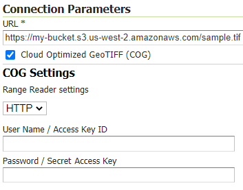
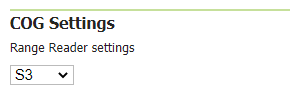

.. _cog_plugin:

COG (Cloud Optimized GeoTIFF) Support
=====================================

`COG <https://github.com/cogeotiff/cog-spec/blob/master/spec.md>`_ (Cloud Optimized GeoTIFF) is a regular GeoTIFF file, aimed at being hosted on a HTTP file server, whose internal organization is friendly for consumption by clients issuing `HTTP GET range <https://en.wikipedia.org/wiki/Byte_serving>`_ requests.
The COG module allows to set configuration params to connect to a Cloud GeoTIFF, as well as adding JARs to the classpath needed to support that connection.

Installation
------------

As a community module, the package needs to be downloaded from the `nightly builds <https://build.geoserver.org/geoserver/>`_,
picking the community folder of the corresponding GeoServer series (e.g. if working on the GeoServer main development branch nightly
builds, pick the zip file form ``main/community-latest``).

To install the module, unpack the zip file contents into the GeoServer ``WEB-INF/lib`` directory and restart GeoServer.

COG GeoTIFF Configuration Panel
-------------------------------
The COG plugin does not add new stores, instead, it adds COG support to existing ones.

When configuring a GeoTIFF store, a new checkbox is available: ``Cloud Optimized GeoTIFF (COG)``. Setting that will open a new section presenting the COG configuration parameters for this COG Store.

   COG Connection params

Checking the ``Cloud Optimized GeoTIFF (COG)`` checkbox will provide new options:

.. list-table::
   :widths: 20 80
   :header-rows: 1
   :stub-columns: 1

   * - Option
     - Description
   * - :guilabel:`URL`
     - (prefixed by ``cog://``) representing the connection URL to the COG Dataset.
   * - :guilabel:`Range Reader Settings`
     - Which type of Range Reader implementation. Values currently supported are HTTP and S3, the latter using an S3 Client
   * - :guilabel:`User Name / Access Key ID`
     - Optional user name (HTTP) or Access Key ID (S3) in case the COG dataset requires basic authentication
   * - :guilabel:`Password / Secret Access Key`
     - Password (HTTP) or Secret Access Key (S3) for the previous credential

COG ImageMosaic Configuration
-----------------------------
Additional configuration parameters can be specified in the ImageMosaic indexer configuration, in order to properly configure a COG based ImageMosaic.

:file:`indexer.properties`
~~~~~~~~~~~~~~~~~~~~~~~~~~

.. list-table::
   :widths: 15 5 80
   :header-rows: 1
   :stub-columns: 1

   * - Parameter
     - Mandatory?
     - Description
   * - Cog
     - Y
     - A boolean flag (true/false) to be set (Cog=true) in order to signal that the ImageMosaic is a COG data mosaic.
   * - CogRangeReader
     - N
     - Specifies the desired RangeReader implementation performing the Range Reads requests. Currently supported values are ``it.geosolutions.imageioimpl.plugins.cog.HttpRangeReader`` and ``it.geosolutions.imageioimpl.plugins.cog.S3RangeReader``, with the latter using an S3 Client to access S3 buckets. Default implementation uses HTTP.
   * - CogUser
     - N
     - Credential to be set whenever basic HTTP authentication is needed to access the COG Datasets or an S3 Access KeyID is required
   * - CogPassword
     - N
     - Password for the above user OR Secret Access Key for the above S3 KeyId.

COG Global Settings
-------------------
The GeoServer Global Settings page contains the default COG settings presented when setting up a new COG GeoTIFF Store.

   Default Global COG Settings

HTTP Client (OkHttp) configuration
----------------------------------
HTTP client configuration (based on `OkHttp client <https://square.github.io/okhttp/>`_) can be specified through Environment variables. 

.. list-table::
   :widths: 15 80
   :header-rows: 1
   :stub-columns: 1

   * - Environment Variable
     - Description
   * - IIO_HTTP_MAX_REQUESTS
     - The maximum number of requests to execute concurrently. Above this requests queue in memory, waiting for the running calls to complete. (Default 128)
   * - IIO_HTTP_MAX_REQUESTS_PER_HOST
     - The maximum number of requests for each host to execute concurrently. (Default 5)
   * - IIO_HTTP_MAX_IDLE_CONNECTIONS
     - The maximum number of idle connections. (Default 5)
   * - IIO_HTTP_KEEP_ALIVE_TIME
     - The Keep alive time (in seconds), representing maximum time that excess idle threads will wait for new tasks before terminating. (Default 60)

AWS S3 Client configuration
---------------------------
A single S3 Asynchronous Client will be used for the same region and alias (url schema, i.e. http, https). 
The following Environment Variables can be set to customize the pool for the asynchronous client for that particular alias. 
On the table below, replace the "$ALIAS$" template with HTTP or HTTPS or S3 if you are configuring properties for these schema. 

.. list-table::
   :widths: 15 80
   :header-rows: 1
   :stub-columns: 1

   * - Environment Variable
     - Description
   * - IIO_$ALIAS$_AWS_CORE_POOL_SIZE
     - The core pool size for the S3 Client (Default 50)
   * - IIO_$ALIAS$_AWS_MAX_POOL_SIZE
     - The maximum number of thread to allow in the pool for the S3 Client (Default 128)
   * - IIO_$ALIAS$_AWS_KEEP_ALIVE_TIME
     - The Keep alive time (in seconds), representing maximum time that excess idle threads will wait for new tasks before terminating. (Default 10)
   * - IIO_$ALIAS$_AWS_USER
     - Default user (access key ID) for AWS basic authentication credentials
   * - IIO_$ALIAS$_AWS_PASSWORD
     - Default password (secret access key) for AWS basic authentication credentials

Client configuration (System Properties)
----------------------------------------
Note that all the IIO  settings reported in the previous tables can also be specified using System Properties instead of Environment variables.
You just need to replace UPPER CASE words with lower case words and underscores with dots.
So, the value for Maximum HTTP requests can be specified by setting either a ``IIO_HTTP_MAX_REQUESTS`` Environment variable or a ``iio.http.max.requests`` Java System Property alternatively (Environment variables are checked first).

By default, when accessing a COG, an initial chunk of 16 KB is read in attempt to parse the header so that the reader will have the offset and length of the available tiles. When dealing with files hosting many tiles, it is possible that the whole header won't fit in the initial chunk. In this case additional reads (chunks of the same size) will be progressively made to complete loading the header.
A ``it.geosolutions.cog.default.header.length`` system propery can be configured to set the length (in bytes) of the reading chunk. Tuning this so that the header is read with few extra requests can help improve performance. A value too large can cause memory comsumption issues and will reduce efficiency, as un-necessary data will be read.
