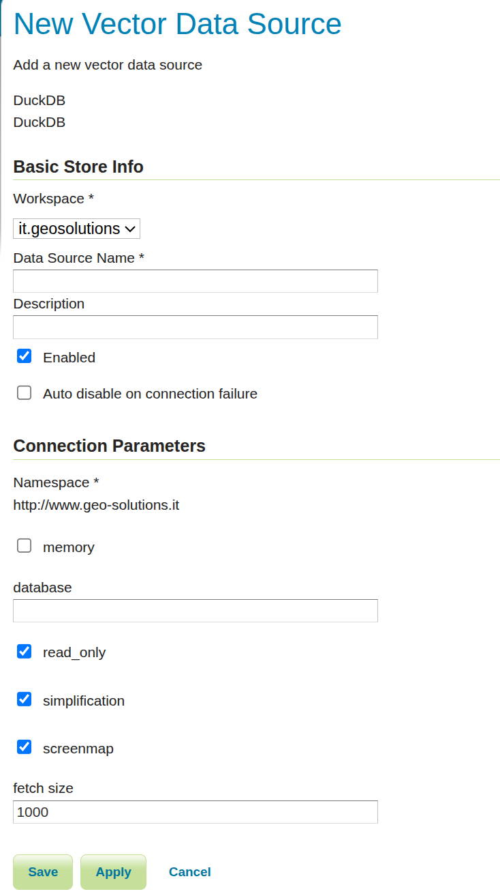

.. _duckdb_configuration:

Configuring a DuckDB Data Store
===============================

Creating a DuckDB Store
-----------------------

#. Navigate to :menuselection:`Stores > Add new Store`.
#. Select :guilabel:`DuckDB`.
#. Fill in the connection parameters.
#. Save the store and publish layers from the discovered feature types.

Connection Parameters
---------------------

The following screenshot shows the DuckDB store form in GeoServer:

   DuckDB store configuration form.

The following parameters are relevant for DuckDB:

.. list-table::
   :widths: 25 75

   * - ``dbtype``
     - Must be ``duckdb``.
   * - ``memory``
     - If ``true``, use an in-memory DuckDB database. Default is ``false``.
   * - ``database``
     - Path to the DuckDB database file. Required when ``memory=false``.
       Must be omitted when ``memory=true``.
   * - ``read_only``
     - Enables read-only mode for the store. Default is ``true``.
       Set to ``false`` to allow write operations.
   * - ``simplification``
     - Enables SQL-side geometry simplification when rendering/query hints request it.
       Default is ``true``.
   * - ``screenmap``
     - Enables screenmap rendering optimization to skip features that fall in already painted screen pixels.
       Default is ``true``.
   * - ``namespace``
     - Namespace URI used for published feature types.
   * - ``fetch size``
     - JDBC fetch size hint for result streaming.

Storage Configuration Rules
---------------------------

DuckDB store configuration enforces the following:

* ``memory`` and ``database`` are mutually exclusive.
* If ``memory=false``, ``database`` is required.
* If ``memory=true``, ``database`` must not be provided.

Security Model
--------------

The DuckDB datastore in GeoServer uses a guarded execution policy from GeoTools:

* Store instances are read-only by default (``read_only=true``).
* SQL execution is restricted to approved statement categories.
* Session script style SQL and multi-statement SQL are blocked.
* User-defined SQL view workflows are not supported for DuckDB stores.

Write Mode
----------

To enable writes for a specific store, set ``read_only=false``.

When write mode is enabled, GeoTools can execute managed DDL/DML statements required by datastore operations.
Keep this disabled unless you explicitly need write behavior.
