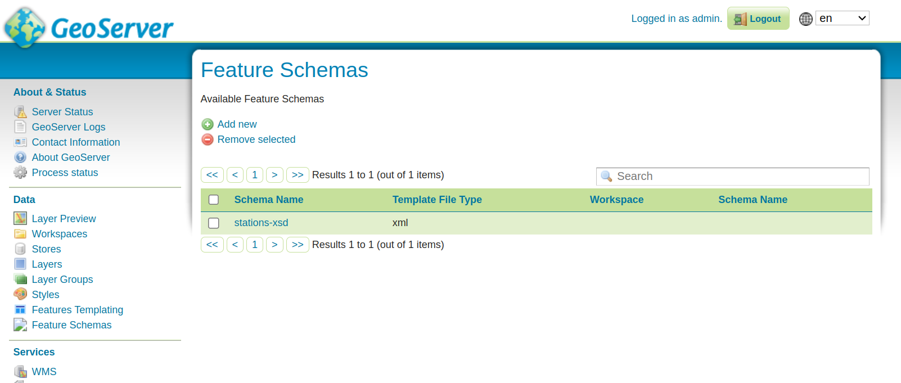
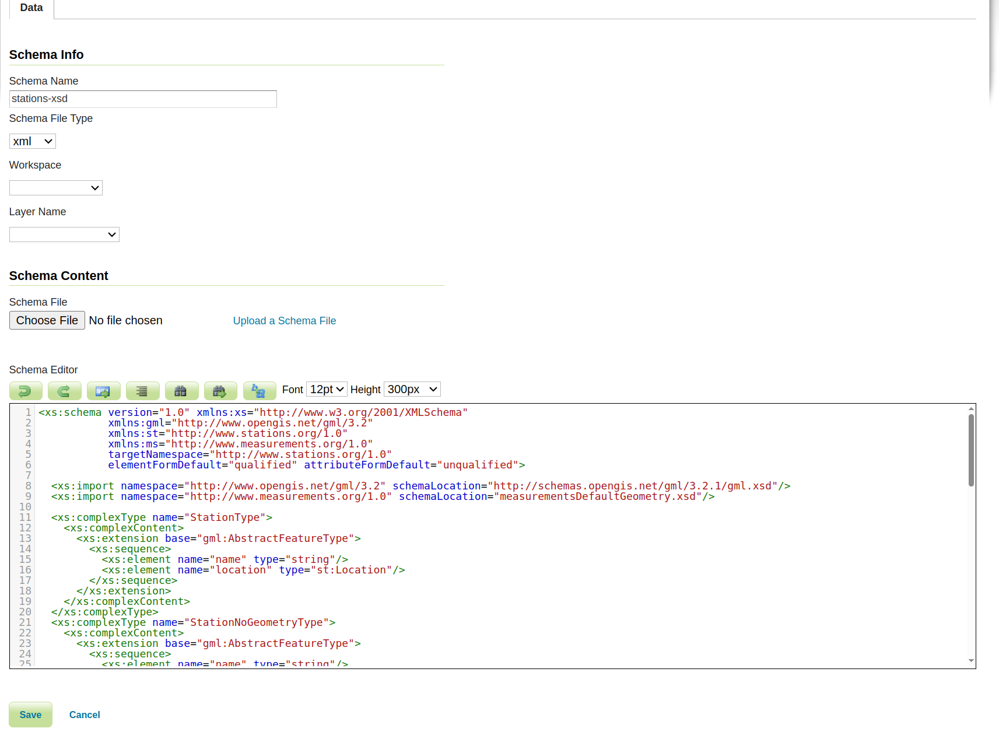
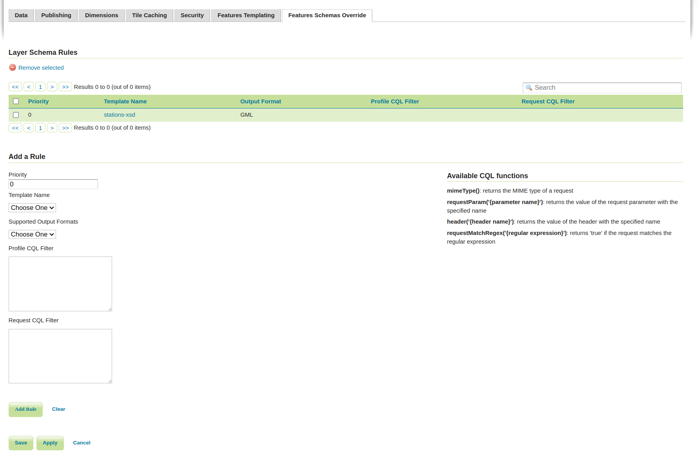

.. _schemas-configuration:

Schemas Configuration
=====================

This part of the documentation explains how to add new Schemas to GeoServer and how to define rules from the layer configuration page for when an schema should be returned in a DescribeFeatureType operation.

Add Feature Schemas to GeoServer
--------------------------------

Once the plug-in is installed, the left panel of the GeoServer UI will show a new option ``Feature Schemas`` under the ``Data`` section.
Clicking on that option will open a table with the available Schemas.



Clicking on the :guilabel:`add New` button will open the configuration page.



In the first tab the user can specify the following values:

* the :guilabel:`Schema Name`. This name will be used for the schema file name when saved in the data directory.
* the :guilabel:`Schema File Type` (file extension) of the schema, by selecting one among those available.
* the :guilabel:`Workspace` if the user wants to limit the usage of the Schema to the vector layers available in a specific workspace.
* * the :guilabel:`Layer Name` if the user wants to limit the usage of the Schema to only a specific vector layer. Selecting a :guilabel:`Layer Name` will not cause the Schema to be applied to that Layer. This option is intended to make the Schema usable only by the selected Layer. In order to apply a Schema content negotiation rules need to be configured on a per layer basis (see section below).

The :guilabel:`Workspace` and :guilabel:`Layer Name` values, if specified, will also affect where the Schema will be saved:

* if neither is specified the Schema will be saved inside the :code:`features-schema` directory.
* if a :guilabel:`Workspace` is specified the Schema will be saved in that workspace folder.
* if a :guilabel:`Layer Name` is specified the Schema will be saved in that layer folder.

The :guilabel:`Schema Content` section is where the Schema is actually defined.

* The Schema can be uploaded from a file, and in that case the :guilabel:`Schema Name` and :guilabel:`Schema File Type` fields are automatically populated from the file.
* Otherwise the Schema can be written from scratch into the Schema editor.

Add Schemas Rules to a Layer
--------------------------------

To inform GeoServer when to apply a Schema, the user needs to specify the rules on a per layer basis.
The most basic rule is one that binds a Schema to a specific output format. :guilabel:`Request CQL Functions` allow specifying more advanced rules.

When the plug-in is installed a new tab will be available in the Layer configuration page, allowing for the definition of Schema rules.



Once the form is filled the user needs to press the :guilabel:`Add` button to add the rule to the rules table. The rules will be then persisted to the layer configuration only when the :guilabel:`Save` button is pressed.

The following values can be specified:

* the :guilabel:`Priority` needed to inform GeoServer which rule should be applied if more than one rule matches the GetFeature request.
* the :guilabel:`Schema Name` that indicates which Schema should be applied. If the Schema has a global scope the dropdown will present it with the Schema name value only. If a Workspace has been defined at Schema configuration time, the format will be {workspace name}:{Schema name}. If a Layer Name has been specified at Schema configuration time, the format will be {workspace name}:{layer name}:{Schema name}.
* the :guilabel:`Supported Output Formats` dropdown shows the output formats for which a Schema can be invoked. The user can choose one to indicate which output format the selected Schema should be applied to. If the GML value is selected, the Schema will be applied to all GML version output formats. If different GML Schemas should be applied for different GML versions, it is possible to define a condition on the MIME Type using the mimeType() function.
* the :guilabel:`Request CQL filter` area allows defining a generic CQL filter to evaluate against the request to determine if the Schema should be t. The available request functions to be used are listed on the right side of the form.
* the :guilabel:`Profile CQL Filter` allows defining a CQL filter allowing a content negotiation to be done per profile. The available request functions to be used are listed on the right side of the form. There is several approaches for content negotiations per profile, for example one of them is the `W3C recommended approach <https://www.w3.org/TR/dx-prof-conneg/>`_ where the profile is provided as an HTTP header. This will translate in a CQL filter similar to this one ``header('Accept-Profile')='http://my-profile/geo+json'``. 


An example CQL filter might be the following:

* ``requestParam('myParameter')``` = 'use this Schema'
* ``mimeType()`` = 'application/geo+json'
* ``requestMatchRegex('^.*matchedPart.*$')`` = true
* ``header('testHeader')`` = 'myHeaderValue'

Every rule must define either a value from the :guilabel:`Supported Output Formats` dropdown or a :guilabel:`Request CQL filter`  with a filter on the mimeType() value, or both.

Once rules are defined, if an incoming GetFeature request is matched the Schema corresponding to the matched rule will be applied to the output.
