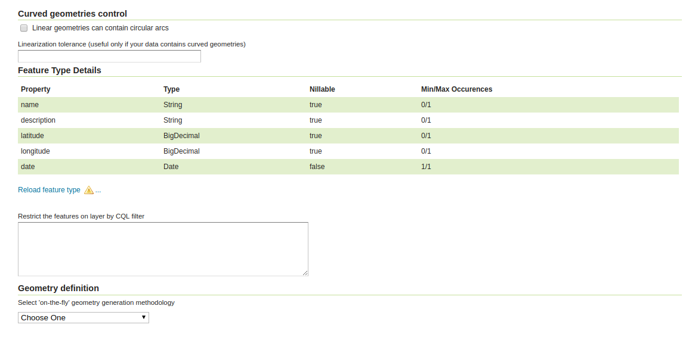
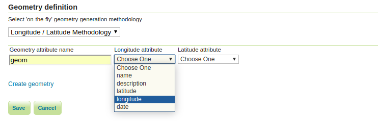
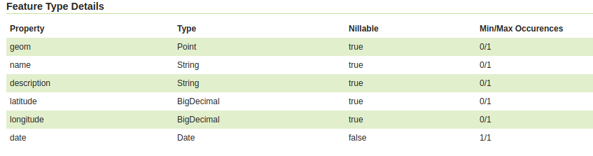

.. _community_generated_geometries:

Generated Geometries
====================

This module allows us to configure layer without geometry data to create geometry on-the-fly. 

Basic Use Case
--------------

Let's imagine we have data table containing x / y coordinates and no specific geometry data defined yet. One would like to create a layer of points based on those coordinates, so that it can be displayed as any other layer by GeoServer.
Using Generated Geometries module we can do this. First it is needed to open "Edit Layer" page. At the bottom, below actual data properties, it should show configuration panel for generated geometries:

Then we have to select one of the geometry generation strategies available in the dropdown and configure it:

It shows an UI when we can set all required parameters. In the example above we're using Longitude/Latitude strategy. It requires both coordinates' sources specified and a name for geometry attribute. After clicking "Create geometry" link below the panel, new property should appear in the table:

It should also set "Coordinate Reference Systems" to to the one selected from the picker.
Last step should be now to generate Bounding Boxes and save the layer.
