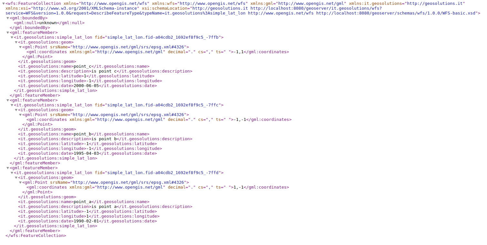
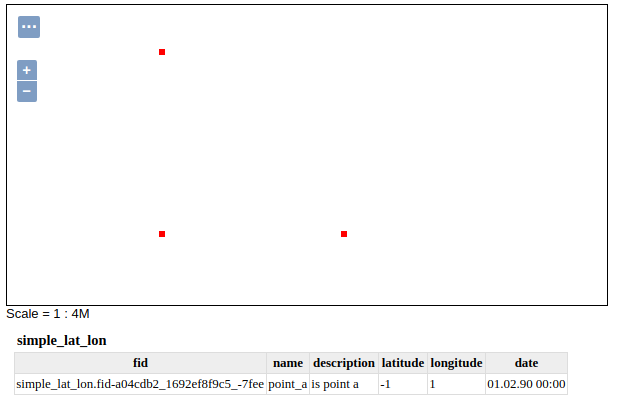

.. _community_generated_geometries:

Generated Geometries
====================

This module allows us to configure layer without geometry data to create geometry on-the-fly. 

Basic Use Case
--------------

Let's imagine we have data table containing longitude/latitude coordinates and no specific geometry data defined yet. One would like to create a layer of points based on those coordinates, so that it can be displayed as any other layer by GeoServer.
Using Generated Geometries module we can do this. First it is needed to open "Edit Layer" page. At the bottom, below actual data properties, it should show configuration panel for generated geometries:

.. figure:: images/geometry_definition.png
   :align: center

Then we have to select one of the geometry generation strategies available in the dropdown and configure it:

.. figure:: images/configuration.png
   :align: center

It shows an UI when we can set all required parameters. In the example above we're using Longitude/Latitude strategy. It requires both coordinates' sources specified and a name for geometry attribute. After clicking "Create geometry" link below the panel, new property should appear in the table:

.. figure:: images/geometry_property_generated.png
   :align: center

It should also set "Coordinate Reference Systems" to EPSG:4326, as it is appropriate for lon/lat data format. 
Last step should be now to generate Bounding Boxes and save the layer.

Newly created layer can be examined for example using WFS or WMS calls:

   *Example of WFS call*

   *Example of WMS call*

Implementation details
----------------------

Module introduces two important extension points for the GeoServer's backend. First is the more generic one::
	
	ResourcePoolCallback<FT extends FeatureType, F extends Feature>

It is applied at the end of Feature Type creation / configuration process. It may be also used for Feature Source overriding, if needed.
Second extension is designed for configuring geometry attributes and generating geometry data::

	GeometryGenerationStrategy<FT extends FeatureType, F extends Feature>

Last extension point is required on the frontend::

	GeneratedGeometryConfigurationPanel extends ResourceConfigurationPanel

It represents the "Geometry definition" panel.

For the example above we have to implement GeometryGenerationStrategy interface focusing on ``defineGeometryAttributeFor`` and ``generateGeometry`` methods. New definition introduces a point geometry property to ``SimpleFeatureType``. Once defined, geometry can be generated in second method mentioned as an attribute of ``SimpleFeature``. 

For more details please take a look into ``org.geoserver.generatedgeometries.longitudelatitude`` package of ``community/generated-geometries`` module. 

Remarks
-------

1) Module is activated by 'generated-geometries' maven profile.

2) ``ResourcePoolCallback`` is a generic extension for ``ResourcePool``. Can be used also in other scenarios, where Feature Type changes are required. 
