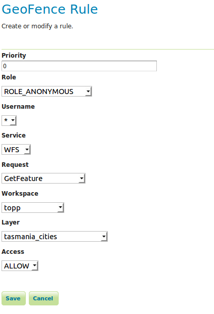

.. geofence_server_gui:

GeoFence Server GUI
===================

The GeoFence user interface is a component of the GeoServer web interface. You can access it from the GeoServer web interface by clicking the :guilabel:`GeoFence Server` link, found on the left side of the screen after logging in.

Rules page
----------
An overview of all rules is provided with priority, the rule's scope specifications (role, user, service, request, workspace and layer) and its access behaviour. The '*' symbol means that the rule applies to all possible values of that specification. Rules are always ordered by priority, but the order can be reversed by pressing the 'P' priority column header. 

.. figure:: images/rulespage.png
   :align: center

A new rule can be added with the "Add new rule" link. Any number of rules can be deleted by selecting them and then clicking on the "Remove selected rules" link.

Rule priority order can be easily on this page through the up and down arrows on the right side. Rules can be modified using the pencil symbol, which opens the rule page.

Rule page
---------
This page is displayed both when creating a new rule and modifying an existing rule.

Priority can be changed manually by specifying a priority number. If this priority number is already occupied by another rule, this will cause that rule and all rules after it to shift one place to a lower priority.

