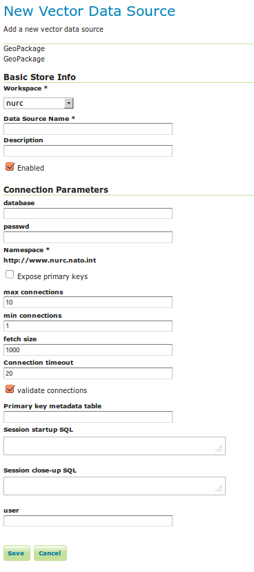
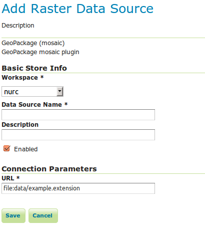

GeoPackage Data Stores
======================
 
Adding a GeoPackage Vector Data Store
-------------------------------------

When the extension has been installed, :guilabel:`GeoPackage` will be an option in the :guilabel:`Vector Data Sources` list when creating a new data store.

.. figure:: images/geopackagecreate.png
   :align: center

   *GeoPackage in the list of vector data stores*

   *Configuring a GeoPackage Vector data store*

.. list-table::
   :widths: 20 80

   * - **Option**
     - **Description**
   * - :guilabel:`database`
     - URI specifying geopackage file.
   * - :guilabel:user
     - User to access database.
   * - :guilabel:`passwd`
     - Password to access database.
   * - :guilabel:`namespace`
     - Namespace to be associated with the database.  This field is altered by changing the workspace name.
   * - :guilabel:`max connections`
     - Maximum amount of open connections to the database. 
   * - :guilabel:`min connections`
     - Minimum number of pooled connections.
   * - :guilabel:`fetch size`
     - Number of records read with each interaction with the database.
   * - :guilabel:`Connection timeout`
     - Time (in seconds) the connection pool will wait before timing out.
   * - :guilabel:`validate connections`
     - Checks the connection is alive before using it.

When finished, click :guilabel:`Save`.

Adding a GeoPackage Raster (Mosaic) Data Store
----------------------------------------------

When the extension has been installed, :guilabel:`GeoPackage (mosaic)` will be an option in the :guilabel:`Raster Data Sources` list when creating a new data store.

.. figure:: images/geopackagemosaiccreate.png
   :align: center

   *GeoPackage (mosaic) in the list of raster data stores*

   *Configuring a GeoPackage (mosaic) data store*

.. list-table::
   :widths: 20 80

   * - **Option**
     - **Description**
   * - ``Workspace``
     - Name of the workspace to contain the GeoPackage Mosaic store. This will also be the prefix of the raster layers created from the store.
   * - ``Data Source Name``
     - Name of the GeoPackage Mosaic Store as it will be known to GeoServer. This can be different from the filename. )
   * - ``Description``
     - A full free-form description of the GeoPackage Mosaic Store.
   * - ``Enabled``
     -  If checked, it enables the store. If unchecked (disabled), no data in the GeoPackage Mosaic Store will be served from GeoServer.
   * - ``URL``
     - Location of the GeoPackage file. This can be an absolute path (such as :file:`file:C:\\Data\\landbase.gpkg`) or a path relative to GeoServer's data directory (such as :file:`file:data/landbase.gpkg`).

When finished, click :guilabel:`Save`. 