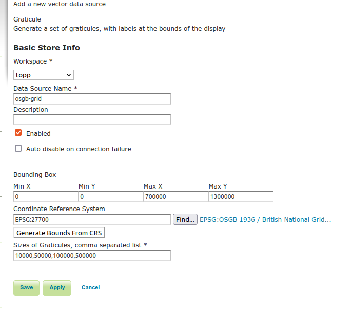
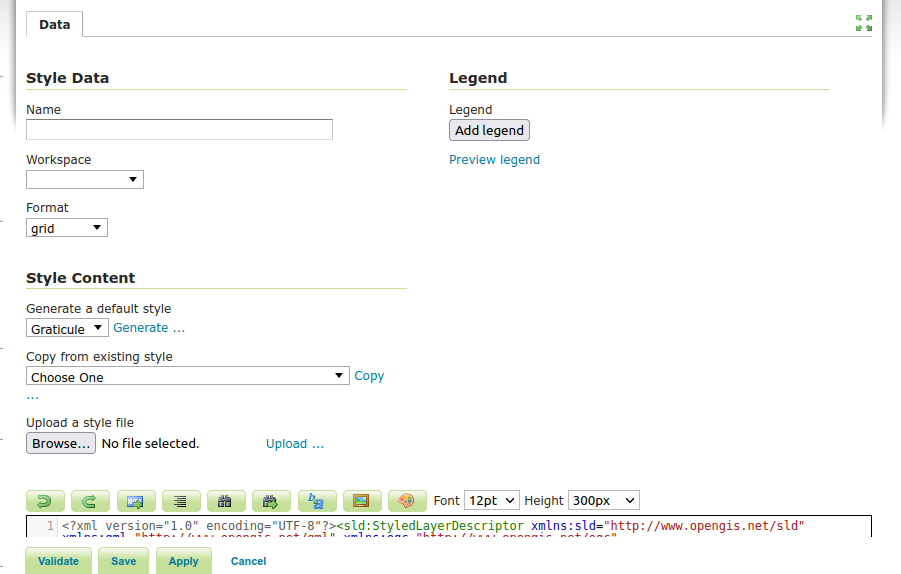

.. _community_graticule:

Graticule Extension
===================

This module allows GeoServer to add graticules or grids to a WMS (or to allow them to be downloaded as WFS).
The extension includes a vector process that can transform the grid lines to label points based on a bounding box, to allow
adding labels in WMS images (this reqiures the WPS module to be present).

Installing the graticule extension
-----------------------------------

 #. Download the graticule extension from the `nightly GeoServer community module builds <https://build.geoserver.org/geoserver/main/community-latest/>`_.

    .. warning:: Make sure to match the version of the extension to the version of the GeoServer instance!

 #. Extract the contents of the archive into the ``WEB-INF/lib`` directory of the GeoServer installation.

Checking if the extension is enabled
------------------------------------

Once the extension is installed, the new graticule store should show up in the ``New data source`` page:

.. figure:: images/graticule-store.png
   :align: center

Creating a Graticule Data Source
--------------------------------

A new graticule store is created by providing a name, optional description and the a bounding box (which can be calculated automatically from the CRS),
a Coordinate Reference System and a series of steps separated by commas.

The bounding box will set the limits of the grid when the user has zoomed out to small scales, while the CRS will be used to determine the values of
the grid lines. The list of steps will be used to provide a more detailed grid as the user zooms in to larger scale maps. Each step is used to define
a level of grid with a gap of *step* units between the gaps.

Creating a new style for graticule
----------------------------------

When creating a new style for a graticule layer, change the ``format`` to ``grid`` and select ``Generate a default style`` for the ``Graticule`` option.
A new SLD style will be created for graticule layer. The main elements are described below.

Styling Lines
+++++++++++++

.. code-block:: xml

 <sld:FeatureTypeStyle>
        <sld:Name>name</sld:Name>
        <sld:Rule>
          <ogc:Filter>
            <ogc:PropertyIsGreaterThanOrEqualTo>
              <ogc:PropertyName>level</ogc:PropertyName>
              <ogc:Literal>0</ogc:Literal>
            </ogc:PropertyIsGreaterThanOrEqualTo>
          </ogc:Filter>
          <sld:MaxScaleDenominator>4000000.0</sld:MaxScaleDenominator>
          <sld:LineSymbolizer>
            <sld:Stroke>
              <sld:CssParameter name="stroke">#666666</sld:CssParameter>
              <sld:CssParameter name="stroke-dasharray">2.0 2.0</sld:CssParameter>
            </sld:Stroke>
          </sld:LineSymbolizer>
        </sld:Rule>
        <sld:Rule>
          <ogc:Filter>
            <ogc:PropertyIsGreaterThanOrEqualTo>
              <ogc:PropertyName>level</ogc:PropertyName>
              <ogc:Literal>1</ogc:Literal>
            </ogc:PropertyIsGreaterThanOrEqualTo>
          </ogc:Filter>
          <sld:MaxScaleDenominator>9000000.0</sld:MaxScaleDenominator>
          <sld:LineSymbolizer>
            <sld:Stroke>
              <sld:CssParameter name="stroke">#666666</sld:CssParameter>
              <sld:CssParameter name="stroke-dasharray">2.0 2.0</sld:CssParameter>
            </sld:Stroke>
          </sld:LineSymbolizer>
        </sld:Rule>
        <sld:Rule>
          <ogc:Filter>
            <ogc:PropertyIsGreaterThanOrEqualTo>
              <ogc:PropertyName>level</ogc:PropertyName>
              <ogc:Literal>2</ogc:Literal>
            </ogc:PropertyIsGreaterThanOrEqualTo>
          </ogc:Filter>
          <sld:MaxScaleDenominator>3.5E7</sld:MaxScaleDenominator>
          <sld:LineSymbolizer>
            <sld:Stroke>
              <sld:CssParameter name="stroke">#666666</sld:CssParameter>
              <sld:CssParameter name="stroke-dasharray">2.0 2.0</sld:CssParameter>
            </sld:Stroke>
          </sld:LineSymbolizer>
        </sld:Rule>
        <sld:Rule>
          <ogc:Filter>
            <ogc:PropertyIsGreaterThanOrEqualTo>
              <ogc:PropertyName>level</ogc:PropertyName>
              <ogc:Literal>3</ogc:Literal>
            </ogc:PropertyIsGreaterThanOrEqualTo>
          </ogc:Filter>
          <sld:LineSymbolizer>
            <sld:Stroke>
              <sld:CssParameter name="stroke">#666666</sld:CssParameter>
              <sld:CssParameter name="stroke-dasharray">2.0 2.0</sld:CssParameter>
            </sld:Stroke>
          </sld:LineSymbolizer>
        </sld:Rule>
        <sld:Rule>
          <ogc:Filter>
            <ogc:PropertyIsEqualTo>
              <ogc:PropertyName>value</ogc:PropertyName>
              <ogc:Literal>0.0</ogc:Literal>
            </ogc:PropertyIsEqualTo>
          </ogc:Filter>
          <sld:LineSymbolizer>
            <sld:Stroke/>
          </sld:LineSymbolizer>
        </sld:Rule>
      </sld:FeatureTypeStyle>

This block of SLD is used to style the lines of the graticule. There are 4 ``Rule``s with a ``Filter`` and ``MaxScaleDenominator`` to select which level of lines is drawn as the user
zooms in and out of the map.

.. code-block:: xml

  <ogc:Filter>
    <ogc:PropertyIsGreaterThanOrEqualTo>
      <ogc:PropertyName>level</ogc:PropertyName>
      <ogc:Literal>0</ogc:Literal>
    </ogc:PropertyIsGreaterThanOrEqualTo>
  </ogc:Filter>
  <sld:MaxScaleDenominator>4000000.0</sld:MaxScaleDenominator>

In this case the fiter will show all the lines with a level of 0 or more (all lines) when the map scale is larger that 1:4M. The scale denominator
most likely needs to adjusted for different CRS and grid steps, but the logic will be the same.

Adding Labels to the lines
++++++++++++++++++++++++++

Before we can easily label the lines in the grid we need to find a set of label points to place the labels at, this is done with a rendering transform
(and as such needs the WPS extension to be installed, though not necessarily enabled). This is applied to the grid in a separate ``FeatureTypeStyle``

.. code-block:: xml

      <sld:FeatureTypeStyle>
        <sld:Name>name</sld:Name>
        <sld:Transformation>
          <ogc:Function name="vec:GraticuleLabelPoint">
            <ogc:Function name="parameter">
              <ogc:Literal>grid</ogc:Literal>
            </ogc:Function>
            <ogc:Function name="parameter">
              <ogc:Literal>boundingBox</ogc:Literal>
              <ogc:Function name="env">
                <ogc:Literal>wms_bbox</ogc:Literal>
              </ogc:Function>
            </ogc:Function>
          </ogc:Function>
        </sld:Transformation>

The first parameter ``grid`` takes the features and passes them into the process, the second parameter ``boundingBox`` is the extent of the map being drawn. In this case is filled
in using the ``wms_bbox`` environment variable (:ref:`sld_variable_substitution`).