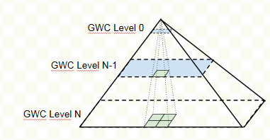
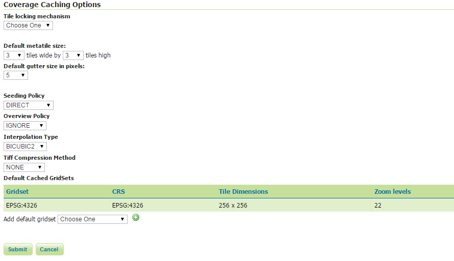

.. _community_gridcoveragecache:

GridCoverage Cache
==================

GridCoverage Cache is a module which allows to add a back-end GridCoverage caching layer to GeoServer.
Raster data composing GridCoverages will be cached in order to avoid repeated read accesses when serving same data. 
This will reduce time consumption needed to go to the fileSystem/remote disks to get the data bytes or access DB, 
perform subsampling/oversampling on the read data, assemble different pieces of different images to create the coverage 
(as for the ImageMosaic case).

GridCoverage caching is based on GWC capabilities so that features like Disk Quota control, REST seeding, custom blobStore specification are supported.
Cached GridCoverages catalog is stored into a separate folder (Standard GWC layers are stored inside *gwc-layers* folder on GEOSERVER_DATA_DIR whilst cached GridCoverage layers are stored inside *gwc-layers2* by default, which can be changed through applicationContext).
Moreover, cached GridCoverage layers aren't advertised as standard GWC layers so they won't be reported in the *TileLayers* section of the GeoServer GUI).

Installing the GridCOverage Cache extension
-------------------------------------------

 #. Download the extension from the `nightly GeoServer community module builds <http://ares.opengeo.org/geoserver/master/community-latest/>`_.

    .. warning:: Make sure to match the version of the extension to the version of the GeoServer instance!

 #. Extract the contents of the archive into the ``WEB-INF/lib`` directory of the GeoServer installation.

Configuration and usage
-----------------------
Once installed, a new panel will be available when configuring a layer (you can find it as an additional last tab after the standard *Data, Publishing, Dimensions and Tile Caching*) in order to customize the GridCoverage caching support:

  .. figure:: images/rastercachetab.png
    :align: center

Note that the Tile Caching panel is related to the standard GWC tile caching mechanism (which caches served rendered tiles) whilst the Raster Caching panel is related to the new capabilities for caching the raw GridCoverages data. Access to raw data is internally performed through WCS2.0 requests.

Once selected that tab, a panel to customize the GridCoverage caching parameters will be provided.

  .. figure:: images/rastercachegui.png
    :align: center

Some configuration parameters are the same provided to configure traditional GWC tile caching, such as MetaTiling factors, gutter, gridsets and parameter filters.
See more details on :ref:`default_metatile_size`.

New parameters are here described:

Seeding Policy
^^^^^^^^^^^^^^
Policy involved to create tiles. Available values are DIRECT/RECURSIVE.

.. list-table::
   :widths: 20 80

   * - **Option**
     - **Description**
   * - ``DIRECT``
     - The requested tile will be provided by sending a WCS2.0 request specifying proper envelope and scaling factors to match the request. 
   * - ``RECURSIVE``
     - The requested tile at level K will be computed on top of the 4 tiles coming from level K+1 having better resolution. In case a tile from level K+1 is not available yet, it will be computed on top of the 4 tiles coming from level K+2 and so on... See the next figure.

Overview Policy
^^^^^^^^^^^^^^^
In case the format serving the GridCoverage data (GeoTIFF, imageMosaic, ...) does support overviews, this parameter allows to customize the policy to be used to decide which overviews should be used to serve that request. The overviewPolicy will be specified as parameter of the WCS request to be propagated to the underlying reader.

.. list-table::
   :widths: 20 80

   * - **Option**
     - **Description**
   * - ``IGNORE``
     - Ignore the overviews.
   * - ``NEAREST``
     - Choose the overview with with the resolution closest to the one used for rendering.
   * - ``QUALITY``
     - Choose the overview with the lower (better) resolution among the ones with higher resolution than one used for rendering.
   * - ``SPEED``
     - Choose the overview with the higher (worse) resolution among the ones with lower resolution than one used for rendering.

Resampling Algorithm
^^^^^^^^^^^^^^^^^^^^^
Interpolation to be used by WCS processing operation to produce the requested tile.

Compression
^^^^^^^^^^^
All raw data is stored as a TIFF file. This parameter allows to specify a compression parameter to be used when storing TIFFs. Supported values are NONE, LZW, DEFLATE, JPEG

Seeding
-------
The Raster Caching panel also provides a link to the seeding REST interface. Once you have configured all the parameters you can click on *apply Modifications* button so that the specified configuration parameters are stored. After that the link *seed/truncate* will be enabled so that you can click it and be redirect to the standard GWC seeding REST interface. More information are available at :ref:`gwc_seeding`. 
In case you are using a Recursive seeding policy and your dataset is a big one (~GB) and your gridset has a high number of levels, please make sure to start doing seeding from last level N and then re-apply seeding to N-1 and so on.

Global Configuration
-----------------------
As you may notice after installing the plugin, another section in the *Caching Defaults* page has appeared. This section can be used for configuring the default global values of the parameters described above. 

Current limitation
------------------
At the time of writing, if specifying more GridSets in the raster configuration, only the first one will be used when performing read operation.
A vendor parameter will be added to instruct the reader to perform caching using a specific gridSet.
