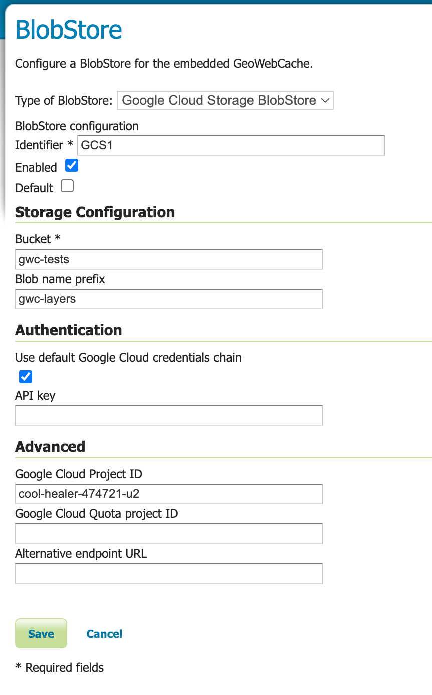

.. _community_gcs_tilecache:

GWC Google Cloud Storage BlobStore plugin
=========================================
This plugin supports the use of `Google Cloud Storage <https://cloud.google.com/storage>`_ as a storage medium for :ref:`gwc_webadmin`.

Installing the Google Cloud Storage BlobStore plugin
----------------------------------------------------

 #. Download the extension from the `nightly GeoServer community module builds <https://build.geoserver.org/geoserver/main/community-latest/>`_.

    .. warning:: Make sure to match the version of the extension to the version of the GeoServer instance!

 #. Extract the contents of the archive into the ``WEB-INF/lib`` directory of the GeoServer installation.

Configuring the Google Cloud Storage BlobStore plugin
-----------------------------------------------------

Once the plugin has been installed, one or more GCS BlobStores may be configured through :ref:`gwc_webadmin_blobstores`.
Afterwards, cached layers can be explicitly assigned to it or one blobstore could be marked as 'default' to use it for all unassigned layers.

Configuration Parameters
------------------------

Bucket
~~~~~~
**Required.** The name of the Google Cloud Storage bucket where the tiles will be stored.

Prefix
~~~~~~
**Optional.** A prefix path to use as the root to store tiles under the bucket. If unset, the cache operates at the bucket's root.

Google Cloud Project ID
~~~~~~~~~~~~~~~~~~~~~~~

**Optional.** The Google Cloud project ID associated with the bucket.

When using **Application Default Credentials** (see below), this parameter is typically optional as the project ID can be automatically inferred from the service account credentials. However, it may be required in some authentication scenarios.

Google Cloud Quota Project ID
~~~~~~~~~~~~~~~~~~~~~~~~~~~~~~
**Optional.** The ID of the project to bill for quota purposes when accessing a `Requester Pays bucket <https://cloud.google.com/storage/docs/requester-pays>`_.

This parameter is only needed when:

* The bucket has Requester Pays enabled
* The accessing principal needs to specify which project should be billed for data access charges

.. note::
   In this context, "Requester Pays" refers to GeoServer itself being charged for accessing the GCS bucket.
   End users fetching tiles from GeoServer do not interact directly with GCS and are not subject to any Google Cloud charges.

Alternative Endpoint URL
~~~~~~~~~~~~~~~~~~~~~~~~
**Optional.** A custom GCS endpoint URL for use with the `GCS Storage Emulator <https://github.com/fsouza/fake-gcs-server>`_ or GCS-compatible services.

Example: ``http://localhost:4443``

Authentication
--------------

The plugin supports three authentication methods, applied in the following priority order:

API Key
~~~~~~~
**Optional.** A Google Cloud API key for authentication. When provided, this method takes precedence over all others.

.. note::
   API keys have limited capabilities with Google Cloud Storage and may only work for public buckets or with specific API restrictions. For production use, Application Default Credentials with service accounts is the recommended approach.

Use Default Google Cloud Credentials Chain
~~~~~~~~~~~~~~~~~~~~~~~~~~~~~~~~~~~~~~~~~~~
**Optional.** When enabled, the plugin will use `Application Default Credentials <https://cloud.google.com/docs/authentication/application-default-credentials>`_.

This is the **recommended authentication method** for production environments. Application Default Credentials automatically discover credentials from:

1. The ``GOOGLE_APPLICATION_CREDENTIALS`` environment variable pointing to a service account key file
2. Service account credentials attached to the compute instance (when running on Google Cloud)
3. User credentials from ``gcloud auth application-default login`` (for local development)

Anonymous Access
~~~~~~~~~~~~~~~~
If neither an API key nor the credentials chain is configured, the client will attempt anonymous access. This only works for public buckets with public read access.

Authentication Examples
-----------------------

Using a Service Account Key File
~~~~~~~~~~~~~~~~~~~~~~~~~~~~~~~~~

1. Create a service account in your Google Cloud project with appropriate permissions (e.g., ``Storage Object Admin``)
2. Download the service account key as a JSON file
3. Set the environment variable before starting GeoServer:

   .. code-block:: bash

      export GOOGLE_APPLICATION_CREDENTIALS=/path/to/service-account-key.json

4. Check **Use Default Google Cloud Credentials Chain** in the blob store configuration

Using Compute Engine Service Account
~~~~~~~~~~~~~~~~~~~~~~~~~~~~~~~~~~~~~

When running GeoServer on Google Cloud (GCE, GKE, Cloud Run, etc.):

1. Ensure the compute instance has a service account attached with appropriate storage permissions
2. Check **Use Default Google Cloud Credentials Chain** in the blob store configuration
3. The **Google Cloud Project ID** and **Google Cloud Quota Project ID** will be automatically inferred if not specified

Using an API Key (Limited Use)
~~~~~~~~~~~~~~~~~~~~~~~~~~~~~~~

1. Create an API key in the Google Cloud Console
2. Restrict the API key to the Cloud Storage JSON API
3. Enter the API key in the **API Key** field
4. Note that this method has limited functionality and is not recommended for production

Implementation Notes
--------------------

* The blob store uses the TMS key structure for organizing tiles: ``[prefix]/<layer>/<gridset>/<format>/<params>/<z>/<x>/<y>.<ext>``
* Tile deletions are performed asynchronously using a background thread pool and the GCS batch API for optimal performance
* When a layer or gridset is removed, the corresponding tiles are deleted in batches of up to 1000 objects per request
* All configuration properties support environment variable expansion using the ``${VARIABLE_NAME}`` syntax

.. note::

   Unlike AWS S3, Google Cloud Storage access control is managed at the bucket or object level through IAM policies.
   If you want to build a public tile cache that can be directly accessed by clients as static files, configure the
   bucket with public read access and fully seed the cache.
