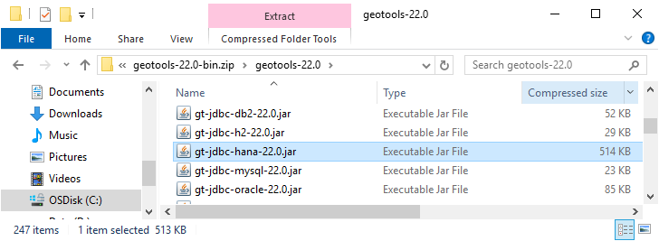
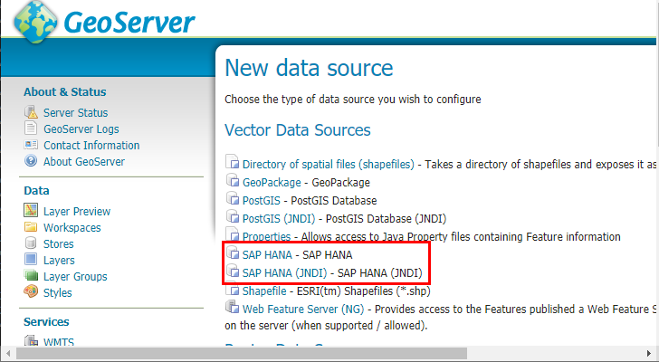

.. _community_hana:

SAP HANA
========

Supported versions
------------------

The module supports HANA 1 SPS 12 and all HANA 2 versions including the `free express edition <https://www.sap.com/sap-hana-express>`_.

.. _hana_install:

Installing SAP HANA support
---------------------------

GeoServer has no built-in support for SAP HANA. You can enable SAP HANA support by adding the HANA GeoTools module and the HANA JDBC driver to your GeoServer installation.

Installing the HANA GeoTools module
```````````````````````````````````

Identify the GeoTools version your GeoServer installation is using by navigating to the :file:`webapps/geoserver/WEB-INF/lib/` folder in your GeoServer installation and locating the file :file:`gt-jdbc-{<version>}.jar` as shown in the image below. In the example below the GeoServer version is ``22.0``.

.. figure:: images/gt-version.png
   :align: center

   *Finding the GeoTools version*

Download the GeoTools archive with the version used by GeoServer from the `GeoTools website <https://geotools.org/>`_. You need the :file:`geotools-{<version>}-bin.zip` file. Copy the :file:`gt-jdbc-hana-{<version>}.jar` file to the :file:`webapps/geoserver/WEB-INF/lib/` folder of your GeoServer installation.



   *Locating the GeoTools HANA module*

Installing the HANA JDBC driver
```````````````````````````````

Browse to the `SAP Development Tools website <https://tools.hana.ondemand.com/#hanatools>`_ and download the JDBC component to the :file:`webapps/geoserver/WEB-INF/lib/` folder of your GeoServer installation.

.. figure:: images/ngdbc.png
   :align: center

   *Downloading ngdbc.jar from the SAP Development Tools website*

Afterwards restart your GeoServer instance.

Adding a SAP HANA database
--------------------------

After both modules have been installed, ``SAP HANA`` will show up as an option when creating a new data store.



   *HANA in the list of vector data sources*

Configuring a SAP HANA data store
---------------------------------

.. figure:: images/hana-options.png
   :align: center

   *Configuring a SAP HANA data store*

The following options are relevant for SAP HANA:

.. list-table::
   :widths: 20 80

   * - ``host``
     - The machine name or IP address to connect to.
   * - ``port``
     - The port to connect to. If set and different from 0, the parameters ``instance`` and ``database`` are ignored. If not set or 0, the ``instance`` parameter must be set.
   * - ``instance``
     - The instance to connect to. This parameter is ignored if a port is set. The ``instance`` field is at the bottom of the configuration form in case you have difficulties locating it.
   * - ``database``
     - The database to connect to. Leave empty in case of single-container databases. Set to ``SYSTEMDB`` to connect to the system database of a multi-container database. This parameter is ignored if a port is set.
   * - ``schema``
     - The database schema to access. If left blank, the user-specific database schema is accessed.
   * - ``user``
     - The database user used to connect to the database.
   * - ``passwd``
     - The password used to connect to the database.
   * - ``use ssl``
     - If checked the TLS/SSL cryptograhic protocol is used to establish a secure connection with the database.

