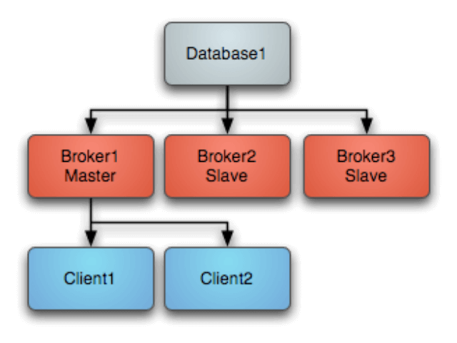
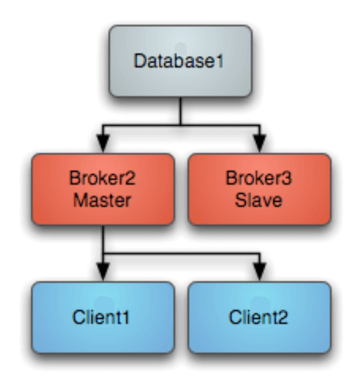
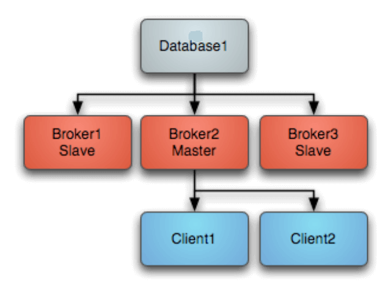

JDBC Master Slave
=================

If you are using pure JDBC and not using the high performance journal then you are generally relying on your database as your single point of failure and persistence engine. If you do not have really high performance requirements this approach can make a lot of sense as you have a single persistence engine to backup and manage etc.

Startup
-------

When using just JDBC as the data source you can use a Master Slave approach, running as many brokers as you wish as this diagram shows. On startup one master grabs an exclusive lock in the broker database - all other brokers are slaves and pause waiting for the exclusive lock.

Clients should be using the Failover Transport to connect to the available brokers. e.g. using a URL something like the following
failover:(tcp://broker1:61616,tcp://broker2:61616,tcp://broker3:61616)
Only the master broker starts up its transport connectors and so the clients can only connect to the master.

Master failure
--------------

If the master looses connection to the database or looses the exclusive lock then it immediately shuts down. If a master shuts down or fails, one of the other slaves will grab the lock and so the topology switches to the following diagram

One of the other other slaves immediately grabs the exclusive lock on the database to them commences becoming the master, starting all of its transport connectors.
Clients loose connection to the stopped master and then the failover transport tries to connect to the available brokers - of which the only one available is the new master.
Master restart
At any time you can restart other brokers which join the cluster and start as slaves waiting to become a master if the master is shutdown or a failure occurs. So the following topology is created after a restart of an old master...

Configuring JDBC Master Slave
-----------------------------

By default if you use the <jdbcPersistenceAdapter/> to avoid the high performance journal you will be using JDBC Master Slave by default. You just need to run more than one broker and point the client side URIs to them to get master/slave. This works because they both try an acquire an exclusive lock on a shared table in the database and only one will succeed.

The following example shows how to configure the ActiveMQ broker in JDBC Master Slave mode

.. code-block:: xml

  <beans>
  
    <!-- Allows us to use system properties as variables in this configuration file -->
    <bean class="org.springframework.beans.factory.config.PropertyPlaceholderConfigurer"/>
    
    <broker xmlns="http://activemq.apache.org/schema/core">
  
      <destinationPolicy>
	<policyMap><policyEntries>
	  
	    <policyEntry topic="FOO.>">
	      <dispatchPolicy>
		<strictOrderDispatchPolicy />
	      </dispatchPolicy>
	      <subscriptionRecoveryPolicy>
		<lastImageSubscriptionRecoveryPolicy />
	      </subscriptionRecoveryPolicy>
	    </policyEntry>
  
	</policyEntries></policyMap>
      </destinationPolicy>
    
    
      <persistenceAdapter>
	  <jdbcPersistenceAdapter dataDirectory="${activemq.base}/activemq-data"/>
  
	  <!-- 
	  <jdbcPersistenceAdapter dataDirectory="activemq-data" dataSource="#oracle-ds"/>
	  --> 
      </persistenceAdapter>
    
      <transportConnectors>
	<transportConnector name="default" uri="tcp://localhost:61616"/>
      </transportConnectors>
      
    </broker>
    
    <!--  This xbean configuration file supports all the standard spring xml configuration options -->
    
    <!-- Postgres DataSource Sample Setup -->
    <!-- 
    <bean id="postgres-ds" class="org.postgresql.ds.PGPoolingDataSource">
      <property name="serverName" value="localhost"/>
      <property name="databaseName" value="activemq"/>
      <property name="portNumber" value="0"/>
      <property name="user" value="activemq"/>
      <property name="password" value="activemq"/>
      <property name="dataSourceName" value="postgres"/>
      <property name="initialConnections" value="1"/>
      <property name="maxConnections" value="10"/>
    </bean>
    -->
    
    <!-- MySql DataSource Sample Setup -->
    <!-- 
    <bean id="mysql-ds" class="org.apache.commons.dbcp.BasicDataSource" destroy-method="close">
      <property name="driverClassName" value="com.mysql.jdbc.Driver"/>
      <property name="url" value="jdbc:mysql://localhost/activemq?relaxAutoCommit=true"/>
      <property name="username" value="activemq"/>
      <property name="password" value="activemq"/>
      <property name="poolPreparedStatements" value="true"/>
    </bean>
    -->  
      
    <!-- Oracle DataSource Sample Setup -->
    <!--
    <bean id="oracle-ds" class="org.apache.commons.dbcp.BasicDataSource" destroy-method="close">
      <property name="driverClassName" value="oracle.jdbc.driver.OracleDriver"/>
      <property name="url" value="jdbc:oracle:thin:@localhost:1521:AMQDB"/>
      <property name="username" value="scott"/>
      <property name="password" value="tiger"/>
      <property name="poolPreparedStatements" value="true"/>
    </bean>
    -->
	
    <!-- Embedded Derby DataSource Sample Setup -->
    <!-- 
    <bean id="derby-ds" class="org.apache.derby.jdbc.EmbeddedDataSource">
      <property name="databaseName" value="derbydb"/>
      <property name="createDatabase" value="create"/>
    </bean>
    -->  
  
  </beans>
