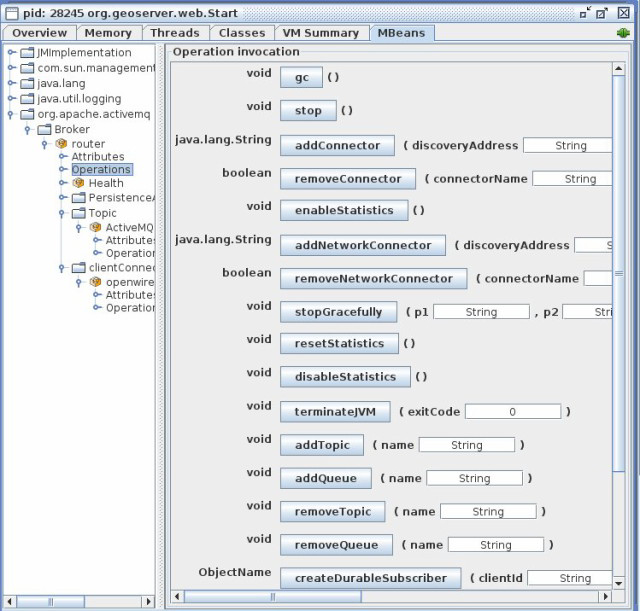

HOWTO configure ActiveMQ broker
===============================

Deploy the produced activemqBroker.war in your tomcat instance and check the extracted webapp. You may locate a file called activemq-jmx.properties which will help you to configure your instance with the most important paramenters.
Anyhow it is only an example and we encourage you to also check the ApplicationContext.xml file deployed to activemq/WEB-INF/classes/ApplicationContext.xml which is the complete configuration:

.. code-block:: xml

  ...
  <!-- The transport connectors expose ActiveMQ over a given protocol to 
	clients and other brokers. 
	For more information, see: http://activemq.apache.org/configuring-transports.html -->
  <transportConnectors>
	  <transportConnector name="openwire" uri="tcp://192.168.1.XXX:61616" />
  </transportConnectors>
  ...

Persistence Configuration
-------------------------
It is possible to enable persistence for messages that cannot be delivered right away (e.g. all consumers are down). Detailed information can be found here, we are simply going to provide basic information on how to achieve that.
To configure the persistence for the messages to deliver you need to setup the <persistenceAdapter> node in the same file as above and then configure a proper datasource in your DBMS of choice. 

.. code-block:: xml

  ...
  <persistenceAdapter>
  <!-- <kahaDB directory="${activemq.base}/data/kahadb"/> --> 
    <jdbcPersistenceAdapter dataDirectory="activemq-data" 
	  dataSource="#postgres-ds" lockKeepAlivePeriod="0"/>
  </persistenceAdapter>
  ...

In the above section we defined a jdbcPersistenceAdapter connected to a dataSource called #postgres-ds that forces the broker to use PostgreSQL for persisting its messages when the delivery cannot be guaranteed (e.g. a slave goes down unexpectedly).
You now need to configure your own datasource as specified in the following section which are specific for different DBMS.

Oracle datasource
^^^^^^^^^^^^^^^^^

To configure the broker to use an oracle database as datasource you need to uncomment and modify the following peace into the ApplicationContext.xml file:

.. code-block:: xml

  ...
  <bean id="oracle-ds" class="org.apache.commons.dbcp.BasicDataSource" destroy-method="close">
    <property name="driverClassName" value="oracle.jdbc.driver.OracleDriver"/>
    <property name="url" value="jdbc:oracle:thin:@localhost:1521:AMQDB"/>
    <property name="username" value="oracle"/>
    <property name="password" value=" oracle "/>
    <property name="poolPreparedStatements" value="true"/>
  </bean>
  ...

In addition, you need to make sure that the jar containing the driver for Oracle is correctly deployed inside the WEB-INF/lib for the activemq war file. At the same time the database referred in provided instructions as well as the user must be already present.

Postgres datasource
^^^^^^^^^^^^^^^^^^^

Configuring PostgreSQL as the datasource to use for the persistence of the messages for the ActiveMQ broker follows the same pattern as above. See below for some examples.

.. code-block:: xml

  ...
  <bean id="postgres-ds" class="org.postgresql.ds.PGPoolingDataSource">
	  <property name="serverName" value="192.168.1.XXX"/>
	  <property name="databaseName" value="activemq"/>
	  <property name="portNumber" value="5432"/>
	  <property name="user" value="postgres"/>
	  <property name="password" value="postgres"/>
	  <property name="dataSourceName" value="postgres"/>
	  <property name="initialConnections" value="15"/>
	  <property name="maxConnections" value="30"/>
  </bean>
  ...

.. note::
  The above ApplicationContext.xml file contains some unused sections which are intentionally commented out to show different types of configurations [Ref. ActiveMQ].

Kaha datasource (Embedded database)
^^^^^^^^^^^^^^^^^^^^^^^^^^^^^^^^^^^
Besides using server DBMS as indicated above we can use embedded database for simpler uses cases of demoing since this usually largely simplify the configuration. At this link all the information needed for achieving this result can be found; basically we need to uncomment the related datasource and then reference it from the persistenceAdapter.

Control instances using JMX
---------------------------

Be sure to edit the activemq-jmx.properties (or via the environment variables) setting different JMX ports for different broker instances.
Deploy as explained the instances into 2 different webapplication container (f.e. Tomcat) and start both application (on different port f.e. 8081 and 8082).
Now run jconsole to connect to the brokers via JMX:

${JAVA_HOME}/bin/jconsole

After you connect to the brokers you may see something like this:

.. figure:: images/master_slave_jmx_1.png
   :align: center
   
You may look at the console, as you can see the 2nd instance of the broker cannot take the look on the file (the example uses KahaDB); this is also visible in the JMX console into the widhow on the right side.

If now you select the 'operation' (on the left side window) you will see:

   
Using that console we are able to perform many operation, so to simulate a broker down we try to click on the 'stop()' button.

Doing so, the first broker instance will stop and the JMX connection will be closed, and the second instance (on the right side) will keep the control of the DB.

.. figure:: images/master_slave_jmx_3.png
   :align: center

.. figure:: images/master_slave_jmx_4.png
   :align: center
