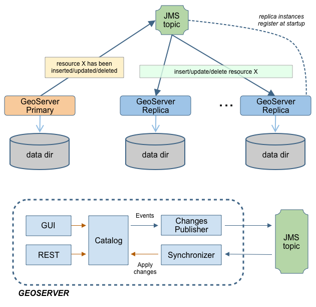
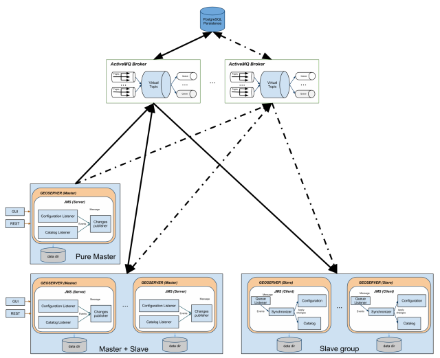

JMS based Clustering
==================== 

Introduction
------------

The are several approaches to implement a clustered deployment  with GeoServer, based on different mixes of data directory sharing plus configuration reload. 
The JMS based clustering module architecture is depicted in the following diagram:

This module implements a robust Master/Slave approach which leverages on a Message Oriented Middleware (MOM) where:

  * The Masters accept changes to the internal configuration, persist them on their own data directory but also forward them to the Slaves via the MOM
  * The Slaves should not be used to change  their configuration from either REST or the User Interface, since are configured to inject configuration changes disseminated by the Master(s) via the MOM
  * The MOM is used to make the Master and the Slave exchange messages in a durable fashion
  * Each Slave has its own data directory and it is responsible for keeping it aligned with the Master's one. In case a Slave goes down when it goes up again he might receive a bunch of JMS messages to align its configuration to the Master's one.
  * A Node can be both Master and Slave at the same time, this means that we don't have a single point of failure, i.e. the Master itself

Summarizing, the Master as well as each Slave use a private data directory, Slaves receive changes from the Master, which is the only one where configuration changes are allowed, via JMS messages. Such messages transport GeoServer configuration objects that the Slaves inject directly in their own in-memory configuration and then persist on disk on their data directory, completely removing the need for a configuration reload for each configuration change.

To make things simpler, in the default configuration the MOM is actually embedded and running inside each
GeoServer, using multicast to find its peers and thus allowing for a clustering installation without
the need to have a separate MOM deploy.

Description
-----------

The GeoServer Master/slave integration is implemented using JMS, Spring and a MOM (Message Oriented Middleware), in particular ActiveMQ.
The schema in Illustration  represents a complete high level design of Master/Slave platform.
It is composed by 3 distinct actors:

1. GeoServer Masters
2. GeoServer Slaves
3. The MOM (ActiveMQ)

This structure allows to have:

1. Queue fail-over components (using MOM).
2. Slaves down are automatically handled using durable topic (which will store message to re-synch changes happens if one of the slaves is down when the message was made available)
3. Master down will not affect any slave synchronization process.

This full blown deployment is composed by:

* A pure Master GeoServer(s), this instance can only send events to the topic. It cannot act as a slave
* A set of GeoServer which can work as both Master and Slave. These instances can send and receive messages to/from the topic. They can work as Masters (sending message to other subscribers) as well as Slaves (these instances are also subscribers of the topic).
* A set of pure Slaves GeoServer instances whic can only receive messages from the topic.
* A set of MOM brokers so that each GeoServer instance is configured with a set of available brokers (failover). Each broker use the shared database as persistence. Doing so if a broker fails for some reason, messages can still be written and read from the shared database.

All the produced code is based on spring-jms to ensure portability amongst different MOM, but if you look at the schema, we are also leveraging ActiveMQ VirtualTopics to get dinamic routing (you can dinamically attach masters and slaves).

The VirtualTopics feature has also other advantages explained here: http://activemq.apache.org/virtual-destinations.html

As said above, in the default configuration the MOM runs inside GeoServer itself, simplifying the topology and
the setup effort.

Installation
^^^^^^^^^^^^

To install the jms cluster modules into an existing GeoServer refer to the :ref:`jms.installation` page 

How to configure GeoServer Instances
------------------------------------

The configuration for the GeoServer is very simple and can be performed using the provided GUI or modifying the ``cluster.properties`` file which is stored into the ``GEOSERVER_DATA_DIR`` under the ``cluster`` folder (e.g. ``${GEOSERVER_DATA_DIR}/cluster``).
 
To override the default destination of this configuration file you have to setup the **CLUSTER_CONFIG_DIR** variable defining the destination folder of the **cluster.properties** file.
This is *mandatory* when you want to share the same GEOSERVER_DATA_DIR, but not required if you are giving each GeoServer its own data directory.

In case of shared data directory, it will be necessary to add a different system variable to each JVM running a GeoServer, e.g.:

* ``-DCLUSTER_CONFIG_DIR=/var/geoserver/clusterConfig/1`` to the JVM running the first node 
* ``-DCLUSTER_CONFIG_DIR=/var/geoserver/clusterConfig/2`` to the JVM running the second node
* and so on

If the directories are missing, GeoServer will create them and provide a initial ``cluster.properties``
with reasonable defaults.

Instance name
-------------
The instance.name is used to distinguish from which GeoServer instance the message is coming from, so each GeoServer instance should use a different, unique (for a single cluster) name.

Broker URL
----------
The broker.url field is used to instruct the internal JMS machinery where to publish messages to (master GeoServer installation) or where to consume messages from (slave GeoServer installation). Many options are available for configuring the connection between the GeoServer instance and the JMS broker, for a complete list, please, check http://activemq.apache.org/configuring-transports.html. In case when (recommended) failover set up  is put in place multiple broker URLs can be used. See http://activemq.apache.org/failover-transport-reference.html for more information about how to configure that.
Note
GeoServer will not complete the start-up phase until the target broker is correctly activated and reachable.

Limitations and future extensions
---------------------------------

Data
^^^^
NO DATA IS SENT THROUGH THE JMS CHANNEL
The clustering solution we have put in place is specific for managing the GeoServer internal configuration, no data is transferred between master and slaves. For that purpose use external mechanisms (ref. [GeoServer REST]). 
In principle this is not a limitation per se since usually in a clustered environment data is stored in shared locations outside the data directory. With our solution this is a requirement since each slave will have its own private data directory.

Things to avoid
^^^^^^^^^^^^^^^
* **NEVER RELOAD THE GEOSERVER CATALOG ON A MASTER**: Each master instance should never call the catalog reload since this propagates the creation of all the resources, styles, etc to all the connected slaves.
* **NEVER CHANGE CONFIGURATION USING A PURE SLAVE**: This will make the configuration of the specific slave out of synch with the others.

Refs:
-----

.. toctree:: 

   installation
   activemq/activemqBroker
   activemq/JDBC
   activemq/SharedFolder

Bibliography:
-------------

[JMS specs]
Sun microsystens - Java Message Service - Version 1.1 April 12, 2002

[JMS]
Snyder Bosanac Davies - ActiveMQ in action - Manning

[GeoServer]
http://docs.geoserver.org/

[GeoServer REST]
http://docs.geoserver.org/latest/en/user/rest/index.html#rest

[ActiveMQ]
http://activemq.apache.org/
