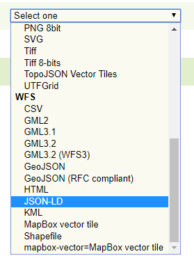

JSON-LD Output Format
============================

JSON-LD Output Format
---------------------

In order to obtain a json-ld output format, request's media type must be specified as "application/ld+json".
From Geoserver UI it is possible to have a preview of the format by choosing JSON-LD format by the layer preview page.

   Dropdown menu in Layer preview page.

If OGC Feature API extension is enabled the output format is available from the collection page as well.

.. figure:: images/json-ld_wfs3.png

   Dropdown menu in OGC Feature API collection page.

The output, given the template file showed in the configuration section, will look like 

.. code-block:: json

  {
    "@context": {
        "gsp": "http://www.opengis.net/ont/geosparql#",
        "sf": "http://www.opengis.net/ont/sf#",
        "schema": "https://schema.org/",
        "dc": "http://purl.org/dc/terms/",
        "Feature": "gsp:Feature",
        "FeatureCollection": "schema:Collection",
        "Point": "sf:Point",
        "wkt": "gsp:asWKT",
        "features": {
            "@container": "@set",
            "@id": "schema:hasPart"
        },
        "geometry": "sf:geometry",
        "description": "dc:description",
        "title": "dc:title",
        "name": "schema:name"
    },
    "type": "FeatureCollection",
    "features": [
        {
            "@id": "mf2",
            "@type": [
                "Feature",
                "gsml:MappedFeature",
                "http://vocabulary.odm2.org/samplingfeaturetype/mappedFeature"
            ],
            "name": "MERCIA MUDSTONE GROUP",
            "gsml:positionalAccuracy": {
                "value": "100.0"
            },
            "gsml:GeologicUnit": {
                "@id": "gu.25678",
                "description": "Olivine basalt, tuff, microgabbro, minor sedimentary rocks",
                "gsml:geologicUnitType": "urn:ogc:def:nil:OGC::unknown",
                "gsml:composition": [
                    {
                        "gsml:compositionPart": [
                            {
                                "gsml:role": {
                                    "value": "interbedded component",
                                    "@codeSpace": "urn:cgi:classi..."
                                },
                                "proportion": {
                                    "@dataType": "CGI_ValueProperty",
                                    "CGI_TermValue": {
                                        "@dataType": "CGI_TermValue",
                                        "value": {
                                            "value": "significant",
                                            "@codeSpace": "some:uri"
                                        }
                                    }
                                },
                                "lithology": [
                                    {
                                        "@id": "cc.3",
                                        "name": {
                                            "value": "name_cc_3",
                                            "@lang": "en"
                                        },
                                        "vocabulary": {
                                            "@href": "urn:ogc:def:nil:OGC::missing"
                                        }
                                    }
                                ]
                            }
                        ]
                    },
                    {
                        "gsml:compositionPart": [
                            {
                                "gsml:role": {
                                    "value": "interbedded component",
                                    "@codeSpace": "urn:cgi:class..."
                                },
                                "proportion": {
                                    "@dataType": "CGI_ValueProperty",
                                    "CGI_TermValue": {
                                        "@dataType": "CGI_TermValue",
                                        "value": {
                                            "value": "minor",
                                            "@codeSpace": "some:uri"
                                        }
                                    }
                                },
                                "lithology": [
                                    {
                                        "@id": "cc.4",
                                        "name": {
                                            "value": "name_cc_4",
                                            "@lang": "en"
                                        },
                                        "vocabulary": {
                                            "@href": "urn:ogc:def:nil:OGC::missing"
                                        }
                                    }
                                ]
                            }
                        ]
                    }
                ],
                "geometry": {
                    "@type": "Polygon",
                    "wkt": "POLYGON ((52.5 -1.3, 52.6 -1.3, 52.6 -1.2,...))"
                }
            }
        }
    ]
    }
