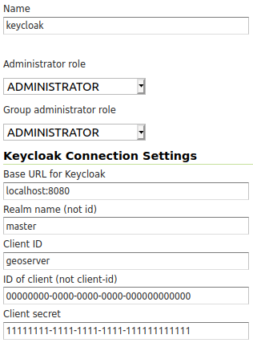

.. _security_tutorials_keycloak_role_service:

Keycloak Role Service
=====================

This tutorial walks through how to set up Keycloak as a role service for GeoServer.

.. note:: In this example the Keycloak service runs on port `8080` while GeoServer runs on port `8181`

Keycloak Client Configuration
-----------------------------

Follow the `Authentication with Keycloak <https://docs.geoserver.org/latest/en/user/community/keycloak/index.html>`_
guide to configure GeoServer to allow logging in via Keycloak. Two clients will need to be configured - one with the
confidential access type, and another with the public access type. Only one authentication filter is required, and it is
recommended to use the confidential client.

For both clients, ensure that:

* Standard flow, implicit flow, and direct access grants are enabled
* The base URL is set to ``http://localhost:8181/geoserver/web``
* The following redirect URIs are enabled:

  * ``http://localhost:8181/geoserver*``
  * ``http://localhost:8080/auth/realms/master/broker/keycloak-oidc/endpoint*``

For the public client, additionally ensure that:

* The access type is set to **public**
* The redirect URI ``http://localhost:8181/*`` is enabled
* Web origins is set to ``*``

For the confidential client, additionally ensure that:

* The access type is set to **confidential**
* Service accounts are enabled
* Under the Service Account Roles tab, the **realm** role "admin" is assigned

Under the Roles tab of the confidential client, create a ``ROLE_ADMINISTRATOR`` role. For any user that should have
administrative privileges in GeoServer, assign them the ``ROLE_ADMINISTRATOR`` role.

.. figure:: images/role_service/keycloak_client001.png
   :align: center

   *An example set of roles for GeoServer-client, with all required roles and an additional staff role.*

To assign a user a role:

#. Under the users section in Keycloak, click the user's ID (if there are missing users, click "View all users").
#. In the role mappings tab, select the GeoStore client from the client roles dropdown.
#. Select the ``ROLE_ADMINISTRATOR`` role from the available roles, and click add selected.

.. figure:: images/role_service/keycloak_client002.png
   :align: center

   *An example set of role mappings for a user who should be an administrator and staff in GeoServer.*

When creating custom roles, ensure they begin with ``ROLE_`` e.g. ROLE_STAFF.

GeoServer Configuration for Role Syncing
----------------------------------------
Role syncing with Keycloak will be tied to the confidential client.

#. In GeoServer as an admin, on the 'Users, Groups, Roles' page, add a new role service.
#. Select Keycloak from the list of provided options. All fillable fields are required, excluding the administrator and group administrator role dropdowns, which should initially have no options.

   * Base URL for Keycloak e.g. http://localhost:8080
   * The ID of the client may be retrieved from the URL when viewing the GeoServer client in Keycloak. URL format: ``/auth/admin/master/console/#/realms/master/clients/{ID of client}``
   * The client secret is under the GeoServer client's credentials tab in Keycloak

#. Ensure you click save to create the Keycloak role service.
#. Once the role service has been created, open the role service again and assign the administrator and group administrator roles to ``ADMINISTRATOR``.
#. On the 'Security Settings' page, set the active role service to be the Keycloak role service

   *An example of a fully configured Keycloak role service.*

GeoServer Configuration for Keycloak Authentication Filters
-----------------------------------------------------------
Under the Authentication section of GeoServer:

* Add the Keycloak authentication filter to the top of the web and default filter chains.
* Add geofence to the selected provider chains, and place it above the default.
