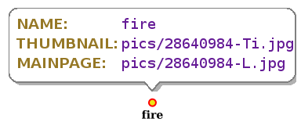

.. _labeling-module:

Attributes labeling module
==========================

The Attributes labeling module introduces to GeoServer the ability of generate text globes with selected attributes names and values for selected features (via filtering) in the WMS GetMap requests.  It handles a set of per-layer settings on the RENDERLABEL vendor parameter and extra visual settings on the style ExternalGraphic URL parameters.  It can draw the attributes globes without the need of a predefined style.  In its current state, attributes labeling only supports point geometries.

Installing the Plug-in
----------------------

As a community module, the package needs to be downloaded from the nightly builds, picking the community folder of the corresponding GeoServer series (e.g. if working on GeoServer master nightly builds, 
pick the zip file form master/community-latest). The module is only supported in GeoServer 2.17 and later on.

To install the module, unpack the zip file contents into GeoServer own WEB-INF/lib directory and restart GeoServer.

Configuring attributes labeling
-------------------------------

The configuration is SLD based, adding a Rule, PointSymbolizer, Graphic and ExternalGraphic elements tree into the style XML definition.  The most basic configuration is defined in this example:

.. code-block:: xml

         <Rule>
          <PointSymbolizer>
            <Graphic>
              <ExternalGraphic>
                <OnlineResource xlink:type="simple" xlink:href="http://localhost" />
                <Format>geoserver/label</Format>
              </ExternalGraphic>
            </Graphic>
          </PointSymbolizer>
        </Rule>

Analyzing this style rule example, we can see two key arguments:

* **OnlineResource/xlink:href:** Is an standard local not used URL for passing visual settings only on its query parameters.
* **Format:** Is the format required for the attribute labeling module, *geoserver/label* format is mandatory.

Some visual setting can be added to the local URL in the query parameters for example:

.. code-block:: xml

         <Rule>
          <PointSymbolizer>
            <Graphic>
              <ExternalGraphic>
                <OnlineResource xlink:type="simple" xlink:href="http://localhost?fontSize=18;titleColorCode=967826;valueColorCode=651b96;titleFontName=SansSerif;valueFontName=Monospaced" />
                <Format>geoserver/label</Format>
              </ExternalGraphic>
            </Graphic>
          </PointSymbolizer>
        </Rule>

The available visual setting are:

* `fontSize:` The font size used font the attribute names and values.  It's an integer value.
* `titleFontName:` The Font name for attribute titles.
* `valueFontName:` The Font name for attribute values.
* `titleColorCode:` The hexadecimal RGB color code for attribute titles.
* `valueColorCode:` The hexadecimal RGB color code for attribute values.
* `roundCornerRadius:` The integer size for the globe corner radius.  It's an integer value.
* `maxValueChars:` The maximun chars number allowed in attribute values. It's an integer value.
* `interLineSpace:` The number of pixels between text lines.  It's an integer value.
* `margin:` The globe margin with the inner text. It's an integer value.
* `tailHeight:` The height size in pixels for the globe tail. It's an integer value.
* `tailWidth:` The width size in pixels for the globe tail. It's an integer value.

Calling the attributes labeling rendering in WMS GetMap
-------------------------------------------------------

For rendering the attributes labels, the use of *RENDERLABEL* vendor parameter is required on WMS GetMap requests.  The *RENDERLABEL* parameter layer setting has the following syntax:

    ``RENDERLABEL={WORKSPACE:LAYER_NAME};{CQL_FILTER};{ATTRIBUTE_1},{ATTRIBUTE_2},{ATTRIBUTE_N}|{WORKSPACE:LAYER_NAME_2};{CQL_FILTER_2};{ATTRIBUTE_1},{ATTRIBUTE_2},{ATTRIBUTE_N}``

A single layer example:

    ``RENDERLABEL=tiger:poi;INCLUDE;NAME,THUMBNAIL,MAINPAGE``
	
A multi layer example:

    ``RENDERLABEL=tiger:poi;INCLUDE;NAME,THUMBNAIL,MAINPAGE|st:stations;gid IN (1);GID,CODE``

A complete WMS GetMap request example:

    ``http://localhost:8080/geoserver/tiger/wms?SERVICE=WMS&VERSION=1.1.1&REQUEST=GetMap&FORMAT=image%2Fpng&TRANSPARENT=true&LAYERS=tiger%3Apoi&exceptions=application%2Fvnd.ogc.se_inimage&SRS=EPSG%3A4326&STYLES=&WIDTH=642&HEIGHT=769&BBOX=-74.0207540988779,40.692669153227804,-73.99323821069241,40.72563529013157&RENDERLABEL=tiger%3Apoi%3BINCLUDE%3BNAME,THUMBNAIL,MAINPAGE``

Output WMS image example:

