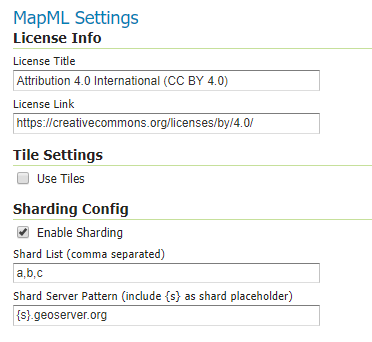

.. _mapml:

MapML 
=========

Map Markup Language (MapML) is a text-based format which allows map authors to encode map information as hypertext documents exchanged over the Uniform Interface of the Web. The format definition is still a work-in-progress by the Maps for HTML W3C Community Group, but various tools to work with the format already exist, including a Leaflet-based map viewer. For more information on MapML refer to the `Maps for HTML Community Group <https://maps4html.github.io/>`_.

The MapML module for GeoServer adds new MapML resources to access WMS and WFS services configured in Geoserver. The MapML modules includes support for styles, tiling, querying, sharding, and dimensions options for WMS layers, and also provides a MapML outputFormat for WMS GetFeatureInfo and WFS GetFeatures requests. See below for information on installing and configuring the MapML module.

Installation
--------------------

#. Download the MapML extension from the `nightly GeoServer community module builds <https://build.geoserver.org/geoserver/master/community-latest/>`_.

   .. warning:: Make sure to match the version of the extension to the version of the GeoServer instance.

#. Extract the contents of the archive into the ``WEB-INF/lib`` directory of the GeoServer installation.

Configuration
-------------

Configuration can be done using the Geoserver administrator GUI. The MapML configuration is accessible in the *MapML Settings* section under the *Publishing* tab of the Layer or Layer Group Configuration page for the layer or layer group being configured. Here is the MapML Settings section, with some example values filled in:

License Info
^^^^^^^^^^^^

Together these two attributes all the administrator to define the contents of the ``<link rel=license>`` element in the MapML header. Here is an example of the resulting XML:

  <link href="https://creativecommons.org/licenses/by/4.0/" rel="license" title="Attribution 4.0 International (CC BY 4.0)"/>

**License Title**
  The License Title will be included as the value of ``title`` attribute of the ``<link rel=license>`` element in the MapML header.

**License Link**
  The License Link will be included as the value of ``href`` attribute of the ``<link rel=license>`` element in the MapML header, and should be a valid URL referencing the license document.

Tile Settings
^^^^^^^^^^^^^

Using tiles to access the layer can increase the performance of your web map. This is especially true if there is a tile cache mechanism in use between GeoServer and the browser client.

**Use Tiles**
  If the "Use Tiles" checkbox is checked, by default the output MapML will define a tile-based reference to the WMS server. Otherwise, an image-based reference will be used.  If one or more of the MapML-defined GridSets is referenced by the layer or layer group in its "Tile Caching" profile, GeoServer will generate tile references instead of generating WMS GetMap URLs in the MapML document body.

Tile Caching
^^^^^^^^^^^^

In the Tile Caching tab panel of the Edit Layer or Edit Layer Group page, at the bottom of the page you will see the table of GridSets that are assigned to the layer or layer group.  The values "WGS84" and "OSMTILE" are equivalent to the EPSG:4326 and EPSG:900913 built in GeoWebCache GridSets. However, for the MapML module to recognize these GridSets, you must select and use the MapML names.   For new layers or layer groups, or newly created grid subsets for a layer or layer group, the MapML values are selected by default.  For existing layers that you wish to enable the use of cached tile references by the MapML service, you will have to select and add those values you wish to support from the dropdown of available GridSets.  The set of recognized values for MapML is "WGS84" (equivalent to EPSG:4326), "OSMTILE" (equivalent to EPSG:900913), "CBMTILE" (Canada Base Map) and "APSTILE" (Alaska Polar Stereographic).

.. figure:: images/mapml_tile_caching_panel_ui.png

Sharding Config
^^^^^^^^^^^^^^^^

The Sharding Config options are intended to allow for parallel access to tiles via different server names. The actual server names must be configured in the DNS to refer to either the same server or different servers with the same GeSserver layer configuration. In the example above, the mapML client would alternate between the servers a.geoserver.org, b.geoserver.org, and c.geoserver.org to access the the map images. The values in the example above would result in the following MapML:  

.. code-block:: html

    <input name="s" type="hidden" shard="true" list="servers" min="0.0" max="0.0"/>
    <datalist id="servers">
        <option value="a"/>
        <option value="b"/>
        <option value="c"/>
    </datalist>
    <link tref="http://{s}.geoserver.org:8080/geoserver/test/wms?version=1.3.0&amp;service=WMS&amp;request=GetMap&amp;crs=EPSG:3857&amp;layers=cntry00&amp;styles=&amp;bbox={xmin},{ymin},{xmax},{ymax}&amp;format=image/png&amp;transparent=false&amp;width={w}&amp;height={h}" rel="image"/>

**Enable Sharding**
  If Enable Sharding is checked, and values are provided for the Shard List and Shard Server Pattern fields, then a hidden shard list input will be included in the MapML. 
  
**Shard List**
  If Enable Sharding is checked, the Shard List should be populated with a comma-separated list of shard names which will be used to populate the shard data list element.
  
**Shard Server Pattern**
  The Shard Server Pattern should be a valid DNS name including the special placeholder string {s} which will be replace with the Shard Names from the Shard List in requests to the server. This pattern should not include any slashes, the protocol string (http://) or the port number (:80), as these are all determined automatically from the URL used to access the MapML resource.  

Dimension Config
^^^^^^^^^^^^^^^^

**Dimension**
  The selected dimension (if any) is advertised in the mapml as an input with the appropriate value options or ranges, as configured in the *Dimension* tab of the Layer Configuration page. Only dimensions enabled in the *Dimension* tab are available as options.

MapML Resources
---------------

MapML resources will be published for any published WMS layers. The MapML resources will be available at::

  http://{serverName}/geoserver/mapml/{layerName}/{projectionName}?style={styleName}&transparent={true|false}&format={wmsFormat}
  

The ``{layerName}`` is the WMS layer name, and the ``{serverName}`` is the name or IP address of the server on which Geoserver is running. The ``{projectionName}`` must be one of the projections supported by MapML:

- OSMTILE
- CBMTILE
- APSTILE
- WGS84 

Each of the URL query string parameters are optional, but if provided they are effectively passed-through to the underlying WMS service call. Here are some details on the parameters:

**style**
  If provided, the specified ``{styleName}`` must correspond to an available WMS style to use for the layer.
  
**transparent**
  If provided, must be either ``true`` or ``false``. The same value is passed through to the underlying WMS service. If not provided, it defaults to the inverse of the "opaque" WMS publishing layer setting. 
  
**format**
  If provided, must be a valid WMS format specifier. If not provided, it defaults to ``image/png``. 

MapML Visualization
-------------------

With the MapML Community Module installed, the GeoServer Layer Preview page is modified to add a link to the MapML resources for each layer and layer group.  The MapML link in the Layer Preview table intercepted by the MapML module, and an HTML Web map page is created on the fly which refers to the MapML resource:

.. figure:: images/mapml_preview_ui.png

You can add layers to the map as you like, by dragging the link URL from the Layer Preview table and dropping it onto another layer's MapML preview.  If all goes well, you should see the layers stacked on the map and in the layer control.

The only tool which is presently able to display MapML is a Leaflet-based MapML client. You can get your own copy of the client by using the npm "bower" package management tool.  Once you have bower installed, you can install the web-map client in a directory of your choice, by running the "bower install web-map" command in that directory. This will create a "bower_components" directory in the directory in which you execute the command. This client can be imported into an HTML page with the appropriate ``<map>`` and ``<layer>`` elements to reference the MapML resources defined above. Here is a simple, self-contained example of such an HTML page: 

.. code-block:: html

    <html>
        <head>
            <title>MapML Test Map</title>
            <meta charset="utf-8" />
            
            <link rel="import" href="./bower_components/web-map/web-map.html">
            
        </head>
        <body>
            <map is="web-map" projection="osmtile" zoom="2" lat="61.209125" lon="-90.850837" controls>
                <layer- label="US States" src="http://localhost:8080/geoserver/mapml/topp:states/osmtile?style=population" checked></layer->
            </map>
        </body>
    </html>
    
In the above example, the place-holders ``topp:states``, ``localhost:8080``, ``osmtile``, and ``population`` would need to be replaced with the appropriate values, and/or the ``style`` parameter could be removed entirely from the URL if not needed.  You may also like to "View Source" on the preview page to see what the markup looks like for any layer.  This code can be copied and pasted without harm, and you should try it and see what works and what the limitations are.  For further information about MapML, and the Maps for HTML Community Group, please visit http://maps4html.org.