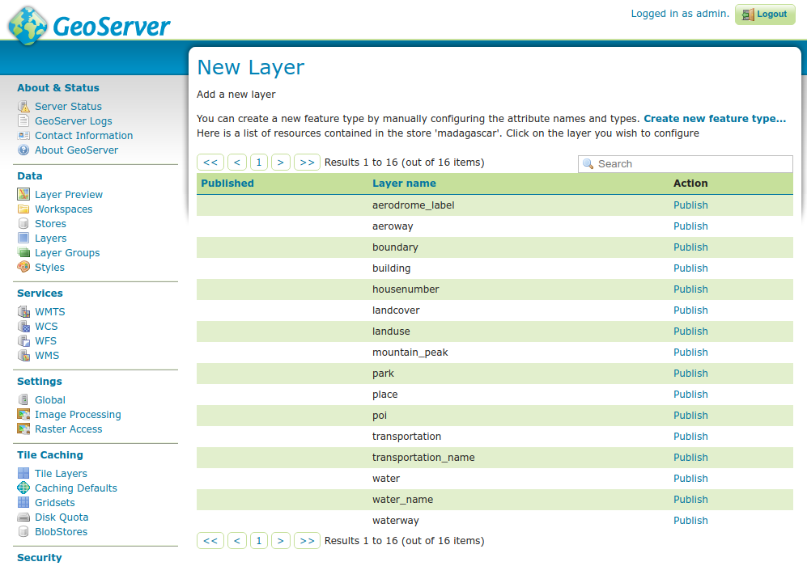

MBTiles Raster and Vector Data Stores
=====================================
 
Adding an MBTiles Mosaic Raster Data Source
-------------------------------------------

When the extension has been installed, :guilabel:MBTiles` will be an option in the :guilabel:`Raster Data Sources` list when creating a new data store.

.. figure:: images/mbtilescreate.png
   :align: center

   *MBTiles in the list of raster data sources*

.. figure:: images/mbtilesconfigure.png
   :align: center

   *Configuring an MBTiles data source*

.. list-table::
   :widths: 20 80

   * - **Option**
     - **Description**
   * - ``Workspace``
     - Name of the workspace to contain the MBTiles Mosaic store. This will also be the prefix of the raster layers created from the store.
   * - ``Data Source Name``
     - Name of the MBTiles Store as it will be known to GeoServer. This can be different from the filename. 
   * - ``Description``
     - A full free-form description of the MBTiles store.
   * - ``Enabled``
     -  If checked, it enables the store. If unchecked (disabled), no data in the GeoPackage Mosaic Store will be served from GeoServer.
   * - ``URL``
     - Location of the MBTiles file. This can be an absolute path (such as :file:`file:C:\\Data\\landbase.mbtiles`) or a path relative to GeoServer's data directory (such as :file:`file:data/landbase.mbtiles`).

Adding an MBTiles vector tiles Data Store
-----------------------------------------

When the extension has been installed, :guilabel:`MBTiles with vector tiles` will be an option in the :guilabel:`Vector Data Sources` list when creating a new data store.

.. figure:: images/mbtiles-vector-create.png
   :align: center

   *MBTiles in the list of vector data sources*

.. figure:: images/mbtiles-vector-configure.png
   :align: center

   *Configuring an MBTiles data store*

.. list-table::
   :widths: 20 80

   * - **Option**
     - **Description**
   * - ``database``
     - Path to the MBTiles file
   * - ``user``
     - Optional user name 
   * - ``passwd``
     - Optional password

After configuration the store will allow setting up the layers, as they get described in the
``json`` entry of the `metadata table <https://github.com/mapbox/mbtiles-spec/blob/master/1.3/spec.md#content>`_.

   *Configuring layers out of a MBTiles store*

Each vector tile contains data for all the layers described, the store maintains a "soft cache" of parsed
tiles to avoid re-parsing them from the binary on multi-layer rendering operations.
