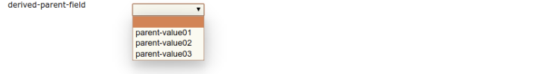
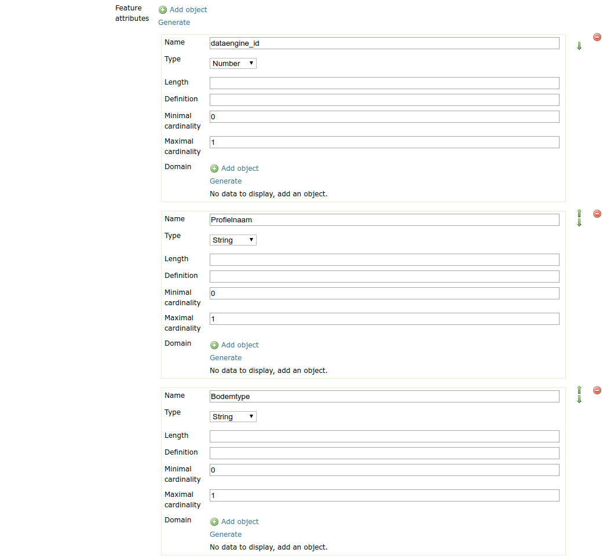
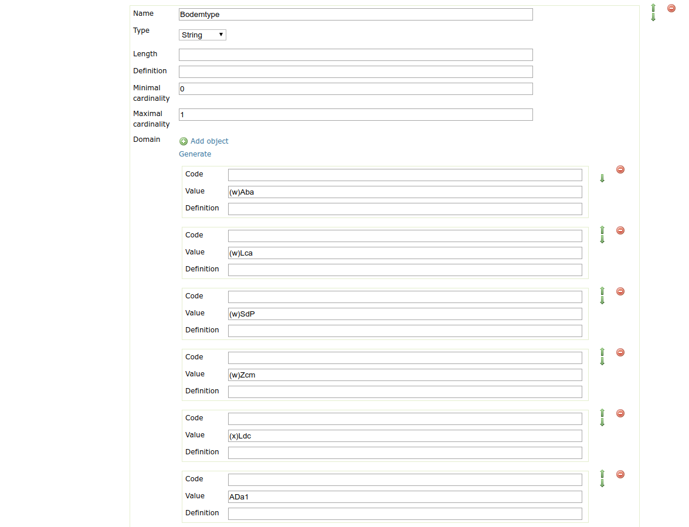

.. _community_metadata_uiconfiguration:

Fields configuration
====================
The ui for the metadata tab is made from a list of field components.
The type of the field component and how they behave can be configured in the yaml file.
All fields should be configured as a list which has the parent key ``attributes``.

.. contents:: :local:
    :depth: 1

Field options
-------------
A field is defined in the yaml following key-value pairs:

    - `key`_
    - `fieldType`_
    - `label`_
    - `occurrence`_
    - `values`_  (specific field types)
    - `derivedFrom`_  (specific field types)
    - `typename`_  (specific field types)

key
^^^

The key is the identifier for the field and should therefore be unique.
Other configurations can refer the field by using this identifier. E.g the geonetwork mapping, internationalization.

================  ========  ============================
Key               Required  Value
================  ========  ============================
 key                yes          a unique string    
================  ========  ============================

fieldType
^^^^^^^^^

Chooses the type of input widget for the field.
A detailed description for each type can be found in the `Field Types`_ section.

================  ========  ============================
Key               Required  Value
================  ========  ============================
 fieldType          yes         - COMPLEX
                                - TEXT
                                - NUMBER
                                - TEXT_AREA
                                - DATE
                                - DATETIME
                                - BOOLEAN
                                - UUID
                                - DROPDOWN
                                - SUGGESTBOX
                                - DERIVED
================  ========  ============================

    

label
^^^^^

If present this value will be used as the label for the field.
When the label is not present in the yaml cofiguration the key will be used as label. 
Note: when the key is present in the internationalization (i18n) file see `Internationalization support`_  than the value from that file wil be used as the label.

================  ========  ============================
Key               Required  Value
================  ========  ============================
 label              no         any string
================  ========  ============================
   

occurrence
^^^^^^^^^^

The value for ``occurrence`` determins whether or not the field should displayed as a table or as a single input field.
``SINGLE`` will result in one input field.

    .. figure:: images/single-value.png

        e.g. single value input field of fieldType ``TEXT``.

Choosing ``REPEAT`` will render the field in a table allowing the user to input multiple values.

    .. figure:: images/repeat.png

        e.g. field of fieldType ``TEXT`` rendered as a table.

The data in table can be sorted using the green arrow buttons.

================  ========  ============================
Key               Required  Value
================  ========  ============================
 occurrence         no        - SINGLE (Default)
                              - REPEAT
================  ========  ============================

values
^^^^^^
The choices in a `DROPDOWN`_ or a `SUGGESTBOX`_ can be set using the ``values``  attribute in the yaml. 
This is useful for small list, for larger list it can be better to list the choices in a separate .csv file.

derivedFrom
^^^^^^^^^^^
Only used in the `DERIVED`_ field. The attribute ``derivedFrom`` contains the key for the parent on which the `DERIVED`_ field depends.
Follow the link for more information on the `DERIVED`_ field.

typename
^^^^^^^^
The ``typename`` is a required attribute for `COMPLEX`_ fields. It contains the key pointing to the definition of the `COMPLEX`_ field.
A special ``typename`` `featureAttribute` is reserved for the `Feature Catalog Generation`_  and should not be used.

Field Types
-----------

        - `TEXT`_
        - `TEXT_AREA`_
        - `UUID`_
        - `NUMBER`_
        - `BOOLEAN`_
        - `DATE`_
        - `DATETIME`_
        - `DROPDOWN`_
        - `SUGGESTBOX`_
        - `DERIVED`_
        - `COMPLEX`_

TEXT
^^^^
Input field that allows any text.

 .. figure:: images/fieldtext.png

.. code:: YAML

  attributes:
    - key: text-field
      fieldType: TEXT

TEXT_AREA
^^^^^^^^^
A multiline input.

 .. figure:: images/fieldtextarea.png

.. code:: YAML

  attributes:
    - key: text-area-field
        fieldType: TEXT_AREA

UUID
^^^^
Input field for a UUID, it allows any text input or the user can generate a UUID.

 .. figure:: images/fielduuid.png

.. code:: YAML

  attributes:
    - key: uuid-field
      fieldType: UUID

NUMBER
^^^^^^
Only numbers are accepted as valid input.

 .. figure:: images/fieldnumber.png

.. code:: YAML

  attributes:
    - key: number-field
      fieldType: NUMBER

BOOLEAN
^^^^^^^
Input field with checkbox.

 .. figure:: images/fieldboolean.png

.. code:: YAML

  attributes:
    - key: boolean-field
      fieldType: BOOLEAN

DATE
^^^^

Date selection without time information.

 .. figure:: images/fielddate.png

.. code:: YAML

  attributes:
    - key: date-field
      fieldType: DATE

DATETIME
^^^^^^^^

Selection date with time information.

 .. figure:: images/fielddatetime.png

.. code:: YAML

  attributes:
    - key: datetime-field
      fieldType: DATETIME

DROPDOWN
^^^^^^^^
A field for selecting a value from a dropdown. 
The values can be configured with the ``values`` attribute in the yaml or they can be configured in an other .csv file which is used for dropdowns with a lot of choices.

 .. figure:: images/fielddropdown.png

Configuration in the yaml file.

.. code:: YAML

  attributes:
    - key: dropdown-field
      fieldType: DROPDOWN
      values:
            - first
            - second
            - third

To configure the values in a separate file add a yaml key ``csvImports`` on the same level as ``attributes`` and add the list of CSV files under this key.
The first line in each CSV file should contain the key of the dropdown field for which you want to add the choices.

``metadata-ui.yaml``

.. code:: YAML

  attributes:
    - key: dropdown-field
      fieldType: DROPDOWN
   csvImports:
    - dropdowncontent.csv   
        
``dropdowncontent.csv``

.. code::

    dropdown-field
    first
    second
    third

SUGGESTBOX
^^^^^^^^^^
A field for selecting a value from a suggestbox. Suggestions will be given for the values where the input matches the beginning of the possible values.
The values can be put in a separate CSV file in the same way as for the DROPDOWN field.

.. figure:: images/fieldsuggest.png

.. code:: YAML

  attributes:
    - key: suggestbox-field
      fieldType: SUGGESTBOX
      values:
            - first
            - second
            - third

DERIVED
^^^^^^^
A derived field is a hidden field whose value depends on an other field. The yaml key ``derivedFrom`` should contain the key of the field it depends on.
When a value is selected in the parent field a matching value for the derived field is searched in csv file or the value with the same index is picked from the values list.

The CSV file should have at least two columns and start with the key of the parent field in the first column followed by the values for the parent field, the other columns should contain the key(s) of the derived field(s) in the first row followed by the matching values.

Example derived field with config in a CSV file:

``metadata-ui.yaml``

.. code:: YAML

  attributes:
    - key: derived-parent-field
      fieldType: DROPDOWN
    - key: hidden-field
      fieldType: DERIVED
      derivedFrom: derived-parent-field
  csvImports:
    - derived-mapping.csv

``derivedmapping.csv``

.. code::

    derived-parent-field;hidden-field
    parent-value01;hidden-value01
    parent-value02;hidden-value02
    parent-value03;hidden-value03
  
Example derived field with values lists:

``metadata-ui.yaml``

.. code:: YAML

  attributes:
    - key: derived-parent-field
      fieldType: DROPDOWN
      values:
          - parent-value01
          - parent-value02
          - parent-value03
    - key: hidden-field
      fieldType: DERIVED
      derivedFrom: derived-parent-field
      values:
          - hidden-value01
          - hidden-value02
          - hidden-value03

COMPLEX
^^^^^^^
A complex field is composed of multiple other fields.  The yaml key ``typename`` is added to the field configuration.
On the root level the yaml key ``types`` indicates the beginning of all complex type definition.
A type definition should contain the ``typename`` followed by the key ``attributes`` which contains the configuration for the subfields.

.. figure:: images/fieldcomplex.png

.. code:: YAML

  attributes:
    - key: complex-type
      fieldType: COMPLEX
      typename: complex-field
  
  types:
     - typename: complex-field
       attributes:
            - key: object-text
              fieldType: TEXT
            - key: object-numer
              fieldType: NUMBER

Feature Catalog Generation
--------------------------
To create a feature catalog for a vector layer, a complex structure is needed to describe all the attributes. A lot of this information is already present in the GeoServer feature type or the database.
Metadata supports automatically generating a new structure in the metadata from the information at hands that can be customised afterwards. 
To create support for this feature in your configuration, define a repeatable COMPLEX_ field with built-in ``fieldType``  `featureAttribute` .

In the example the featureCatalog object has two attributes. A unique identifier of the type UUID_ and the feature attribute field.

.. figure:: images/fa01.png

    e.g. Empty Feature attribute field

.. code:: YAML

  - typename: featureCatalog
    attributes:
        - label: Unique identifier
          key: feature-catalog-identifier
          fieldType: UUID
        - label: Feature attribute
          key: feature-attribute
          fieldType: COMPLEX
          typename: featureAttribute
          occurrence: REPEAT

The ``Generate`` action will check the database metadata for that layer and generate a feature type for each column in the table.

    e.g. Feature attribute with generate feature types

Whitin each feature type there is another ``Generate`` action that will generate the domain.

    e.g. Feature attribute with generate domain

Internationalization support
----------------------------
All metadata field labels that appear in the :guilabel:`Metadata fields` can be internationalized.
This is performed by creating an internationalization (i18n) file named metadata.properties.
Create an entry for each key in the gui configuration following this pattern:  `PREFIX.attribute-key`

e.g.

``metadata.properties``

.. code::

  metadata.generated.form.metadata-identifier=Unique identifier for the metadata

``metadata_nl.properties``

.. code::

  metadata.generated.form.metadata-identifier=Metadata identificator

Hidden Fields
-------------

Hidden fields are not visible in the GUI and do not need to be configured. They are updated automatically.

 - ``_timestamp``: date and time of the last metadata update.