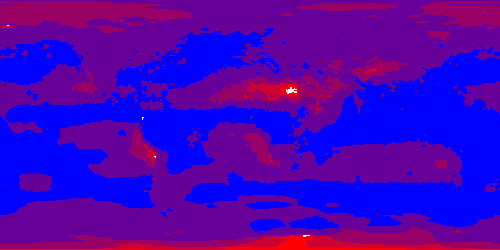

.. _ncwms:

ncWMS WMS extensions support
============================

The **ncWMS module** adds to GeoServer the ability to support some of the ncWMS extensions to the WMS protocol and configuration.
In particular:

* Ability to create a named style by simply providing a list of colors, that will adapt to the layer in use based on request parameters and its statistics
* Ability to control the palette application in GetMap via a number of extra parameters
* GetTimeSeries operation, which can retrieve a CSV or an xy chart of a time series of values on a certain point

At the time of writing the extra calls to extract elevation series, transects and NetCDF metadata are not supported.
The extension is however not NetCDF specific, but can be used with any single banded raster layer instead.

The Dynamic Palette style format
--------------------------------

A new "Dynamic palette" style format has been added that accepts a palette, one color per line, defining a color progression to be applied on raster data.
Each color can be defined using these possible syntaxes (same as ncWMS):
 
 * ``#RRGGBB``
 * ``#AARRGGBB``
 * ``0xRRGGBB``
 * ``0xAARRGGBB``
 
Comments can be added in the file by starting the line by a percentage sign. For example, a red to blue progression might look like::
 
     % Red to blue progression
     #FF0000
     #0000FF
     
.. figure:: images/redblue-editor.png
   :align: center
    
   *Configuring a dynamic palette style* 

Several ready to use palettes coming from the popular "color brewer" site are available in the `ncWMS source code repository <https://github.com/Reading-eScience-Centre/edal-java/tree/master/graphics/src/main/resources/palettes>`_.

The palette translates on the fly into a SLD with rendering transformation using the :ref:`community_colormap` module, in particular, 
the above style translates to the following style:

.. code-block:: xml
   :linenos:
   
    <?xml version="1.0" encoding="UTF-8"?>
    <sld:StyledLayerDescriptor xmlns="http://www.opengis.net/sld" xmlns:sld="http://www.opengis.net/sld" xmlns:gml="http://www.opengis.net/gml" xmlns:ogc="http://www.opengis.net/ogc" version="1.0.0">
      <sld:NamedLayer>
        <sld:Name/>
        <sld:UserStyle>
          <sld:Name/>
          <sld:FeatureTypeStyle>
            <sld:Transformation>
              <ogc:Function name="ras:DynamicColorMap">
                <ogc:Function name="parameter">
                  <ogc:Literal>data</ogc:Literal>
                </ogc:Function>
                <ogc:Function name="parameter">
                  <ogc:Literal>opacity</ogc:Literal>
                  <ogc:Function name="env">
                    <ogc:Literal>OPACITY</ogc:Literal>
                    <ogc:Literal>1.0</ogc:Literal>
                  </ogc:Function>
                </ogc:Function>
                <ogc:Function name="parameter">
                  <ogc:Literal>colorRamp</ogc:Literal>
                  <ogc:Function name="colormap">
                    <ogc:Literal>rgb(255,0,0);rgb(0,0,255)</ogc:Literal>
                    <ogc:Function name="env">
                      <ogc:Literal>COLORSCALERANGE_MIN</ogc:Literal>
                      <ogc:Function name="bandStats">
                        <ogc:Literal>0</ogc:Literal>
                        <ogc:Literal>minimum</ogc:Literal>
                      </ogc:Function>
                    </ogc:Function>
                    <ogc:Function name="env">
                      <ogc:Literal>COLORSCALERANGE_MAX</ogc:Literal>
                      <ogc:Function name="bandStats">
                        <ogc:Literal>0</ogc:Literal>
                        <ogc:Literal>maximum</ogc:Literal>
                      </ogc:Function>
                    </ogc:Function>
                    <ogc:Function name="env">
                      <ogc:Literal>BELOWMINCOLOR</ogc:Literal>
                      <ogc:Literal>rgba(0,0,0,0)</ogc:Literal>
                    </ogc:Function>
                    <ogc:Function name="env">
                      <ogc:Literal>ABOVEMAXCOLOR</ogc:Literal>
                      <ogc:Literal>rgba(0,0,0,0)</ogc:Literal>
                    </ogc:Function>
                    <ogc:Function name="env">
                      <ogc:Literal>LOGSCALE</ogc:Literal>
                      <ogc:Literal>false</ogc:Literal>
                    </ogc:Function>
                    <ogc:Function name="env">
                      <ogc:Literal>NUMCOLORBANDS</ogc:Literal>
                      <ogc:Literal>254</ogc:Literal>
                    </ogc:Function>
                  </ogc:Function>
                </ogc:Function>
              </ogc:Function>
            </sld:Transformation>
            <sld:Rule>
              <sld:RasterSymbolizer/>
            </sld:Rule>
          </sld:FeatureTypeStyle>
        </sld:UserStyle>
      </sld:NamedLayer>
    </sld:StyledLayerDescriptor>
  
The above explains a bit of how the palette is applied:

* By default a palette of 254 colors is generated between a min and max value, plus one color for anything below the minimum and another for anything above the maximum
* It is possible to pass the minimum and maximum values using the GetMap ``env`` parameter, if not provided, they are fetched from the configured band statistics (as found in the layer configuration)
* The overall opacity of the palette can be controlled (using a value between 0 and 1 to conform with the SLD opacity description)
* The scale can be either linear, or logarithmic

.. figure:: images/bandrange.png
   :align: center
    
   *Editing the defaults for min/max scale range values in the GeoServer layer editor* 

The above parameters can all be used at will to control the palette generation using the typical environment variable approach. However, it's also possible to use ncWMS own extensions, which
are adding direct parameters in the request. See the following section for details.

ncWMS GetMap extensions
-----------------------

This module also adds a dynamic translator taking the ncWMS GetMap vendor parameters and mapping them to the dynamic palette expectations. In particular (copying the parameter description 
from the ncWMS manual, with GeoServer specific annotations):

* COLORSCALERANGE: Of the form min,max this is the scale range used for plotting the data (mapped to the COLORSCALERANGE_MIN and COLORSCALERANGE_MAX env vars)
* NUMCOLORBANDS: The number of discrete colours to plot the data. Must be between 2 and 250 (mapped to the NUMCOLORBANDS env variable)
* ABOVEMAXCOLOR: The colour to plot values which are above the maximum end of the scale range. Colours are of the form 0xRRGGBB or 0xAARRGGBB, and it also accepts "transparent" and "extend"
* BELOWMINCOLOR: The colour to plot values which are below the minimum end of the scale range. Colours are of the form 0xRRGGBB or 0xAARRGGBB, and it also accepts "transparent" and "extend"
* LOGSCALE: "true" or "false" - whether to plot data with a logarithmic scale
* OPACITY: The percentage opacity of the final output image as a number between 0 and 100 (maps to OPACITY env var by translating it to a number between 0 and 1)
* ANIMATION: "true" or "false" - whether to generate an animation. The ncWMS documentation states that TIME has to be of the form ``starttime/endtime``,
  but currently TIME needs to be a list of discrete times instead. Animation requires using the "image/gif" as the response format (as the only format supporting animation) 

Here are a few examples based on the "ArcSample" arcgrid sample layer, containing annual precipitation data. The one band provided by this layer has been configured with a default range of 0 to 6000.

* Default output with the "redblue" palette:
  
  http://localhost:8080/geoserver/wms?STYLES=redblue&LAYERS=nurc%3AArc_Sample&FORMAT=image%2Fpng&SERVICE=WMS&VERSION=1.1.1&REQUEST=GetMap&SRS=EPSG%3A4326&BBOX=-180,-90,180,90&WIDTH=500&HEIGHT=250
  
.. figure:: images/redblue-default.png
   :align: center
   
* Adopting a logarithmic scale by adding ``&COLORSCALERANGE=1,6000&LOGSCALE=true`` (a logarithmic scale needs a positive minimum)

.. figure:: images/redblue-logscale.png
   :align: center

* Using just 5 colors in logarithmic mode by adding ``&COLORSCALERANGE=1,6000&LOGSCALE=true&NUMCOLORBANDS=5``

* Limiting the range and specifying other colors above (gray) and below (yellow) by adding ``&COLORSCALERANGE=100,2000&BELOWMINCOLOR=0xFFFF00&ABOVEMAXCOLOR=0xAAAAAA``

.. figure:: images/redblue-range.png
   :align: center
   
ncWMS GetCapabilities extensions
--------------------------------

ncWMS allows users to filter the contents of a capabilites document by adding a ``&dataset=datasetName`` parameter to the request.

While GeoServer does not have a concept of dataset, the ncWMS extension allows to use the same parameter to filter on workspaces, layers and layer groups, by name.

For example:

  * Getting everything in the "topp" workspace: http://localhost:8080/geoserver/ows?service=wms&version=1.3.0&request=GetCapabilities&dataset=topp
  * Getting only the "topp:states" layer: http://localhost:8080/geoserver/ows?service=wms&version=1.3.0&request=GetCapabilities&dataset=topp:states
  * Getting the "tasmania" layer group: http://localhost:8080/geoserver/ows?service=wms&version=1.3.0&request=GetCapabilities&dataset=tasmania
  
ncWMS GetTimeSeries operation
--------------------------------

ncWMS provides a GetTimeSeries operation, which can retrieve a time series of values on a certain point, using a syntax similar to the GetFeatureInfo operation.
The time series can be retrieved as a chart in PNG or JPEG image, or as a CSV.

For example:

  * Getting a time series as CSV: http://localhost:8080/geoserver/wms?SERVICE=WMS&VERSION=1.1.1&REQUEST=GetTimeSeries&FORMAT=image%2Fjpeg&TIME=2008-10-31T00:00:00.000Z/2008-11-01T00:00:00.000Z&QUERY_LAYERS=watertemp&STYLES&LAYERS=watertemp&INFO_FORMAT=text%2Fcsv&FEATURE_COUNT=50&X=50&Y=50&SRS=EPSG%3A4326&WIDTH=101&HEIGHT=101&BBOX=3.724365234375%2C40.81420898437501%2C5.943603515625%2C43.03344726562501

  * Getting a time series as PNG: http://localhost:8080/geoserver/wms?SERVICE=WMS&VERSION=1.1.1&REQUEST=GetTimeSeries&FORMAT=image%2Fjpeg&TIME=2008-10-31T00:00:00.000Z/2008-11-01T00:00:00.000Z&QUERY_LAYERS=watertemp&STYLES&LAYERS=watertemp&INFO_FORMAT=image%2Fpng&FEATURE_COUNT=50&X=50&Y=50&SRS=EPSG%3A4326&WIDTH=101&HEIGHT=101&BBOX=3.724365234375%2C40.81420898437501%2C5.943603515625%2C43.03344726562501

  * Getting a time series as JPG: http://localhost:8080/geoserver/wms?SERVICE=WMS&VERSION=1.1.1&REQUEST=GetTimeSeries&FORMAT=image%2Fjpeg&TIME=2008-10-31T00:00:00.000Z/2008-11-01T00:00:00.000Z&QUERY_LAYERS=watertemp&STYLES&LAYERS=watertemp&INFO_FORMAT=image%2Fjpg&FEATURE_COUNT=50&X=50&Y=50&SRS=EPSG%3A4326&WIDTH=101&HEIGHT=101&BBOX=3.724365234375%2C40.81420898437501%2C5.943603515625%2C43.03344726562501

The INFO_FORMAT accepts the following values: `image/png`, `image/jpg` and `text/csv`

The TIME parameter accepts a time range as defined for other operations in the WMS standard (see Annex D of the 06-042 Web Map Server Implementation Specification). Examples:

  * `TIME=2008-10-31T00:00:00.000Z/2008-11-01T00:00:00.000Z`
  * `TIME=2008-10-31T00:00:00.000Z/2008-10-31T00:00:00.000Z`

Since GeoServer 2.17, TIME parameter also supports 2 additional syntax even if not expressly supported by ncWMS specification:

  #. A List of Times:

     * Example: `TIME=2014-01,2015-01,2016-01,2017-01,2018-01`
     * Example: `TIME=2017-01-01T00:00:00Z,2017-02-01T00:00:00Z,2017-01-03T00:00:00Z`

  #. A periodic time within a range:

     * Example: `TIME=2015-01/2019-01/P1Y`

    .. note::

         * Shortened time specifications in a list are parsed as time ranges by GeoServer. Therefore, a Time like 2014-01 will represent the whole month of January 2014, so a time range: 2014-01-01T00:00:00/2014-01-31T23:59:59.

         * Months and Years expressed through a Period specification (as an instance P2M, P1Y) are considered made of 30 days and 365.25 days respectively. Therefore a periodic interval like 2000-04/2000-12/P1M will be parsed as the list of time instants starting from April 2000 through December 2000 with a period of 30 days:

             * Apr 01 00:00:00 2000
             * May 01 00:00:00 2000
             * May **31** 00:00:00 2000
             * Jun **30** 00:00:00 2000
             * Jul **30** 00:00:00 2000
             * Aug **29** 00:00:00 2000
             * Sep **28** 00:00:00 2000
             * Oct **28** 00:00:00 2000
             * Nov **27** 00:00:00 2000
             * Dec **27** 00:00:00 2000
             * Therefore if your original dataset has an entry for the the first day of each month, this request will only return 2 values: Apr 01 and May 01. In that case, you might consider enabling nearest match on Layer's time dimension.

Sample CSV output:

.. code-block:: none

    # Latitude: 40.396728515625
    # Longitude: -0.6921386718750019
    Time (UTC),Temperature (degrees)
    2014-01-01T00:00:00.000Z,0.4194810092449188
    2014-02-01T00:00:00.000Z,0.8373379707336426
    2014-03-01T00:00:00.000Z,3.1670899391174316
    2014-04-01T00:00:00.000Z,4.932330131530762

Sample chart output:

.. figure:: images/geoserver-GetTimeSeries.png
   :align: center

**Note:** Since GeoServer 2.17, nodata pixels will not be reported in the result chart. Moreover, entries in CSV list related to nodata pixels will report time but will have no pixel value reported, as in the example below for times 2014-02-01 and 2014-05-01:

.. code-block:: none

    # Latitude: 40.396728515625
    # Longitude: -0.6921386718750019
    Time (UTC),Temperature (degrees)
    2014-01-01T00:00:00.000Z,0.4194810092449188
    2014-02-01T00:00:00.000Z,
    2014-03-01T00:00:00.000Z,3.1670899391174316
    2014-04-01T00:00:00.000Z,4.932330131530762
    2014-05-01T00:00:00.000Z,
    2014-06-01T00:00:00.000Z,0.8373379707336426
