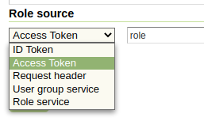
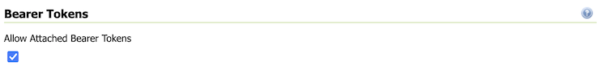

OpenID connect authentication
-----------------------------

The OAuth2 OpenID Connect (OIDC) authentication is working in a way quite similar to Google (and GitHub) 
authentications, the only difference is that the authentication page cannot propose default
values for the various endpoints, which have to be configured manually.

In case the web login will not be used, the ``client ID`` and ``client secret`` are not actually
needed, and can be filled with two made up values (the validation just checks they are present,
but they will be used only in the "authorisation flow", but not when doing OGC requests
where the client is supposed to have autonomously retrieved a valid bearer token).

The configuration GUI supports OpenID Discovery documents.  If the server supports them
it's sufficient to provide the path to the document, or to the authentication service root,
and the GUI will auto-fill itself based on the document contents:

.. figure:: images/discovery.png
   :align: center

The UI allow to set also the ``Post Logout Redirect URI`` which will be used to populate the  ``post_logout_redirect_uri`` request param, when doing the global logout from the GeoServer UI. The OpenId provider will use the URI to redirect to the desired app page.

In addition, the OpenID connect authentication is able to extract the user roles from
either the ID token or the Access Token:

The chosen attribute must be present in either the Access Token or in the Id token, 
and be either a string or an array of strings.

From UI it is also possible to set the ``Response Mode`` value. The field can be kept empty but it is needed when the OpenId server used as Identity Provider doesn't send by default the authorization code as a query string (that is mandatory in order to allow GeoServer and OpenId integration to work properly).

Finally the admin can allow the sending of the ``client_secret`` during an access_token request trough the ``Send Client Secret in Token Request``. Some OpenId implementation requires it for the Authorization Code flow when the client app is a confidential client and can safely store the client_secret.

Logging OAuth2 Activity
^^^^^^^^^^^^^^^^^^^^^^^

The plugin includes an ``OIDC_LOGGING`` profile which is installed on startup. This logging profile quiets most GeoServer logging activity, while enabling trace logging for OAuth2 functionality.

The module also includes an additional connection setting to include the token details as additinoal log messages. This is intended to assist in troubleshooting durring development and initial setup.

.. figure:: images/log-sensitive-information.png
   
   Log sensitive information

This setting can obviously used to access sensitive information and you are advised clear logs after use.

To setup for troubleshooting OIDC activity:

#. Navigate to :menuselection:`Settings --> Global`
#. Select the logging profile ``OIDC_LOGGING``
#. Navigate :menuselection:`Security --> Authentication`
#. Setup your OAuth2 OpenID Connect configuration with :guilabel:`Log Sensitive Information (do not use in production)` checked
#. With these settings each individual steps of the OAuth2 authentication is shown. The logging senstive information setting logs access token and id token (the content of these token may be decoded using https://jwt.io ).

   .. code-block:: text

      DEBUG  [security.oauth2] - OIDC: - CLIENT_SECRET: squirrel
      DEBUG  [security.oauth2] - OIDC: received a CODE from Identity Provider - handing it in for ID/Access Token
      DEBUG  [security.oauth2] - OIDC: CODE=...
      DEBUG  [security.oauth2] - OIDC: Identity Provider returned Token, type=Bearer
      DEBUG  [security.oauth2] - OIDC: SCOPES=openid geocat
      DEBUG  [security.oauth2] - OIDC: ACCESS TOKEN: .... 
      DEBUG  [security.oauth2] - OIDC: ID  TOKEN: ... 
      DEBUG  [security.oauth2] - OIDC: Getting Roles from UserGroupService, location=null
      DEBUG  [security.oauth2] - OIDC: Geoserver Roles: ADMIN
      DEBUG  [security.oauth2] - OIDC: Geoserver Roles: ROLE_ADMINISTRATOR

OpenID Connect With Attached Access Bearer Tokens
^^^^^^^^^^^^^^^^^^^^^^^^^^^^^^^^^^^^^^^^^^^^^^^^^

The OpenID Connect plugin allows the use of Attached Bearer Access Tokens. This is typically used by automated (i.e. desktop or external Web Service) to access the Geoserver REST API.

   Bearer Tokens

The setup process is as follows:

#. Setup your OAuth2 OpenID Connect configuration as normal
#. On the OpenID Connect configuration screen (bottom), makes sure "Allow Attached Bearer Tokens" is checked
#. You can not use ID Tokens as a Role Source for the attached Bearer Tokens (see below)

To Use:

#. Obtain an Access Token from the underlying IDP
#. Attach the access token to your HTTP request headers

`Authorization: Bearer <token>`

The Access Token (JWT) is validated;

#. The Access Token is used to get the "userinfo" endpoint.  The underlying IDP will verify the token (i.e. signature and expiry)
#. The Audience of the Token is checked that it contains the GeoServer configured Client Id.  This make sure an Access Token for another application is not being inappropriately reused in GeoServer (cf. `AudienceAccessTokenValidator.java`).
#. The Subject of the `userinfo` and Access Token are verified to be about the same person.  The OpenID specification recommends checking this (cf. `SubjectTokenValidator.java`).

For KeyCloak, consider using the "userinfo endpoint" role source and configure Keycloak to put groups in the "userinfo."

For Azure AD, configure Azure to allow access to the MS Graph API (memberOf) and use the "Microsoft Graph API (Azure AD)" role source. 

To configure Azure AD for "memberOf" ("GroupMember.Read.All" permission) access;

#. Go to your application in Azure AD (in the portal) 
#. On the left, go to "API permissions" 
#. Click "Add a permission" 
#. press "Microsoft Graph" 
#. press "Delegated permission" 
#. Scroll down to "GroupMember" 
#. Choose "GroupMemeber.Read.All" 
#. Press "Add permission" 
#. On the API Permission screen, press the "Grant admin consent for ..." text

This has been tested with KeyCloak (with groups in the `userinfo` endpoint response), and with MS Azure AD (with the groups from the GraphAPI).  This should work with other IDPs - however, make sure that the Subject and Audience token verification works with their tokens.
  
If you do not need Bearer Token functionality, it is recommended to turn this off.

Proof Key of Code Exchange (PKCE) 
^^^^^^^^^^^^^^^^^^^^^^^^^^^^^^^^^

The OpenID Connect plugin allows the use of Proof Key of Code Exchange (PKCE).

.. figure:: images/pkce.png
   
   Proof Key of Code Echange

The setup process is as follows:

#. Setup your OAuth2 OpenID Connect configuration as normal
#. On the OpenID Connect configuration screen (bottom), makes sure "Use PKCE" is checked

To prevent client side refequest forgery:

* **Step 1**: GeoServer will include a ``code_challenge`` during initial authorization code request
* **Step 2**: GeoServer will include a ``code_verifer`` during the access token request.

  The authentication server will confirm that ``code_verifier`` hash matches the initial ``code_challenge``
  in order the confirm the client is the same as in **Step 1**. 
  
Log output of this exchange is as follows:

.. code-block::

   DEBUG  [oauth2.pkce] - Generate code_verifier: yQat4Y.....
   DEBUG  [oauth2.pkce] - CODE_CHALLENGE: 5HiD...
   DEBUG  [oauth2.pkce] - CODE_CHALLENGE_METHOD: S256
   DEBUG  [oauth2.pkce] - CLIENT_SECRET: squirrel
   DEBUG  [oauth2.pkce] - CODE_VERIFIER: yQat4Y...

Reference:

* `rfc7636 Proof Key for Code Exchange by OAuth Public Clients <https://datatracker.ietf.org/doc/html/rfc7636>`_

JSON Web Key set URI
^^^^^^^^^^^^^^^^^^^^

The ``JSON Web Key set URI`` provides the location of a document of public keys that can be used to check the signature of the provided accessToken.

Optional: It is no longer required to use ``Check Token Endpoint URL`` - if you leave that field blank you may rely only on the ``JSON Web Key set URI`` signature check. When use in this manner roles cannot be extracted from access token.

Azure AD and ADFS setup
^^^^^^^^^^^^^^^^^^^^^^^
To make the OpenIdConnect filter to work properly with an Azure AD or ADFS server via the OpenId protocol, the user must set, in addition to the other configuration parameters, the ``Response Mode`` to query (otherwise by default ADFS will return a url fragment) and check the checkbox ``Send Client Secret in Token Request`` (the client_secret is mandatory in token request according to the `Microsoft documentation <https://docs.microsoft.com/en-us/windows-server/identity/ad-fs/overview/ad-fs-openid-connect-oauth-flows-scenarios#request-an-access-token>`_).

   .. figure:: images/adfs-setup.png
      :align: center

SSL Trusted Certificates
------------------------

When using a custom ``Keystore`` or trying to access a non-trusted or self-signed SSL-protected OAuth2 Provider from a non-SSH connection, you will need to add the certificates to the JVM ``Keystore``.

In order to do this you can follow the next steps:

    In this example we are going to
   
    #. Retrieve SSL certificates from Google domains:
   
        "Access Token URI" = https://accounts.google.com/o/oauth2/token therefore we need to trust ``https://accounts.google.com`` or (``accounts.google.com:443``)
        "Check Token Endpoint URL" = https://www.googleapis.com/oauth2/v1/tokeninfo therefore we need to trust ``https://www.googleapis.com`` or (``www.googleapis.com:443``)
       
        .. note:: You will need to get and trust certificates from every different HTTPS URL used on OAuth2 Endpoints.
   
    #. Store SSL Certificates on local hard disk

    #. Add SSL Certificates to the Java Keystore
   
    #. Enable the JVM to check for SSL Certificates from the Keystore
   
1. Retrieve the SSL Certificates from Google domains

   Use the ``openssl`` command in order to dump the certificate
  
   For ``https://accounts.google.com``
  
       .. code-block:: shell
      
           openssl s_client -connect accounts.google.com:443
          
       .. figure:: images/google_ssl_001.png
          :align: center

   And for ``https://www.googleapis.com``
  
       .. code-block:: shell
      
           openssl s_client -connect www.googleapis.com:443
          
       .. figure:: images/google_ssl_002.png
          :align: center

2. Store SSL Certificates on local hard disk

   Copy-and-paste the two sections ``-BEGIN CERTIFICATE-``, ``-END CERTIFICATE-`` and save them into two different ``.cert`` files
   
   .. note:: ``.cert`` file are plain text files containing the ASCII characters included on the ``-BEGIN CERTIFICATE-``, ``-END CERTIFICATE-`` sections
   
   ``google.cert`` (or whatever name you want with ``.cert`` extension)
   
   .. figure:: images/google_ssl_003.png
      :align: center

   ``google-apis.cert`` (or whatever name you want with ``.cert`` extension)
   
   .. figure:: images/google_ssl_004.png
      :align: center

3. Add SSL Certificates to the Java Keystore

   You can use the Java command ``keytool`` like this
   
   ``google.cert`` (or whatever name you want with ``.cert`` extension)
   
   .. code-block:: shell
   
       keytool -import -noprompt -trustcacerts -alias google -file google.cert -keystore ${KEYSTOREFILE} -storepass ${KEYSTOREPASS}

   ``google-apis.cert`` (or whatever name you want with ``.cert`` extension)
   
   .. code-block:: shell
   
       keytool -import -noprompt -trustcacerts -alias google-apis -file google-apis.cert -keystore ${KEYSTOREFILE} -storepass ${KEYSTOREPASS}

   or, alternatively, you can use some graphic tool which helps you managing the SSL Certificates and Keystores, like `Portecle <http://portecle.sourceforge.net/>`_
   
   .. code-block:: shell
   
       java -jar c:\apps\portecle-1.9\portecle.jar
   
   .. figure:: images/google_ssl_005.png
      :align: center

   .. figure:: images/google_ssl_006.png
      :align: center

   .. figure:: images/google_ssl_007.png
      :align: center

   .. figure:: images/google_ssl_008.png
      :align: center

   .. figure:: images/google_ssl_009.png
      :align: center

   .. figure:: images/google_ssl_010.png
      :align: center

   .. figure:: images/google_ssl_011.png
      :align: center

   .. figure:: images/google_ssl_012.png
      :align: center

   .. figure:: images/google_ssl_013.png
      :align: center

4. Enable the JVM to check for SSL Certificates from the Keystore

   In order to do this, you need to pass a ``JAVA_OPTION`` to your JVM:
   
   .. code-block:: shell
   
       -Djavax.net.ssl.trustStore=F:\tmp\keystore.key

5. Restart your server

.. note:: Here below you can find a bash script which simplifies the Keystore SSL Certificates importing. Use it at your convenience.

   .. code-block:: shell

       HOST=myhost.example.com
       PORT=443
       KEYSTOREFILE=dest_keystore
       KEYSTOREPASS=changeme

       # get the SSL certificate
       openssl s_client -connect ${HOST}:${PORT} </dev/null \
           | sed -ne '/-BEGIN CERTIFICATE-/,/-END CERTIFICATE-/p' > ${HOST}.cert

       # create a keystore and import certificate
       keytool -import -noprompt -trustcacerts \
           -alias ${HOST} -file ${HOST}.cert \
           -keystore ${KEYSTOREFILE} -storepass ${KEYSTOREPASS}

       # verify we've got it.
       keytool -list -v -keystore ${KEYSTOREFILE} -storepass ${KEYSTOREPASS} -alias ${HOST}

