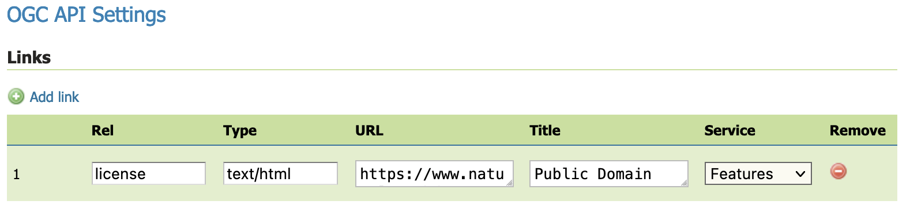
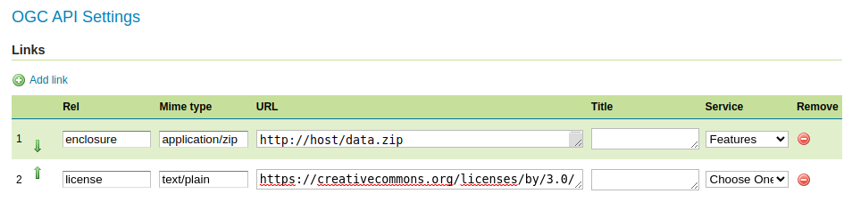

.. _ogcapi_links:

Configuring the GeoServer OGC API module
========================================

The OGC API modules provide additional services along side the existing Open Web Services (OWS).

Service
-------

The OGC API modules primarily use the same configurations as their equivalent OWS services. So, for example, setting the WFS limited SRS list will also limit the SRS list for OGC API - Features.

In addition, the OGC API modules will have some unique configuration options.

Security
--------

* Data security: Data security is managed independently of web service. The same data security restrictions placed on a workspace or layer content are enforced for both OWS services and OGC API web services

* Service security: OGC API web services are managed directly in :menuselection:`Security > Services` page. New access rules can be defined for OGC API services. 

  .. figure:: img/service_rule.png
     
     Service rule for OGC API Features getLandingPage

Collections
-----------

OGCAPI web services provides a ``collections`` resource describing the published content.

As an example OGC API - Features collections lists:

* **links**: Links and metadata
* **collections**: List of individual collections available
* **crs**: List of coordinate reference systems defined by WFS settings

Custom links for the "collections" resource
^^^^^^^^^^^^^^^^^^^^^^^^^^^^^^^^^^^^^^^^^^^

The ``collections`` resource can have a number of additional links, beyond
the basic ones that the service code already includes. Navigate to :menuselection:``Settings > Global``. The links are configured under heading :guilabel:`OGC API Settings`.
  
.. figure:: img/global_links.png
   
   Links used to indicate global Creative Commons license 

Link editor column description:

* **rel**: the link relation type, as per the OGC API - Features specification
* **Mime type**: the mime type for the resource found following the link
* **URL**: the link URL
* **Title**: the link title (optional)
* **Service**: the service for which the link is valid (optional, defaults to all) 

Common links relationships that could be added for the ``collections`` resource are:

* ``enclosure``, in case there is a package delivering all the collections (e.g. a GeoPackage, a ZIP full of shapefiles).
* ``describedBy``, in case there is a document describing all the collections (e.g. a JSON or XML schema).
* ``license``, if all collection data is under the same license.

Example from OGC API - Features service (``http://localhost:8080/geoserver/ogc/features/v1/collections/?f=application%2Fjson``):

.. code-block:: json

   {
     "href": "https://creativecommons.org/licenses/by/3.0/",
     "rel": "license",
     "type": "text/html",
     "title": "Creative Commons - Attribution"
   }

Custom links for workspace collections
^^^^^^^^^^^^^^^^^^^^^^^^^^^^^^^^^^^^^^

Additional custom ``collections`` links can also be defined for an individual workspace. Navigate to :menuselection:``Workspaces > Edit Workspace``. Links are configured on the :guilabel:`Basic Info` tab.

   
   Links used to indicate public domain license for ne workspace

In this example the ``license`` is changed to reflect the natural earth terms of use (overriding the ``license`` defined in global settings).

Example from workspace OGC API - Features service ( ``http://localhost:8080/geoserver/ne/ogc/features/v1/collections/?f=application%2Fjson``):

.. code-block:: json

    {
      "href": "https://www.naturalearthdata.com/about/terms-of-use/",
      "rel": "license",
      "type": "text/html",
      "title": "Public Domain"
    }

Single collection
-----------------

Each GeoServer layer is published is represented in OGC API as a single ``collection``.

As an example OGC API - Features collections lists:

* **id**: Layer name
* **title**: Layer title
* **description**: Layer abstract
* **extent**: Layer bounds
* **links**: Links to access content and metadata
* **crs**
* **storageCrs**

Custom links for single collection
^^^^^^^^^^^^^^^^^^^^^^^^^^^^^^^^^^

Additional custom links can be provided for an individual layer. Use the Layer Editor :guilabel:``Publishing`` tab, and locate the heading for :guilabel:`OGC API`.

   Links used to define enclosure download for ne:counteries layer

The relationships are the same as for the ``collections`` resource, but used in case
there is anything that is specific to the collection (e.g., the schema for the single collection). 
In addition, other relations can be specified, like the ``tag`` relation, to link to the eventual
INSPIRE feature concept dictionary entry.

Example from workspace ``ne:counteries`` collection providing enclosure for download:

.. code-block:: json

    {
      "href": "https://www.naturalearthdata.com/http//www.naturalearthdata.com/download/10m/cultural/ne_10m_admin_0_countries.zip",
      "rel": "enclosure",
      "type": "application/zip",
      "title": "ne_10m_admin_0_countries.zip"
    }
