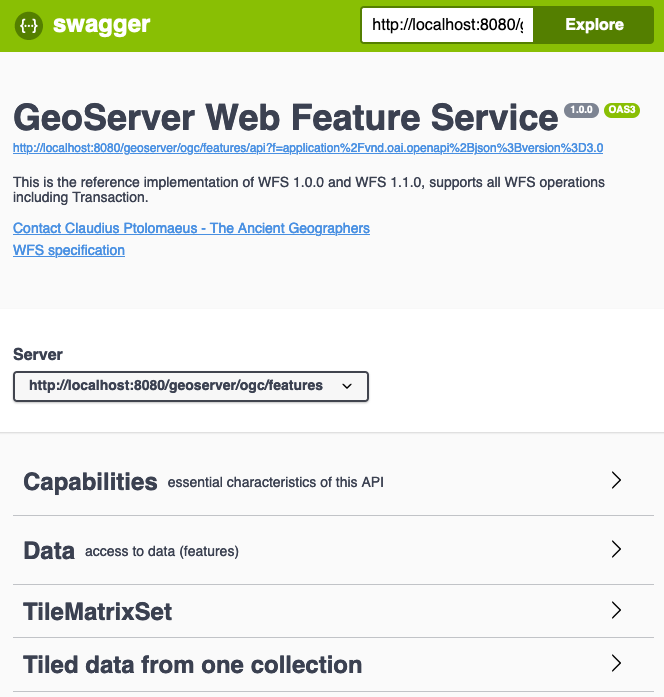
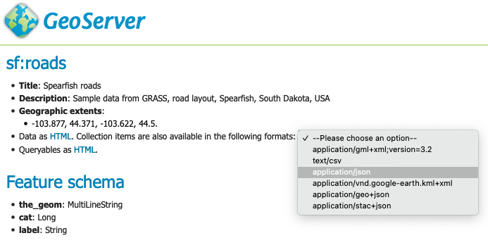
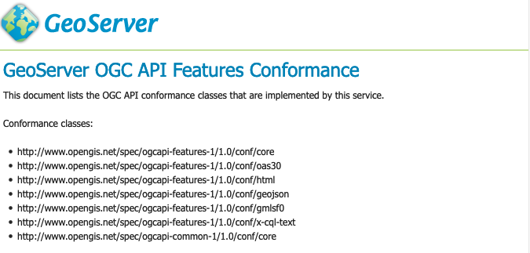

.. _ogcapi-features:

OGC API - Features
==================

An `OGC Features API <https://github.com/opengeospatial/ogcapi-features>`_ publishing feature data using an OpenAPI web service.

Features Implementation status
------------------------------

.. list-table::
   :widths: 30, 20, 50
   :header-rows: 1

   * - `OGC API - Features <https://github.com/opengeospatial/ogcapi-features>`__
     - Version
     - Implementation status
   * - Part 1: Core
     - `1.0.1 <https://docs.ogc.org/is/17-069r4/17-069r4.html>`__
     - Passes compliance tests
   * - Part 2: Coordinate Systems by Reference
     - `1.0.1 <https://docs.ogc.org/is/18-058r1/18-058r1.html>`__
     - Passes compliance tests
   * - Part 3: Filtering
     - `1.0.0 <https://docs.ogc.org/is/19-079r2/19-079r2.html>`__
     - Implemented an earlier draft, being updated to final (no CITE tests yet)
   * - Common Query Language (CQL2)
     - `1.0.0 <https://docs.ogc.org/is/21-065r2/21-065r2.html>`__
     - Implemented an earlier draft, being updated to final (no CITE tests yet)
   * - Part 4: Create, Replace, Update and Delete
     - `1.0.0 <https://docs.ogc.org/DRAFTS/20-002r1.html>`__
     - Not implemented (volunteers/sponsoring wanted)
   * - Part 5: search
     - `Proposal DRAFT <https://github.com/opengeospatial/ogcapi-features/tree/master/proposals/search>`__
     - A search endpoint for complex queries is implemented at the single collection level (POST to immediately get a response, no support for stored queries).
   * - Part 6 - Schemas
     - `Proposal DRAFT <https://github.com/opengeospatial/ogcapi-features/tree/master/proposals/search>`__
     - Not implemented (volunteers/sponsoring wanted)
   * - Part n: Query by IDs
     - `Proposal DRAFT <https://github.com/opengeospatial/ogcapi-features/tree/master/proposals/query-by-ids>`__
     - Proposal implemented, but syntax and semantic is subject to change in a future release. Thus said, usage should be carefully considered.
   * - Sorting
     - `DRAFT in github <https://github.com/opengeospatial/ogcapi-features/tree/master/extensions/sorting/standard>`__
     - Partial implementation borrowed by OGC API Records, using the sortby parameter. Sortables are not exposed.

Installing the GeoServer OGC API Features module
------------------------------------------------

#. Download the OGC API Features zip from the latest release (or nightly build) from :download_extension:`ogcapi-features`.
   
   .. warning:: Verify that the version number in the filename corresponds to the version of GeoServer you are running (for example geoserver-|release|-ogcapi-features-plugin.zip above).

#. Extract the contents of the archive into the ``WEB-INF/lib`` directory of the GeoServer installation.

#. On restart the services are listed at http://localhost:8080/geoserver

Docker use of OGC API Features module
-------------------------------------

#. The nightly Docker image supports the use of OGC API Feature:

   .. parsed-literal::
      
      docker pull docker.osgeo.org/geoserver:|release|

#. To run with OGC API Features:

   .. parsed-literal::
  
      docker run -it -p8080:8080 \\
        --env INSTALL_EXTENSIONS=true \\
        --env STABLE_EXTENSIONS="ogcapi-features" \\
        docker.osgeo.org/geoserver:|version|.x

#. The services are listed at http://localhost:8080/geoserver

Use of OGC API - Features service
---------------------------------

The OGC API Features Service is accessed via the :guilabel:`Features` version :guilabel:`1.0.1` link on the home page.

Capabilities
''''''''''''

The service is self described using:

* ``html``: A collection of web pages, with links for navigation between content (and that can be indexed by search engines for discoverability).

  .. figure:: img/features.png
 
     OGC API Features service

* `application/json`: A collection of :file:`json` documents, with reference between each document for programmatic access by web developers.

  .. code-block:: json
  
     {
       "title": "GeoServer Features services",
       "description": "This services delivers vector data in raw form, including both geometries and attributes.",
       "links": [
         {
           "href": "https://gs-main.geosolutionsgroup.com/geoserver/ogc/features/v1/?f=application%2Fjson",
           "rel": "self",
           "type": "application/json",
           "title": "This document"
         },
         {
           "href": "https://gs-main.geosolutionsgroup.com/geoserver/ogc/features/v1/?f=application%2Fx-yaml",
           "rel": "alternate",
           "type": "application/x-yaml",
           "title": "This document as application/x-yaml"
         },
         {
           "href": "https://gs-main.geosolutionsgroup.com/geoserver/ogc/features/v1/?f=text%2Fhtml",
           "rel": "alternate",
           "type": "text/html",
           "title": "This document as text/html"
         },

The service title and description are provided by the existing :ref:`wfs` settings.

Open API
''''''''

For programmatic access an `OpenAPI <https://www.openapis.org/>`__ description of the service is provided, that may be browsed as documentation, or used to generate a client to access the web services.

   
   OGC API Features OpenAPI Document

Collections
'''''''''''

The collection of feature types being published by the service.

Each collection entry is described using the layer details of title, description, geographic extent.

Data can be browsed as web pages, or downloaded in a range of formats such as :file:`GeoJSON` and :file:`GML` documents.

   
   Collection sf:roads download formats

Conformance
'''''''''''

Lists the operations this service can perform, each "conformance class" documents supported functionality. 

   OGC API Features Conformance

Contact information
'''''''''''''''''''

Advertises contact information for the service.

Defined by defined in by :ref:`config_contact`.

Configuration of OGC API - Features module
------------------------------------------

The service operates as an additional protocol for sharing vector data along side Web Feature Service.

The service is configured using:

* The existing :ref:`wfs` settings to define title, abstract, and output formats.
  
  This is why the service page is titled ``GeoServer Web Feature Service`` by default.

* Feature Service conformances:
  
  The OGC API Feature Service is modular, allowing you to enable/disable the functionality you wish to include.
  
  By default stable Standards and Community Standards are enabled. If WFS is strict, only official Standards are enabled and community standards are disabled
  
  The OpenAPI service description is manditory and may not be disabled.
  
  The HTML and GeoJSON output formats are built-in and may not be disabled.
  
  .. figure:: img/feature-service-configuration.png
     
     Feature Service Configuration
  
* CQL2 Filter conformances.
  
  Both the Text and JSON formats for CQL2 are available.
  
  The built-in CQL2 functionality may not be disabled, and functionality that is not implemented yet may not be enabled.

  .. figure:: img/cql2-configuration.png
     
     CQL2 Filter configuration

* Control of ECQL Filter conformances

  .. figure:: img/ecql-configuration.png
     
     ECQL Filter configuration

  
* Built-in templates used for html generation

* Extra links can be added on a per-service or per-collection basis as indicated in :ref:`ogcapi_links`.

HTML Templates
''''''''''''''

To override an OGC API Features template:

#. Create a directory :file:`ogc/features` in the location you wish to override:
   
   * :file:`GEOSERVER_DATA_DIR/templates/ogc/features/v1`
   * :file:`GEOSERVER_DATA_DIR/workspace/{workspace}/ogc/features/v1`
   * :file:`GEOSERVER_DATA_DIR/workspace/{workspace}/{datastore}/ogc/features/v1` 
   * :file:`GEOSERVER_DATA_DIR/workspace/{workspace}/{datastore}/{featuretype}/ogc/features/v1` 

#. Create a file in this location, using the GeoServer |release| examples below:

   * :download:`ogc/features/v1/landingPage.ftl  </../../../../src/extension/ogcapi/ogcapi-features/src/main/resources/org/geoserver/ogcapi/v1/features/landingPage.ftl>`
   * :download:`ogc/features/v1/collection.ftl  </../../../../src/extension/ogcapi/ogcapi-features/src/main/resources/org/geoserver/ogcapi/v1/features/collection.ftl>`
   * :download:`ogc/features/v1/collection_include.ftl  </../../../../src/extension/ogcapi/ogcapi-features/src/main/resources/org/geoserver/ogcapi/v1/features/collection_include.ftl>`
   * :download:`ogc/features/v1/collections.ftl  </../../../../src/extension/ogcapi/ogcapi-features/src/main/resources/org/geoserver/ogcapi/v1/features/collections.ftl>`
   * :download:`ogc/features/v1/queryables.ftl  </../../../../src/extension/ogcapi/ogcapi-core/src/main/resources/org/geoserver/ogcapi/queryables.ftl>`
   * :download:`ogc/features/v1/functions.ftl  </../../../../src/extension/ogcapi/ogcapi-features/src/main/resources/org/geoserver/ogcapi/v1/features/functions.ftl>`
   
   The above built-in examples are for GeoServer |release|, please check for any changes when upgrading GeoServer.

To override a template used to list features:

#. Use the directory in the location you wish to override (can be general, specific to a workspace, datastore, or feature type):

   * :file:`GEOSERVER_DATA_DIR/templates`
   * :file:`GEOSERVER_DATA_DIR/workspace/{workspace}`
   * :file:`GEOSERVER_DATA_DIR/workspace/{workspace}/{datastore}` 
   * :file:`GEOSERVER_DATA_DIR/workspace/{workspace}/{datastore}/{featuretype}` 

#. Create a file in this location, using the GeoServer |release| examples below:

   * :download:`ogc/features/getfeature-complex-content.ftl  </../../../../src/extension/ogcapi/ogcapi-features/src/main/resources/org/geoserver/ogcapi/v1/features/getfeature-complex-content.ftl>`
   * :download:`ogc/features/getfeature-content.ftl  </../../../../src/extension/ogcapi/ogcapi-features/src/main/resources/org/geoserver/ogcapi/v1/features/getfeature-content.ftl>`
   * :download:`ogc/features/getfeature-empty.ftl  </../../../../src/extension/ogcapi/ogcapi-features/src/main/resources/org/geoserver/ogcapi/v1/features/getfeature-empty.ftl>`
   * :download:`ogc/features/getfeature-footer.ftl  </../../../../src/extension/ogcapi/ogcapi-features/src/main/resources/org/geoserver/ogcapi/v1/features/getfeature-footer.ftl>`
   * :download:`ogc/features/getfeature-header.ftl  </../../../../src/extension/ogcapi/ogcapi-features/src/main/resources/org/geoserver/ogcapi/v1/features/getfeature-header.ftl>`

   The above built-in examples are for GeoServer |release|, please check for any changes when upgrading GeoServer.

As an example customize how collections are listed:

#. The file :file:`ogc/features/collections.ftl` lists published collection:

   .. literalinclude:: /../../../../src/extension/ogcapi/ogcapi-features/src/main/resources/org/geoserver/ogcapi/v1/features/collections.ftl

#. Save file to :file:`GEOSERVER_DATA_DIR/workspace/templates/ogc/collections.ftl`, and rewrite as:
   
   .. code-block::
   
      <#include "common-header.ftl">
             <h2>OGC API Feature Collections</h2>
             
List of collections published.

             
See also: <#list model.getLinksExcept(null, "text/html") as link>
                <a href="${link.href}">${link.type}</a><#if link_has_next>, </#if></#list>.

     
           <#list model.collections as collection>
             <h2><a href="${serviceLink("collections/${collection.id}")}">${collection.id}</a></h2>
             <#include "collection_include.ftl">
           </#list>
      <#include "common-footer.ftl">

#. Many templates are constructed using ``#include``, for example :file:`collection.ftl` above uses ``<#include "common-header.ftl">`` located next to :file:`collections.ftl`.

   Presently each family of templates manages its own :file:`common-header.ftl` (as shown in the difference between :file:`ogc/features` service templates, and getfeature templates above).

#. A restart is not required, the system will notice when the template is updated and apply the changes automatically.
   
   .. figure:: img/template_override.png
      
      Template collections.ftl override applied
      
#. Language codes are appended for internationalization. For French create the file :file:`GEOSERVER_DATA_DIR/workspace/{workspace}/ogc/collections_fr.ftl` and translate contents:

   .. code-block::
   
      <#include "common-header.ftl">
             <h2>OGC API Feature Service</h2>
             
Liste des collections publiées.

             
Voir également: <#list model.getLinksExcept(null, "text/html") as link>
                <a href="${link.href}">${link.type}</a><#if link_has_next>, </#if></#list>.

     
           <#list model.collections as collection>
             <h2><a href="${serviceLink("collections/${collection.id}")}">${collection.id}</a></h2>
             <#include "collection_include.ftl">
           </#list>
      <#include "common-footer.ftl">
      
#. For details on how to write templates see :ref:`tutorial_freemarkertemplate` tutorial.

The following functions are specific to OGC API templates:

* ``serviceLink(path*, format)`` generates a link back to the same service. 
  The first argument, mandatory, is the extra path after the service landing page, the second argument, optional, is the format to use for the link.
* ``genericServiceLink(path*, k1, v1, k2, v2, ....)`` generates a link back to any GeoServer OGC service, with additional query parameters. 
  The first argument, mandatory, is the extra path after the GeoServer context path (usually ``/geoserver``), 
  the following arguments are key-value pairs to be added as query parameters to the link.
* ``resourceLink(path)`` links to a static resource, such as a CSS file or an image. 
  The argument is the path to the resource, relative to the GeoServer context path (usually ``/geoserver``).
* 

