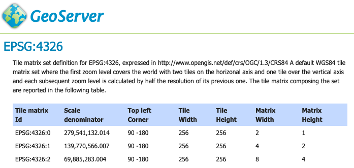

.. _ogcapi-tiles:

OGC API Tiles
=============

A `OGC Tiles API <https://github.com/opengeospatial/OGC-API-Tiles>`_ based on the current early specification draft, delivering both tiled data (vector tiles) and tiled maps (classic map tiles).

.. list-table::
   :widths: 30, 20, 50
   :header-rows: 1

   * - `OGC API - Tiles <https://github.com/opengeospatial/ogcapi-tiles>`__
     - Version
     - Implementation status
   * - Part 1: Core
     - `Draft <https://docs.ogc.org/DRAFTS/20-057.html>`__
     - Implementation based on early specification draft.
     
OGC API Features Extension
--------------------------

This operates as an extension to :ref:`ogcapi-features` listing GridSets as an additional resource.

   
   Tile matrix EPSG:4326 definition