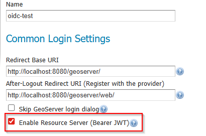
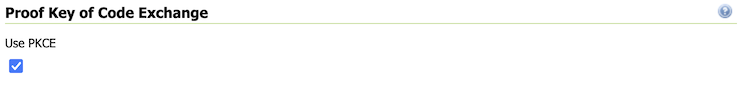

.. _community_oidc_advanced:

Advanced Information
====================

.. _community_oidc_troubleshooting:

Troubleshooting
---------------

There are a lot of little problems that can occur - here are some troubleshooting tips.

#. Turn on GeoServer's "VERBOSE_LOGGING" configuration
#. In your OIDC Security Filter, turn on "Log Sensitive Information (do not use in production)"
#. Open the developer tools for your Browser and look at the requests and see if any of them have error/warning message
#. If you can login, but don't have the correct rights, ensure that your IDP is putting roles in its ID Token, Access Token, or userinfo
#. View the ID Token, Access Token, and userinfo that the IDP is generating.  It maybe difficult to access these.  Use `JWT.io <https://jwt.io>`__ to decode your JWT tokens.
#. Look at the bottom and top of the GeoServer configuration screens - there might be an error message (in red)

Common mistakes:

    * Not putting the correct GeoServer callbacks in your IDP
    * Not putting the user roles in the IDP's ID Token, Access Token, or userinfo
    * Setting the wrong "JSON path" to find the roles in the ID Token, Access Token, or userinfo
    * Not putting in a "Role Conversion" that maps your IDPs role name to GeoServer's role name (especially "ROLE_ADMINISTRATOR")

If you are still having issues, you might need to attach a Java debugger to GeoServer.  The standard OIDC process is as follows:

#. User clicks on the "login" button in GeoServer and is redirected to the External OIDC IDP

    * This will rarely be problematic
    * If there is a problem, its most likely that:

        * GeoServer is configured with the wrong "User Authorization URI"
        * The IDP is not configured to allow "http://localhost:8080/geoserver/web/login/oauth2/code/oidc" as the redirect URL

#. User logs into the IDP (if this is problematic, consult your IDP's administrator)

#. The user is then redirected back to GeoServer (http://localhost:8080/geoserver/web/login/oauth2/code/oidc) with an attached `?code=...`.  GeoServer will make a web request to the IDP to hand this "code" in for the Access/ID Token.

    * You should see this request in the Browser Network Logs (see your Browsers DevTools)
    * In the debugger, you can put a breakpoint in `GeoServerOauth2AccessTokenResponseClient#getTokenResponse()` to see this exchange
    
#. View the ID Token, Access Token, and userinfo. Use `JWT.io <https://jwt.io>`__ to decode your JWT tokens.

    * The easiest way to see this is in `GeoServerOAuth2RoleResolver#convert()` (`pParam`)

#. Ensure that the roles are being correctly accessed

    * The easiest way to see this is in `GeoServerOAuth2RoleResolver#convert()`

Logging OAuth2 Activity
-----------------------

The plugin includes an ``OIDC_LOGGING`` profile which is installed on startup. This logging profile quiets most GeoServer logging activity, while enabling trace logging for OAuth2 functionality.

The module also includes an additional connection setting to include the token details as additional log messages. This is intended to assist in troubleshooting during development and initial setup.

   
   Log sensitive information

This setting can obviously be used to access sensitive information, and you are advised to clear logs after use.

To setup for troubleshooting OIDC activity:

#. Navigate to :menuselection:`Settings --> Global`
#. Select the logging profile ``OIDC_LOGGING``
#. Navigate :menuselection:`Security --> Authentication`
#. Setup your OAuth2 OpenID Connect configuration with :guilabel:`Log Sensitive Information (do not use in production)` checked
#. With these settings each individual step of the OAuth2 authentication is shown. The logging sensitive information setting logs access token and id token (the contents of these tokens may be decoded using https://jwt.io).

   .. code-block:: text

      DEBUG  [security.oauth2] - OIDC: - CLIENT_SECRET: squirrel
      DEBUG  [security.oauth2] - OIDC: received a CODE from Identity Provider - handing it in for ID/Access Token
      DEBUG  [security.oauth2] - OIDC: CODE=...
      DEBUG  [security.oauth2] - OIDC: Identity Provider returned Token, type=Bearer
      DEBUG  [security.oauth2] - OIDC: SCOPES=openid geocat
      DEBUG  [security.oauth2] - OIDC: ACCESS TOKEN: .... 
      DEBUG  [security.oauth2] - OIDC: ID  TOKEN: ... 
      DEBUG  [security.oauth2] - OIDC: Getting Roles from UserGroupService, location=null
      DEBUG  [security.oauth2] - OIDC: Geoserver Roles: ADMIN
      DEBUG  [security.oauth2] - OIDC: Geoserver Roles: ROLE_ADMINISTRATOR

Resource Server (Bearer JWT)
----------------------------

   
   Proof Key of Code Exchange

When enabled, the same OAuth2 / OpenID Connect login filter also accepts machine-to-machine requests that provide an Authorization: Bearer <JWT> header. The token is validated using the provider's JWK Set URI configured in this panel.

Disable this option if you only want browser-based login, and you do not want this filter chain to accept bearer tokens.

Proof Key of Code Exchange (PKCE) 
---------------------------------

The OpenID Connect plugin allows the use of Proof Key of Code Exchange (PKCE).

   
   Proof Key of Code Exchange

The setup process is as follows:

#. Setup your OAuth2 OpenID Connect configuration as normal
#. On the OpenID Connect configuration screen (bottom), makes sure "Use PKCE" is checked

To prevent client side request forgery:

* **Step 1**: GeoServer will include a ``code_challenge`` during initial authorization code request
* **Step 2**: GeoServer will include a ``code_verifer`` during the access token request.

  The authentication server will confirm that ``code_verifier`` hash matches the initial ``code_challenge``
  in order the confirm the client is the same as in **Step 1**. 
  
Log output of this exchange is as follows:

.. code-block::

   DEBUG  [oauth2.pkce] - Generate code_verifier: yQat4Y.....
   DEBUG  [oauth2.pkce] - CODE_CHALLENGE: 5HiD...
   DEBUG  [oauth2.pkce] - CODE_CHALLENGE_METHOD: S256
   DEBUG  [oauth2.pkce] - CLIENT_SECRET: squirrel
   DEBUG  [oauth2.pkce] - CODE_VERIFIER: yQat4Y...

Reference:

* `rfc7636 Proof Key for Code Exchange by OAuth Public Clients <https://datatracker.ietf.org/doc/html/rfc7636>`_

JSON Web Key set URI
--------------------

The ``JSON Web Key set URI`` provides the location of a document of public keys that can be used to check the signature of the provided accessToken.

Optional: It is no longer required to use ``Check Token Endpoint URL`` - if you leave that field blank you may rely only on the ``JSON Web Key set URI`` signature check. When use in this manner roles cannot be extracted from access token.

Enforce Token Validation
------------------------

`True` by default.

Check this option to enforce the validation of the token signature.

Per the `RFC 7517` or this doc from `auth0`, the parameters does not include neither `public_key_use` (but use nor `key_id` (but `kid`)

The RFC specifies that kid is optional (`RFC 7517: JSON Web Key (JWK)`) Use of this member is `OPTIONAL`.

Reference:

* `RFC 7517: JSON Web Key (JWK) <https://www.rfc-editor.org/rfc/rfc7517#section-4.5>`_

Opaque tokens supports
----------------------

The OpenID Connect plugin allows the use of opaque tokens. These tokens have a payload that cannot be read
by the client, and are validated by the authorization server.

When the UI login path is used, the token is provided by the authorisation server and it's not subject to
extra validation.
Roles cannot be read from it, due to its opaque nature the payload cannot be decrypted, but
roles can be read using the userinfo endpoint instead (if the authorization server supports it, and it's configured).

When the Bearer Token path is used, the opaque token is provided by the client gets validated against
the authorization server on the `introspection endpoint <https://datatracker.ietf.org/doc/html/rfc7662#page-4>`_,
which must be configured. The roles are again read from the userinfo endpoint.

Authentication caching
----------------------

The OpenId connect support can make a lot of requests to the OIDC server.

In a scenario where bearer encrypted tokens are used, in encrypted form, and with roles extraction from the userinfo endpoint,
a WMS client sending tokens for each request will trigger the following requests to the OIDC server:

* The bearer token is used against the ``token`` endpoint for username extraction

* Then it’s used against the ``instrospection`` endpoint for validation (which also contains the exp attribute, see later)

* It's finally used against the ``userinfo`` to extract the roles

With clients performing many small tiled requests, the traffic to the OIDC server may becomes excessive.

However, tokens have an ``exp`` attribute, a UNIX epoch indicating the token's expiry.
The :guilabel:`cache authentication` setting makes GeoServer cache the authentication against that token
until expiration to reduce traffic.

SSL Trusted Certificates
------------------------

When using a custom ``Keystore`` or trying to access a non-trusted or self-signed SSL-protected OAuth2 Provider from a non-SSH connection, you will need to add the certificates to the JVM ``Keystore``.

In order to do this you can follow the next steps:

    In this example we are going to
   
    #. Retrieve SSL certificates from Google domains:
   
        "Access Token URI" = https://accounts.google.com/o/oauth2/token therefore we need to trust ``https://accounts.google.com`` or (``accounts.google.com:443``)
        "Check Token Endpoint URL" = https://www.googleapis.com/oauth2/v1/tokeninfo therefore we need to trust ``https://www.googleapis.com`` or (``www.googleapis.com:443``)
       
        .. note:: You will need to get and trust certificates from every different HTTPS URL used on OAuth2 Endpoints.
   
    #. Store SSL Certificates on local hard disk

    #. Add SSL Certificates to the Java Keystore
   
    #. Enable the JVM to check for SSL Certificates from the Keystore
   
1. Retrieve the SSL Certificates from Google domains

   Use the ``openssl`` command in order to dump the certificate
  
   For ``https://accounts.google.com``
  
       .. code-block:: shell
      
           openssl s_client -connect accounts.google.com:443
          
       .. figure:: images/google_ssl_001.png
          :align: center

   And for ``https://www.googleapis.com``
  
       .. code-block:: shell
      
           openssl s_client -connect www.googleapis.com:443
          
       .. figure:: images/google_ssl_002.png
          :align: center

2. Store SSL Certificates on local hard disk

   Copy-and-paste the two sections ``-BEGIN CERTIFICATE-``, ``-END CERTIFICATE-`` and save them into two different ``.cert`` files
   
   .. note:: ``.cert`` file are plain text files containing the ASCII characters included on the ``-BEGIN CERTIFICATE-``, ``-END CERTIFICATE-`` sections
   
   ``google.cert`` (or whatever name you want with ``.cert`` extension)
   
   .. figure:: images/google_ssl_003.png
      :align: center

   ``google-apis.cert`` (or whatever name you want with ``.cert`` extension)
   
   .. figure:: images/google_ssl_004.png
      :align: center

3. Add SSL Certificates to the Java Keystore

   You can use the Java command ``keytool`` like this
   
   ``google.cert`` (or whatever name you want with ``.cert`` extension)
   
   .. code-block:: shell
   
       keytool -import -noprompt -trustcacerts -alias google -file google.cert -keystore ${KEYSTOREFILE} -storepass ${KEYSTOREPASS}

   ``google-apis.cert`` (or whatever name you want with ``.cert`` extension)
   
   .. code-block:: shell
   
       keytool -import -noprompt -trustcacerts -alias google-apis -file google-apis.cert -keystore ${KEYSTOREFILE} -storepass ${KEYSTOREPASS}

   or, alternatively, you can use some graphic tool which helps you managing the SSL Certificates and Keystores, like `Portecle <http://portecle.sourceforge.net/>`_
   
   .. code-block:: shell
   
       java -jar c:\apps\portecle-1.9\portecle.jar
   
   .. figure:: images/google_ssl_005.png
      :align: center

   .. figure:: images/google_ssl_006.png
      :align: center

   .. figure:: images/google_ssl_007.png
      :align: center

   .. figure:: images/google_ssl_008.png
      :align: center

   .. figure:: images/google_ssl_009.png
      :align: center

   .. figure:: images/google_ssl_010.png
      :align: center

   .. figure:: images/google_ssl_011.png
      :align: center

   .. figure:: images/google_ssl_012.png
      :align: center

   .. figure:: images/google_ssl_013.png
      :align: center

4. Enable the JVM to check for SSL Certificates from the Keystore

   In order to do this, you need to pass a ``JAVA_OPTION`` to your JVM:
   
   .. code-block:: shell
   
       -Djavax.net.ssl.trustStore=F:\tmp\keystore.key

5. Restart your server

.. note:: Here below you can find a bash script which simplifies the Keystore SSL Certificates importing. Use it at your convenience.

   .. code-block:: shell

       HOST=myhost.example.com
       PORT=443
       KEYSTOREFILE=dest_keystore
       KEYSTOREPASS=changeme

       # get the SSL certificate
       openssl s_client -connect ${HOST}:${PORT} </dev/null \
           | sed -ne '/-BEGIN CERTIFICATE-/,/-END CERTIFICATE-/p' > ${HOST}.cert

       # create a keystore and import certificate
       keytool -import -noprompt -trustcacerts \
           -alias ${HOST} -file ${HOST}.cert \
           -keystore ${KEYSTOREFILE} -storepass ${KEYSTOREPASS}

       # verify we've got it.
       keytool -list -v -keystore ${KEYSTOREFILE} -storepass ${KEYSTOREPASS} -alias ${HOST}
