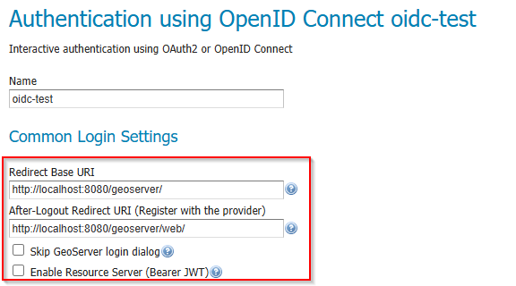

.. _community_oidc_config:

OAUTH2/OIDC configuration
=========================

The basic steps are:

#. Configure your IDP
#. In GeoServer, add the OIDC filter and select your provider from the :guilabel:`Provider` dropdown (configured for your IDP)
#. In GeoServer, configure the "roles source" (if needed)
#. In GeoServer, add your OIDC filter to the "web" filter Chain

For more details, here are detailed examples for different OIDC server types:

   * :ref:`Google <community_oidc_google>`
   * :ref:`GitHub <community_oidc_github>`
   * :ref:`Keycloak <community_oidc_keycloak>`
   * :ref:`MS Azure and Entra <community_oidc_azure>`
   * :ref:`Generic OpenID Connect <community_oidc_generic>`

.. _community_oidc_common_settings:

Common Login Settings
---------------------

When creating or editing an OIDC filter, the top of the configuration form contains settings that apply to all providers.

   Common Login Settings section of the OIDC filter configuration.

The following table describes each field:

.. list-table::
   :header-rows: 1
   :widths: 25 50 25

   * - Field
     - Description
     - Notes
   * - Name
     - A unique name for this filter (e.g. ``keycloak-oidc``).
     - Used internally and in the filter chain configuration.
   * - Provider
     - Select the OAuth2 / OpenID Connect provider type from the dropdown.
     - Choose :guilabel:`OpenID Connect Provider` for generic OIDC IDPs, or a specific provider (Google, GitHub, Microsoft) to pre-fill well-known endpoints.
   * - Redirect Base URI
     - The public base URL of your GeoServer instance, ending with the context path (e.g. ``https://geoserver.example.com/geoserver``).
     - Automatically resolved — see :ref:`Redirect Base URI <community_oidc_redirect_base_uri>` below.
   * - After-Logout Redirect URI
     - The URI the user is sent to after the IDP completes a logout.
     - Must be registered with the IDP as a permitted redirect URI. See :ref:`Logout Behavior <community_oidc_logout_behavior>`.
   * - Redirect URI
     - The full OAuth2 callback URL that GeoServer uses to receive the authorization code from the IDP.
     - **Read-only.** Automatically calculated from the Redirect Base URI. Copy this value when registering GeoServer with your IDP.
   * - Skip GeoServer login dialog
     - When checked and only one provider is active, unauthenticated users are redirected directly to the IDP login page.
     - Bypasses the GeoServer login form entirely. Use with caution — local administrator login will no longer be available through the web UI.
   * - Enable Resource Server (Bearer JWT)
     - When checked, the same filter also accepts machine-to-machine requests using an ``Authorization: Bearer <JWT>`` header.
     - Enabled by default. Disable if you only need browser-based interactive login.

.. _community_oidc_redirect_base_uri:

Redirect Base URI
^^^^^^^^^^^^^^^^^

The Redirect Base URI determines the public-facing URL that your IDP will redirect users back to after authentication. GeoServer resolves this value automatically using the following priority order:

#. **PROXY_BASE_URL environment variable** (or Java system property) — highest priority. This is the recommended approach for Docker and container deployments.
#. **Proxy Base URL from GeoServer's Global Settings** — the value configured in :menuselection:`Settings --> Global` (stored in ``global.xml``).
#. **Current HTTP request context** — derived from the incoming request when no proxy base URL is configured.

.. note::

   The Redirect Base URI is resolved **dynamically**. If the administrator changes the global Proxy Base URL or the ``PROXY_BASE_URL`` environment variable, the OIDC filter will pick up the change automatically without requiring a re-save of the filter configuration.

   If the Redirect Base URI is manually edited in the filter configuration form, the explicit value takes precedence for that session. After a GeoServer restart (or config reload from XML), dynamic resolution resumes.

For Docker and container deployments, always set the ``PROXY_BASE_URL`` environment variable to the externally accessible URL:

.. code-block:: bash

   docker run -e PROXY_BASE_URL=https://geoserver.example.com/geoserver ...

Without this, GeoServer may resolve the redirect URI to an internal hostname that the user's browser cannot reach.

Redirect URI (Read-Only)
^^^^^^^^^^^^^^^^^^^^^^^^^

The :guilabel:`Redirect URI` field is calculated automatically from the Redirect Base URI and cannot be edited directly. It has the form::

   <Redirect Base URI>/web/login/oauth2/code/<provider>

For example::

   https://geoserver.example.com/geoserver/web/login/oauth2/code/oidc

This is the callback URL that must be registered with your IDP as a permitted redirect URI. Copy it from the form and paste it into your IDP's client configuration.

.. _community_oidc_logout_behavior:

Logout Behavior
^^^^^^^^^^^^^^^

When a user clicks :guilabel:`Log out` in GeoServer, two things can happen depending on how the **After-Logout Redirect URI** is configured:

**Global logout (default)**
   If the After-Logout Redirect URI points to the IDP's logout endpoint (e.g. Keycloak's ``/protocol/openid-connect/logout``), the user is signed out of both GeoServer **and** the IDP. This terminates the IDP session entirely, affecting all applications that share the same IDP session.

**GeoServer-only logout**
   If the After-Logout Redirect URI is changed to GeoServer's own URL (e.g. ``http://localhost:8080/geoserver/web/``), the user is only signed out of GeoServer. The IDP session remains active, so the user can re-authenticate without entering credentials again.

Choose the appropriate behavior for your deployment:

* **Shared IDP across many applications** — GeoServer-only logout may be preferred so that users are not unexpectedly signed out of other applications.
* **Dedicated IDP or security-sensitive environment** — global logout is the safer default, ensuring no stale sessions remain.

.. tip::

   The After-Logout Redirect URI must be registered with your IDP as a permitted post-logout redirect URI. Check your IDP's client configuration.
