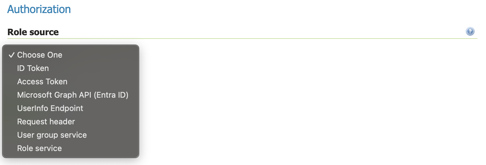
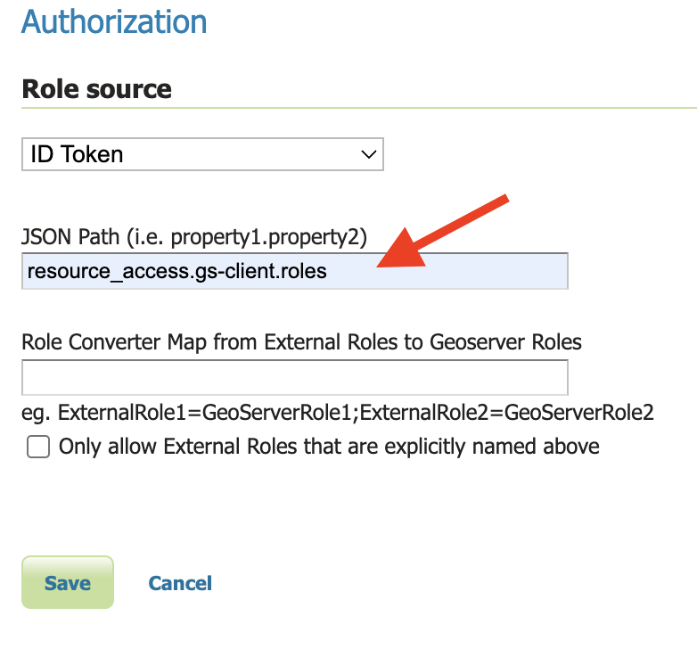
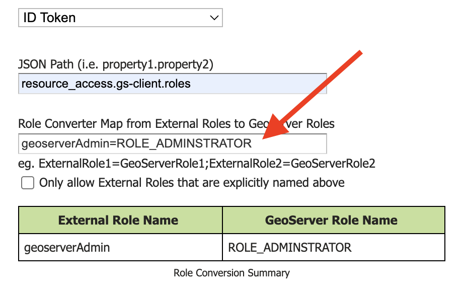

.. _community_oidc_config:

OAUTH2/OIDC configuration
=========================

Extracting Roles from the OIDC IDP
----------------------------------

The `oidc` module allows for providing user roles with the standard GeoServer role providers.  It also adds four new ones: ID Token, Access Token, UserInfo, and  Microsoft Graph.

.. list-table:: OIDC-Specific Role Providers
   :header-rows: 1

   * - Name
     - Meaning
   * - ID Token
     - The `ID token <https://auth0.com/docs/secure/tokens/id-tokens>`_ is an OIDC specific `JWT <https://en.wikipedia.org/wiki/JSON_Web_Token>`_ token that contains signed `claims <https://auth0.com/docs/secure/tokens/json-web-tokens/json-web-token-claims>`_ from the OIDC `IDP <https://en.wikipedia.org/wiki/Identity_provider>`_. These claims can be used for GeoServer roles (see below). This is the recommended place to get roles from.
   * - Access Token
     - The `Access Token <https://en.wikipedia.org/wiki/Access_token>`_ is a OAUTH2 token that is also present in OIDC.  Typically, one should not be looking inside the Access Token, however, if your provider's access token is a JWT, then you can use it extract claims.  This is not the recommended method of getting roles, but is provided as an option.
   * - UserInfo
     - The OIDC `specification <https://openid.net/developers/specs/>`_ provides a `UserInfo endpoint <https://connect2id.com/products/server/docs/api/userinfo>`_ that accepts an Access Token and returns a JSON document with claims about the user.     This is recommended only if the ID Token doesn't contain the claims to get roles from.
   * - Microsoft Graph
     - `Microsoft Graph <https://learn.microsoft.com/en-us/graph/overview>`_ is a Microsoft product for use with their cloud IDP.  Only use this if you are using a Microsoft product like Microsoft Entra ID (formerly Azure AD).

Role Configuration Overview
===========================

1. Choose a role source - typically `ID Token`, but can also be `Access Token` or `UserInfo`.

2. Set the JSON Path to point to where in the Token/UserInfo you want to extract a set of external IDP roles

3. Set the `Role Converter Map` so it converts the IDP's roles to GeoServer roles.

Configuring Roles from the ID Token, Access Token, or UserInfo
--------------------------------------------------------------

The basis of the ID Token, Access Token, and UserInfo is a `JSON <https://en.wikipedia.org/wiki/JSON>`_ document with information about the user.

Here is an example of a `Keycloak <https://www.keycloak.org/>`_ ID Token:

.. code-block:: json

   {
	   "exp": 1708555947,
	   "iat": 1708555647,
	   "auth_time": 1708555288,
	   "jti": "42ee833e-89d3-4779-bd9d-06b979329c9f",
	   "iss": "http://localhost:7777/realms/dave-test2",
	   "aud": "live-key2",
	   "sub": "98cfe060-f980-4a05-8612-6c609219ffe9",
	   "typ": "ID",
	   "azp": "live-key2",
	   "nonce": "4PhqmZSJ355KBtJPbAP_PdwqiLnc7B1lA2SGpB0zXr4",
	   "session_state": "7712b364-339a-4053-ae0c-7d3adfca9005",
	   "at_hash": "2Tyw8q4ZMewuYrD38alCug",
	   "acr": "0",
	   "sid": "7712b364-339a-4053-ae0c-7d3adfca9005",
	   "upn": "david.blasby@geocat.net",
	   "resource_access":  {
            "live-key2": {
                "roles": 
                    [
                        "GeonetworkAdmin", 
                        "GeoserverAdmin"
                    ]
            }
	   },
	   "email_verified": false,
	   "address": { },
	   "name": "david blasby",
	   "groups": ["default-roles-dave-test2", "offline_access", "uma_authorization"],
	   "preferred_username": "david.blasby@geocat.net",
	   "given_name": "david",
	   "family_name": "blasby",
	   "email": "david.blasby@geocat.net"
   }

Many IDPs (including Keycloak) form the ID Token, Access Token (JWT), and UserInfo in a similar format.

In this token's JSON claims, notice this part:

.. code-block:: json

    "resource_access": {
        "live-key2":  {
            "roles": 
                [
                    "GeonetworkAdmin", 
                    "GeoserverAdmin"
                ]
        }
    }

We would, therefore, specify the JSON Path to `resource_access.live-key2.roles` to get the two external IDP roles ("`GeonetworkAdminr`",  and "`GeoserverAdmin`").  In keycloak, the JSON path will be of the form `resource_access.<client name>.roles`.  Other OIDC IDPs will put the roles in a different location. 

Access Token
~~~~~~~~~~~~

If you choose the Access Token as your role source, you can also use `scope` for the JSON path.  This will look at the OIDC IDP's `code response <https://auth0.com/docs/authenticate/login/oidc-conformant-authentication/oidc-adoption-auth-code-flow>`_ to see what `scopes <https://auth0.com/docs/get-started/apis/scopes/openid-connect-scopes>`_ are available.

For **very** advanced users (not recommended - only do this if your IDP uses this mechanism), you can also extract other parts from the code response. This is only provided to help with opaque (non-JWT) Access Tokens. Here is what a typical code response looks like:

.. code-block:: json

    {
        "access_token": "....",
        "token_type": "Bearer",
        "refresh_token": "...",
        "expires_in": 3600,
        "id_token": "..."
    }

Both of these techniques are advanced - and should only be used if you **must** use the Access Token and the Access Token is **not** a JWT.

Configuring  Microsoft Graph
----------------------------

TODO

External-Internal Role Translation
==================================

The `oidc` module provides an easy what to convert the name of an external IDP's role to a local GeoServer role.

In this example, the OIDC IDP will return a `geoserverAdmin` role (see ID Token example, above). You can configure GeoServer to understand what this means, however, this can be complex.  Instead this defines a very simple translation from the role in the ID Token (`External Role Name`) to an internal GeoServer role name.

In this example we are converting the IDP's `geoserverAdmin` role to `ROLE_ADMINISTRATOR`.

You can specify multiple translations separated by the "`;`" character.

If you turn on the "`Only allow External Roles that are explicitly named above`", then roles that are not mentioned in the Role Converter Map will **not** be in the set of GeoServer roles.  For example, in the example ID Token, the user has role "geoserverAdmin" and "geonetworkAdmin". If this is not turned on, then the user will have the GeoServer roles "ROLE_ADMINISTRATOR" (translated from "geoserverAdmin") as well as "geonetworkAdmin".  If it is turned on, then they will only have the "ROLE_ADMINISTRATOR" (translated from "geoserverAdmin") role.