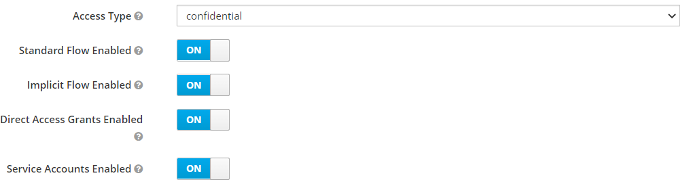
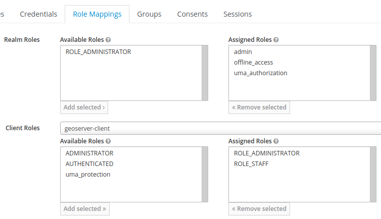
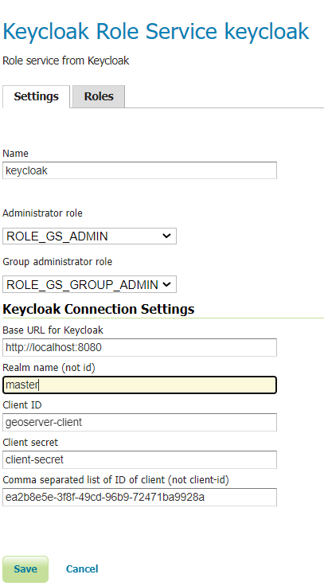

.. _security_tutorials_keycloak_role_service:

Keycloak Role Service
=====================

This tutorial walks through how to set up Keycloak as a role service for GeoServer.

.. note:: In this example the Keycloak service runs on port `8080` while GeoServer runs on port `8181`.

The Keycloak Role Service uses the Keycloak REST api in order to retrieve the roles for its various operations. By default it will retrieve roles with ``realm`` scope.
However it can be configured to retrieve roles with a client scope in a specific realm.

Keycloak Client Configuration
-----------------------------

Follow the `Authentication with Keycloak <https://docs.geoserver.org/latest/en/user/community/keycloak/index.html>`_
guide to configure GeoServer to allow logging in via Keycloak. The Keycloak Role Service needs a client to be configured on Keycloak side having ``Access Type`` set to ``confidential``.

If for your Keycloak Authentication Filter you have used a different ``Access Type`` i.e. ``barer-only``, a separate client will have then to be configured for the Keycloak Role Service.

For the client, ensure that:

* Standard flow, implicit flow, and direct access grants are enabled
* The base URL is set to ``http://localhost:8181/geoserver/web``
* The following redirect URIs are enabled:

  * ``http://localhost:8181/geoserver*``
  * ``http://localhost:8080/auth/realms/master/broker/keycloak-oidc/endpoint*``

* The ``Access Type`` is set to **confidential** and the ``Service Accounts Enabled`` option is enabled.

* Under the ``Service Account Roles`` tab, ensure that the realm-admin, from the realm-management client role is addedd to the ``Assigned roles``.

.. figure:: images/role_service/service_account_roles.png
   :align: center

To assign a user a role:

#. Under the users section in Keycloak, click the user's ID (if there are missing users, click "View all users").
#. In the role mappings tab, select the GeoStore client from the client roles dropdown.
#. Select the role from the available roles, and click add selected.

   *An example set of role mappings for a user.*

When creating custom roles, ensure they begin with ``ROLE_`` e.g. ROLE_STAFF.

GeoServer Configuration for Role Syncing
----------------------------------------
Role syncing with Keycloak will be tied to the confidential client.

#. In GeoServer as an admin, on the 'Users, Groups, Roles' page, add a new role service.
#. Select Keycloak from the list of provided options. All fillable fields are required, excluding the ``Comma separated list of ID of client (not client-id)``.

   * ``Base URL for Keycloak`` is the keycloak host name eg. http://localhost:8080.
   * The ``Realm Name`` is the realm from which the roles should be retrieved eg. master.
   * The ``Client ID`` can be retrieved from the ``Settings`` tab of the client configuration on Keycloak.
   * The ``Client secret`` can be retrieved from the ``Credentials`` tab of the client configuration on Keycloak.
   * The ``Comma separated list of ID of client (not client-id)`` is meant to allow the Role Service to retrieve also roles with client scope. By default indeed the Keycloak Role Service will retrieve realm roles only. The id of a client can be retrieved from the URL when viewing the client configuration page in Keycloak. URL format: eg. ``/auth/admin/master/console/#/realms/master/clients/{ID of client}``

 ``Administrator Role`` and ``Group administator`` role dropdown should be empty at the beginning. They can be filled once saved the role service with the Keycloak role that we want to map to the GeoServer ADMIN and GROUP ADMIN.

#. Ensure you click save to create the Keycloak role service.
#. Once the Role Service has been created and configured to have it active:
   * it can be assigned as a RoleSource to the Keycloak Filter,
   * it can be set as the ``Active Role Service``  in the ``Security Settings`` page.

   *An example of a fully configured Keycloak role service.*

GeoServer Configuration for Keycloak Authentication Filters
-----------------------------------------------------------

Under the Authentication section of GeoServer:

* Add the Keycloak authentication filter to the top of the web and default filter chains.
* Add keycloak to the selected provider chains, and place it above the default.
