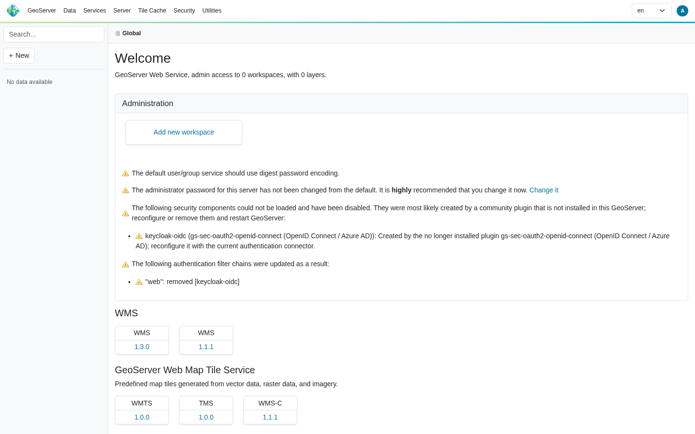
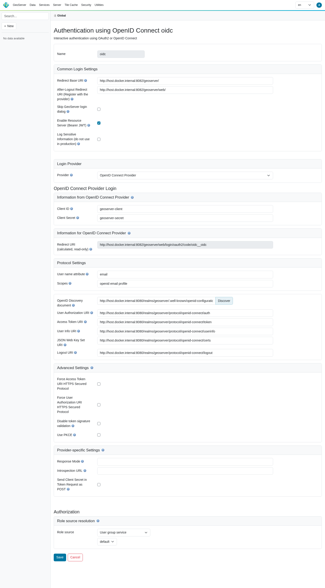

.. _community_oidc_migrating:

Migrating from the legacy OAuth2/OIDC plugins
=============================================

GeoServer 3.0 replaced the separate Spring Security 5 era authentication plugins with a single
:ref:`OpenID Connect / OAuth2 connector <community_oidc>`. The old filters and the Keycloak role service no longer
exist, so their persisted configuration in a data directory created by GeoServer 2.x can no longer be loaded.

This page explains what happens when such a data directory is opened by GeoServer 3.x, and how to migrate each legacy
authentication filter to the new connector.

Reusing a GeoServer 2.x data directory
--------------------------------------

GeoServer 3.x **does not fail to start** when it finds security filters or role services created by a removed or
uninstalled plugin. Instead it degrades gracefully:

* the offending component is **disabled** and **removed from every authentication filter chain** that referenced it;
* the problem is **reported on the GeoServer home page** (visible to administrators), naming the component and, when
  the OpenID Connect module is installed, the plugin that originally created it;
* the on-disk configuration is **left untouched** — nothing is rewritten, so the data directory keeps working with the
  older GeoServer until you migrate it.

For example, opening a GeoServer 2.x data directory whose ``web`` chain used an ``openIdConnectAuthentication`` filter
named ``keycloak-oidc`` produces, on the administrator home page:

.. code-block:: text

   The following security components could not be loaded and have been disabled. They were most likely created
   by a community plugin that is not installed in this GeoServer; reconfigure or remove them and restart GeoServer:

     * keycloak-oidc (gs-sec-oauth2-openid-connect (OpenID Connect / Azure AD)): Created by the no longer installed
       plugin gs-sec-oauth2-openid-connect (OpenID Connect / Azure AD); reconfigure it with the current
       authentication connector.

   The following authentication filter chains were updated as a result:

     * "web": removed [keycloak-oidc]

and the matching startup log line::

   WARN [geoserver.security] - Disabled security filter(s) [keycloak-oidc] were removed from chain 'web'

   Administrator home page listing the disabled legacy security components and the affected filter chains.

.. note::

   Tolerance is generic and lives in GeoServer core, so even a vanilla GeoServer without the OpenID Connect module
   will start and disable the unknown filters — it just reports them with a generic message instead of naming the
   originating plugin.

Fail-closed behaviour
^^^^^^^^^^^^^^^^^^^^^^

Removing a disabled authentication filter from a chain never *grants* access:

* chains that still have a security interceptor continue to enforce their access rules, so an unauthenticated request
  is treated as anonymous and denied for protected resources;
* if removing the filter would leave a chain with **no** authentication filter and **no** interceptor, GeoServer injects
  a fail-closed filter that returns ``403 Forbidden`` for that chain, so a previously protected chain can never silently
  become open.

Recognized legacy filters
-------------------------

When the OpenID Connect module is installed, the following legacy components are recognized and reported by name:

.. list-table::
   :header-rows: 1
   :widths: 30 35 35

   * - Legacy plugin
     - Persisted alias
     - Migrate to
   * - ``gs-sec-oauth2-openid-connect``
     - ``openIdConnectAuthentication``
     - OpenID Connect provider
   * - Azure AD / Microsoft Entra (via the OpenID Connect plugin)
     - ``openIdConnectAuthentication``
     - Microsoft / OpenID Connect provider
   * - ``gs-sec-keycloak`` (filter)
     - ``keycloakAdapter``
     - OpenID Connect provider (Keycloak realm)
   * - ``gs-sec-keycloak`` (role service)
     - ``keycloakRoleService``
     - role source on the OpenID Connect filter
   * - ``gs-sec-oauth2-google``
     - ``googleOauth2Authentication``
     - Google provider
   * - ``gs-sec-oauth2-github``
     - ``githubOauth2Authentication``
     - GitHub provider
   * - ``gs-sec-oauth2-geonode``
     - ``geoNodeOauth2Authentication``
     - OpenID Connect provider (GeoNode)

Migration procedure
--------------------

The new connector is a single ``OAuth2/OpenID Connect`` authentication filter that supports several providers at once.
For each disabled legacy filter:

#. In :menuselection:`Security --> Authentication`, create a new **OAuth2/OpenID Connect** authentication filter.
#. Configure the matching provider with the values from your old filter (see the per-provider notes below).
#. Add the new filter to the authentication filter chains where the old one used to sit (typically the ``web`` and/or
   ``rest`` chains), ahead of the ``anonymous`` filter.
#. Remove the obsolete filter directory under ``security/filter/<name>`` (and, for Keycloak, the obsolete role service
   under ``security/role/<name>``) from the data directory.
#. Restart GeoServer. The home page warning clears once the obsolete configuration is gone.

.. note::

   **When does the warning clear?** It is rebuilt only when the security subsystem re-initializes — at startup, or
   when the global :menuselection:`Security --> Authentication` settings are saved — so refreshing the home page on
   its own never changes it. The warning has two independent parts:

   * *The following authentication filter chains were updated* clears as soon as no chain still references the
     unknown filter — saving the *Authentication* page already rewrites the chains without it.
   * *The following security components could not be loaded* clears only once the obsolete ``security/filter/<name>``
     (and, for Keycloak, ``security/role/<name>``) directory is removed from the data directory.

   A disabled component is **not** listed among the *Authentication* filters, so it cannot be removed with the
   *Remove selected* button — delete its directory on disk, then restart GeoServer, which is the reliable way to
   re-evaluate both parts.

   The unified OpenID Connect login filter configured for a generic OpenID Connect provider (Keycloak): discovery
   populated the endpoints, and the read-only *Redirect URI* shows the
   ``<baseUrl>/web/login/oauth2/code/<filterName>__oidc`` value to register with the IdP.

.. note::

   This migration path was validated end to end against Keycloak: a GeoServer 2.x data directory with an
   ``openIdConnectAuthentication`` filter was opened by GeoServer 3.0 (filter disabled and stripped from the ``web``
   chain, warning shown), a new *OpenID Connect Login* filter was configured for the same realm, and an interactive
   login succeeded. The new connector issues a standards-compliant authorization request with **PKCE**
   (``code_challenge_method=S256``), a CSRF ``state`` and an OIDC ``nonce``, and properly URL-encodes the requested
   scopes — none of which the legacy redirect entry point did. A principal that resolves no roles from the configured
   role source is still authenticated (granted ``ROLE_AUTHENTICATED``) rather than failing.

legacy-openid-connect → OIDC
^^^^^^^^^^^^^^^^^^^^^^^^^^^^^

Carry over the client id, client secret, the authorization / token / user-info endpoints and the scopes from the old
``openIdConnectAuthentication`` filter to the OpenID Connect provider of the new filter. The role source (ID token,
access token, user-info, or Microsoft Graph) maps to the corresponding role source on the new filter.

legacy-azure → OIDC
^^^^^^^^^^^^^^^^^^^

Azure AD / Microsoft Entra was never a separate plugin — it was the OpenID Connect filter pointed at the Azure tenant
endpoints. Migrate it exactly like :ref:`legacy-openid-connect <community_oidc_migrating>`, using the Microsoft / Azure
tenant discovery URL (``https://login.microsoftonline.com/<tenant>/v2.0``). If roles were resolved through Microsoft
Graph, select the Microsoft Graph role source on the new filter.

legacy-keycloak → OIDC
^^^^^^^^^^^^^^^^^^^^^^

The old Keycloak adapter is replaced by the OpenID Connect provider pointed at your Keycloak realm
(``https://<host>/realms/<realm>/.well-known/openid-configuration``). Map the adapter ``resource`` / ``credentials``
to the client id / client secret. If you used the ``keycloakRoleService`` to fetch roles from the Keycloak admin API,
configure the equivalent role source on the new filter instead of a separate role service.

legacy-geonode → OIDC
^^^^^^^^^^^^^^^^^^^^^

Migrate the GeoNode OAuth2 filter to the OpenID Connect provider pointed at the GeoNode ``o/`` OAuth2 endpoints, carrying
over the client id, client secret and redirect URI.

.. note::

   ``gs-sec-oauth2-google`` and ``gs-sec-oauth2-github`` migrate the same way, using the Google and GitHub providers of
   the new connector respectively.

Configuration field changes
---------------------------

The new connector is a single ``OAuth2/OpenID Connect`` filter that supports Google, GitHub, Microsoft / Azure AD and a
generic OpenID Connect provider in one place (use the generic *OpenID Connect* provider for Keycloak, GeoNode and any
standards-compliant IdP). The differences below are what an administrator has to account for when migrating; the values
shown are illustrative.

Redirect / callback URL — must be updated at the IdP
^^^^^^^^^^^^^^^^^^^^^^^^^^^^^^^^^^^^^^^^^^^^^^^^^^^^^^

This is the change most likely to break a migrated login if it is missed. The legacy filters used the GeoServer base
URL as the OAuth2 ``redirect_uri`` (for example ``https://geoserver.example.org/geoserver``) together with a fixed,
provider-specific login path such as ``/j_spring_oauth2_openid_connect_login``.

The new connector follows the Spring Security 6 convention. Each **enabled provider** of a login filter has its own
callback (redirect) URI, shown read-only as *Redirect URI* in that provider's section of the filter configuration page.
**Copy that exact value** into your IdP rather than constructing it by hand. The values follow these patterns:

.. code-block:: text

   <baseUrl>/web/login/oauth2/code/google              # built-in Google provider
   <baseUrl>/web/login/oauth2/code/gitHub              # built-in GitHub provider
   <baseUrl>/web/login/oauth2/code/microsoft           # built-in Microsoft / Azure AD provider
   <baseUrl>/web/login/oauth2/code/<filterName>__oidc  # generic OpenID Connect provider

The built-in Google, GitHub and Microsoft providers use a fixed provider key. The generic *OpenID Connect* provider —
used for **Keycloak, GeoNode, and any standards-compliant IdP** — instead embeds the **filter name**, so multiple
OpenID Connect filters each get a distinct callback. For a filter named ``oidc`` with the base URL
``https://geoserver.example.org/geoserver`` the OpenID Connect callback is:

.. code-block:: text

   https://geoserver.example.org/geoserver/web/login/oauth2/code/oidc__oidc

The base URL is resolved from the ``PROXY_BASE_URL`` environment variable, then the *Proxy Base URL* global setting,
then the current request, so make sure your *Proxy Base URL* is set correctly behind a reverse proxy.

.. important::

   Register the exact *Redirect URI* shown on the filter page as an allowed redirect URI at your IdP **before**
   switching over, and remove the old one. Because the OpenID Connect path embeds the filter name, multiple OpenID
   Connect filters each get a distinct callback URL — they must each be registered separately.

The login is now started from ``<baseUrl>/web/oauth2/authorization/<filterName>__<provider>`` (replacing the legacy
``/j_spring_oauth2_*_login`` endpoints), and the post-logout redirect defaults to ``<baseUrl>/web/`` — register that as
an allowed post-logout redirect URI if your IdP enforces a list.

GeoServer field renames
^^^^^^^^^^^^^^^^^^^^^^^^^

.. list-table::
   :header-rows: 1
   :widths: 40 40 20

   * - Legacy field
     - New field (generic OIDC provider)
     - Change
   * - ``cliendId`` *(sic)* / ``clientSecret``
     - ``oidcClientId`` / ``oidcClientSecret``
     - renamed (typo fixed, provider-scoped)
   * - ``userAuthorizationUri`` / ``accessTokenUri``
     - ``oidcAuthorizationUri`` / ``oidcTokenUri``, or a single ``oidcDiscoveryUri``
     - renamed; discovery preferred
   * - ``jwkURI``
     - ``oidcJwkSetUri``
     - renamed
   * - ``checkTokenEndpointUrl`` / ``introspectionEndpointUrl``
     - ``oidcUserInfoUri`` / ``oidcIntrospectionUrl``
     - renamed
   * - ``principalKey``
     - ``oidcUserNameAttribute``
     - renamed
   * - ``scopes``
     - ``oidcScopes`` (default ``openid``)
     - renamed, provider-scoped
   * - ``sendClientSecret``
     - ``oidcAuthenticationMethodPostSecret``
     - renamed (secret in POST body vs. Authorization header)
   * - ``usePKCE``
     - ``oidcUsePKCE``
     - renamed
   * - ``enforceTokenValidation`` (default ``true``)
     - ``disableSignatureValidation`` (default ``false``)
     - **inverted** — leave signature validation enabled
   * - ``allowBearerTokens``
     - ``enableResourceServerMode``
     - renamed
   * - ``redirectUri`` / ``loginEndpoint`` / ``logoutEndpoint``
     - *(removed — computed, see above)*
     - removed
   * - ``tokenRolesClaim`` / ``postLogoutRedirectUri``
     - ``tokenRolesClaim`` / ``postLogoutRedirectUri`` (now common to all providers)
     - unchanged / moved

Changes to register with your Identity Provider
-----------------------------------------------

When you reconfigure the IdP / OAuth2 client, make sure you:

#. **Redirect URI** — replace the old base-URL callback with the new
   ``<baseUrl>/web/login/oauth2/code/<filterName>__<provider>`` value (and the matching post-logout redirect
   ``<baseUrl>/web/``).
#. **Discovery** — the new connector can read everything from ``<issuer>/.well-known/openid-configuration``
   (``oidcDiscoveryUri``); prefer it over entering each endpoint by hand.
#. **Scopes** — confirm the requested scopes (default ``openid``); the legacy provider-specific defaults are no longer
   pre-filled.
#. **Client authentication / PKCE** — set ``oidcAuthenticationMethodPostSecret`` / ``oidcUsePKCE`` to match what the IdP
   requires.

Per-provider notes:

* **Keycloak** — there is no Keycloak adapter JSON any more. Use the generic OpenID Connect provider with
  ``oidcDiscoveryUri = https://<host>/realms/<realm>/.well-known/openid-configuration`` and the client id / secret from
  your Keycloak client. To resolve roles from the Keycloak Admin API, set the role source to ``KeycloakAPI`` and grant
  the client's service account the ``realm-management`` roles ``view-realm``, ``view-users`` and ``view-clients``;
  optionally list extra client ids in ``keycloakAdminClientIdsOfRoleScopes``.
* **Azure AD / Microsoft Entra** — use the Microsoft provider with the tenant discovery URL
  ``https://login.microsoftonline.com/<tenant>/v2.0``. To resolve roles/groups from Microsoft Graph, enable
  ``msGraphMemberOf`` / ``msGraphAppRoleAssignments``, grant the app registration the **application** Graph permissions
  ``Directory.Read.All`` (groups) and ``AppRoleAssignment.Read.All`` (app roles), and provide the Enterprise Application
  **Object ID** (not the client id) in ``msGraphAppRoleAssignmentsObjectId``.
* **GeoNode** — use the generic OpenID Connect provider pointed at the GeoNode ``o/`` OAuth2 endpoints (authorize /
  token / userinfo), carrying over the client id, client secret and scopes.
