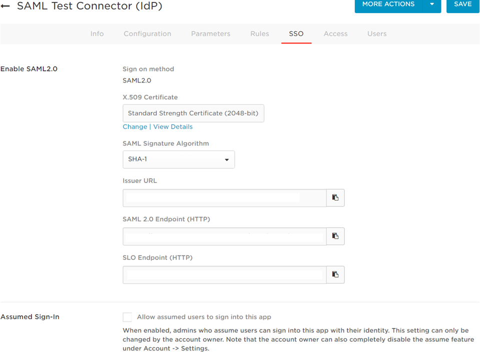
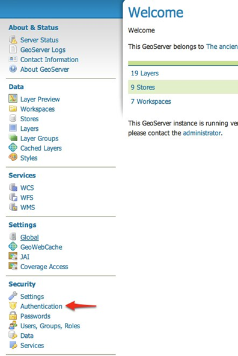
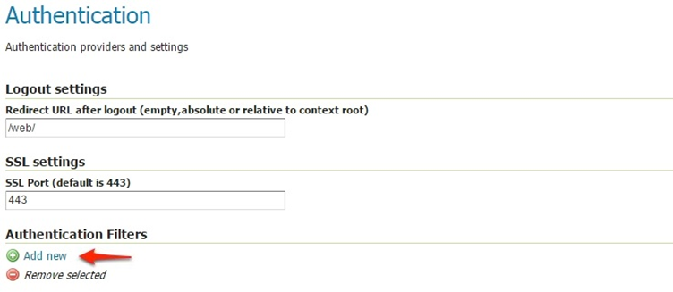
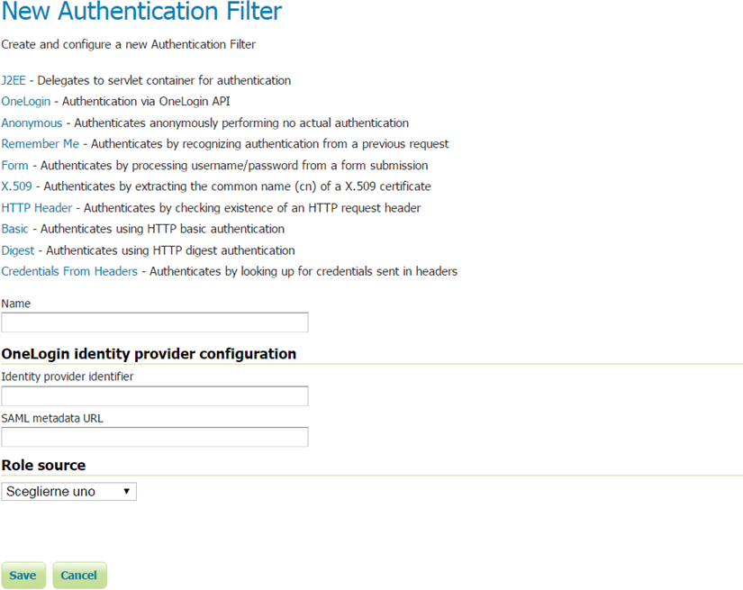
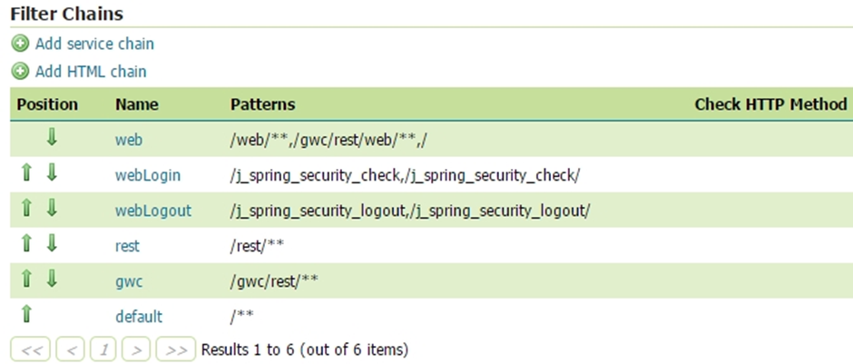
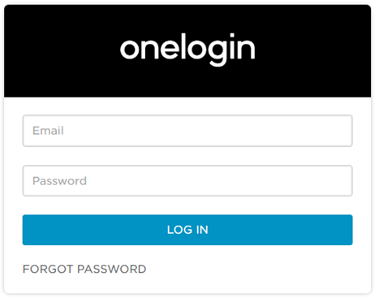

.. _onelogin:

OneLogin Authentication Filter
================================

This plugin adds to GeoServer the support for SAML based Single Sign On (SSO), a process that 
allows users to authenticate themselves against an external Identity Provider (such as OneLogin) 
rather than obtaining and using a separate username and password handled by GeoServer.

What you will need is an account in OneLogin: https://www.onelogin.com/ that will handle the sign-in
process and will eventually provide the authentication credentials of your users to GeoServer.

GeoServer users authenticated through OneLogin are handled from OneLogin and any change performed on the
account is used by GeoServer. The only user data that is necessary for GeoServer is a unique identifier for each user.

User's email is used by default as a unique identifier for each user. GeoServer does not store passwords.

OneLogin Configuration
----------------------

Actually GeoServer is not present within the OneLogin application catalog so we can use the OneLogin SAML test connector.
For more details about configuring the SAML Test Connector follow the guide at:

    https://support.onelogin.com/hc/en-us/articles/202673944-How-to-Use-the-OneLogin-SAML-Test-Connector
    
In the example we assume that GeoServer URL is http://localhost:8080/geoserver, if you have a specific domain 
for geoserver use it instead.

On the SAML Test Connector (IdP) configuration page, use the following values as parameters:

.. list-table::
   :header-rows: 1

   * - Parameter
     - Value
   * - RelayState
     - empty
   * - Audience
     - GeoServer
   * - Recipient
     - http://localhost:8080/geoserver/saml/SSO
   * - ACS URL Validator
     - ^http:\/\/localhost:8080\/geoserver\/saml\/SSO$
   * - ACS URL
     - http://localhost:8080/geoserver/saml/SSO
   * - Single Logout URL
     - http://localhost:8080/geoserver/saml/SingleLogout

Then, write down the Metadata URL you found in the ``Issuer URL`` field of the SSO Configuration page:

Configuring the OneLogin Authentication Filter
----------------------------------------------

1. Start GeoServer and login to the web admin UI as the admin user.
2. Click the Authentication link located under the Security section of the navigation sidebar.
  

3. Scroll down to the Authentication Filters panel and click the Add new link.

  

4. Click the OneLogin link.

  

   

5. Fill in the fields of the settings form as follows; you can use GeoServer role sources to assign
a specific group or role to OneLogin user. OneLogin user email must be mapped to GeoServer user name.

.. list-table::
   :header-rows: 1

   * - Parameter
     - Value
   * - Name
     - OneLogin (or any other unique name)
   * - Identity provider identifier
     - Same value of Audience field on OneLogin configuration panel
   * - SAML metadata URL
     - Put here the Metadata URL copied from the OneLogin configuration panel

6. Update the filter chains by adding the new OneLogin filter.

   
7. Select the OneLogin Filter for each filter chain you want to protect with OneLogin (for example web)

.. figure:: images/onelogin06.png
   :align: center

Testing with OneLogin
---------------------

1.	Navigate to the GeoServer home page and log out of the admin account.

2.	Try to login again, you should be able now to see the external OneLogin form.

   
3.	You can manage users using OneLogin panel located at https://admin.us.onelogin.com/users
