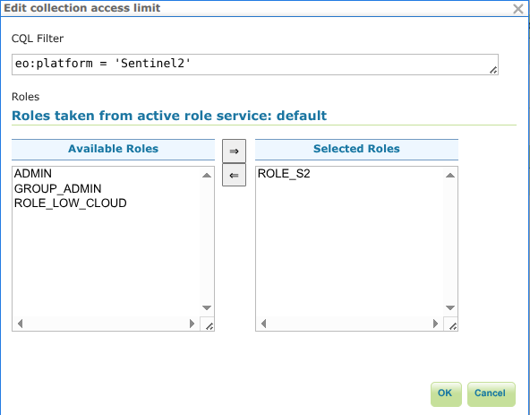
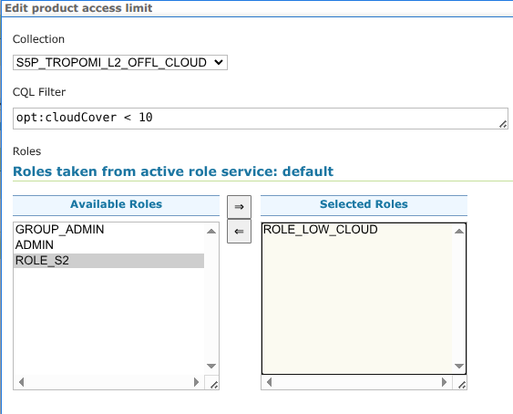

.. _opensearch_eo_security:

OpenSearch/STAC security
========================

While typically catalog contents are accessible to everyone, there are situations
where some data needs to be protected and only accessible to certain users.

GeoServer security subsystem is used to protect OpenSearch and STAC resources.
The following sections describe how to configure security for these resources.

Web interface configuration
---------------------------

OpenSearch and STAC resources can be protected using the Security/EO Security menu entry:

.. figure:: ./images/security-menu.png
   :align: center

The configuration page allows to define rules to protect OpenSearch and STAC resources, in particular,
collections and products (items in STAC terminology).

.. figure:: ./images/security-page.png
   :align: center

A rule associates a filter with one or more roles: the filter defines which resources are protected,
while the roles define which users can access them. In other words, a user must have the required role
to access the resources matching the filter.

The filter syntax is ECQL, the properties that can be used in the filter are the ones also used
in the templates, e.g., ``eo:platform`` for collections, or ``opt:cloudCover`` for products/items.

Adding or editing a collection rule opens the following dialog:

Similarly, adding or editing a product/item rule opens the following dialog, which has in addition
a collection dropdown to restrict the rule to products/items belonging to a specific collection
(mandatory entry when editing a product/item rule):

REST configuration
------------------

The security configuration can also be managed using the REST API, they are part of the
oseo service configuration. For example, the configuration in the screenshots above
can be retrieved with the following request::

   /geoserver/rest/services/oseo/settings.xml

and it would yield the following XML:

.. code-block:: xml

   <oseo>
     <id>OSEOInfoImpl--77996715:1647eb68e30:-8000</id>
     <enabled>true</enabled>
     <name>OSEO</name>
     ...
     <collectionLimits>
       <eoCollectionLimit>
         <cqlFilter>eo:platform = &apos;Sentinel2&apos;</cqlFilter>
         <roles>
           <string>ROLE_S2</string>
         </roles>
       </eoCollectionLimit>
     </collectionLimits>
     <productLimits>
        <eoProductLimit>
          <cqlFilter>opt:cloudCover &lt; 10</cqlFilter>
          <roles>
            <string>ROLE_LOW_CLOUD</string>
          </roles>
          <collection>S5P_TROPOMI_L2_OFFL_CLOUD</collection>
        </eoProductLimit>
     </productLimits>
   </oseo>

The limits can be updated by sending a PUT request to the same URL with the modified configuration.