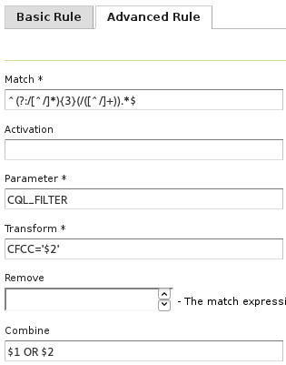
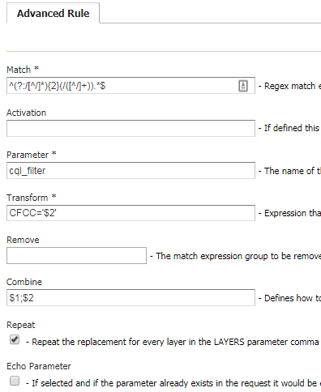
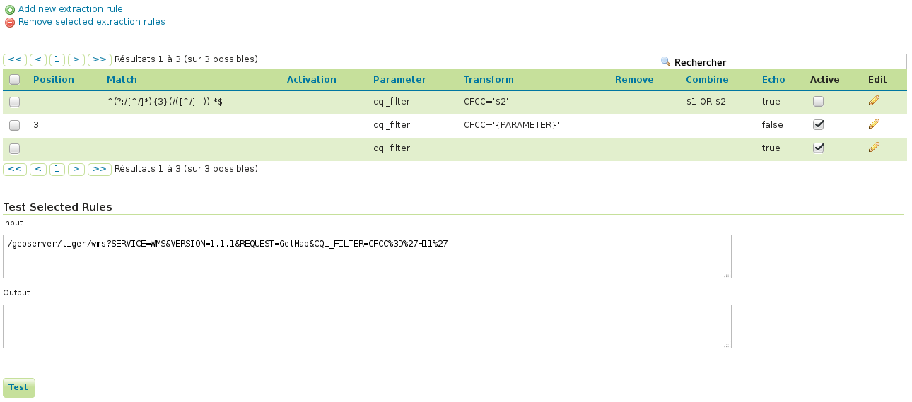

.. _community_params_extractor:

Parameters Extractor
====================

This module allow us to entering specific request parameters as URL path fragments instead of using the query string.
For example, we want to be able to apply a cql_filter using a URL in the following form::

    /geoserver/<workspace>/<layer>/<filter>/ows?service=WMS&version=1.3.0&request=GetMap

As a simple example of usage, if the <filter> is something like::

    K_140M

the URL would become::

    /geoserver/<workspace>/<layer>/K_140M/ows?service=WMS&version=1.3.0&request=GetMap

and this module will translate the URL to this new one::

    /geoserver/<workspace>/<layer>/ows?service=WMS&version=1.3.0&request=GetMap&cql_filter=seq='K140M'

This module is configured by a set of rules that will be applied to the incoming URLs. Note that a get capabilities result will include the original URL maintaining the extra filter.

This module also gives the possibility to echo existing URL parameters to the result of a get capabilities result. As an example, by default the following get capabilities request (note the existing cql_filter parameter)::

    /geoserver/ows?service=wms&version=1.3.0&request=GetCapabilities&cql_filter=CFCC=%27D68%27 

will return a get capabilities document were the URLs will be of the type::

    /geoserver/ows?SERVICE=WMS&

if this module is configured to echo an existing cql_filter parameter the result would be::

    /geoserver/ows?SERVICE=WMS&CQL_FILTER=CFCC%3D%27D68%27&

This module is configured using three types of rules: echo parameter rules, basic rules and advanced rules. All of them can be managed in this module UI which is integrated in GeoServer UI.

Echo Parameter Rules
-----------------------------------

Echo parameter rules are very simple, they allow us to define that a certain existing URL parameter should be echoed to a get capabilities result. This type of rules only required one mandatory parameter which is the name of the existing URL parameter that should be echoed to a get capabilities result.

Example of an echo parameter rule:

.. figure:: images/echo_rule.png
   :align: center

   *Example of a echo parameter rule defined in the UI*

This rule will echo the cql_filter of this URL::

    /geoserver/ows?service=wms&version=1.3.0&request=GetCapabilities&cql_filter=CFCC=%27D68%27

to the get capabilities result::

    /geoserver/ows?SERVICE=WMS&CQL_FILTER=CFCC%3D%27D68%27&

Basic Rules
-----------------------------------

Basic rules allow us to handle simple uses cases where we only want to extract a parameter from the URL. 

A basic rule is defined by three mandatory attributes:

.. list-table::
   :widths: 20 80

   * - **Attribute**
     - **Description**
   * - ``Position``
     - The position of the URL base path element to be selected
   * - ``Parameter``
     - The name of the parameter produced by this rule
   * - ``Transform``
     - Expression that defines the value of the parameter, use {PARAMETER} as a placeholder for the selected path element

For commodity is also possible when defining this type of rules to configure that an existing parameter in the URL should be echoed to a get capabilities result.

Example of a basic rule:

.. figure:: images/basic_rule.png
   :align: center

   *Example of a basic rule defined in the UI*

This rule will transform the URL::

    /geoserver/tiger/wms/H11?SERVICE=WMS&VERSION=1.1.1&REQUEST=GetMap

in::

    /geoserver/tiger/wms?SERVICE=WMS&VERSION=1.1.1&REQUEST=GetMap&CQL_FILTER=CFCC%3D%27H11%27

Advanced Rules
-----------------------------------

Advanced rules allow us to handle more complex uses cases where more flexibility is required. 

An advanced rule is defined by three mandatory attributes and four optional ones:

.. list-table::
   :widths: 10 80 10

   * - **Attribute**
     - **Description**
     - **Mandatory**
   * - ``Match``
     - Regex match expression with groups, for example ^(?:/[^/]*){3}(/([^/]+)).*$ selects the URL base path third element
     - Yes
   * - ``Activation``
     - If defined this rule will only be applied to URLs that match this regex expression
     - No
   * - ``Parameter``
     - The name of the parameter produced by this rule
     - Yes
   * - ``Transform``
     - Expression that defines the value of the parameter, use $1 ... $n as placeholders for groups defined in the match expression
     - Yes
   * - ``Remove``
     - The match expression group to be removed from URL, by default 1
     - No
   * - ``Combine``
     - Defines how to combine parameter existing value ($1 existing value, $2 new value), by default the value is overridden
     - No
   * - ``Repeat``
     - If defined, Combine is applied not only once, but for every layer included in the LAYERS parameter, this allows filling parameters that require a value for each layer (e.g. STYLES or CQL_FILTER)
     - No

For commodity is also possible when defining this type of rules to configure that an existing parameter in the URL should be echoed to a get capabilities result.

Example of an advanced rule:

   *Example of an advanced rule defined in the UI*

This rule will transform the URL::

    /geoserver/tiger/wms/H11?SERVICE=WMS&VERSION=1.1.1&REQUEST=GetMap&CQL_FILTER=CFCC%3D%27D68%27

in::

    /geoserver/tiger/wms?SERVICE=WMS&VERSION=1.1.1&REQUEST=GetMap&CQL_FILTER=CFCC%3D%27D68%27+or+CFCC%3D%27H11%27

No that this rule will also echo an existing cql_filter parameter to the get capabilities result.

Example of an advanced rule with repeat:

   *Example of an advanced rule with repeat defined in the UI*

This rule will transform the URL::

    /geoserver/wms/H11?SERVICE=WMS&VERSION=1.1.1&REQUEST=GetMap&LAYERS=tiger,other

in::

    /geoserver/wms?SERVICE=WMS&VERSION=1.1.1&REQUEST=GetMap&LAYERS=tiger,otherCQL_FILTER=CFCC%3D%27D68%27%3BCFCC%3D%27H11%27

Rules Management
-----------------------------

Rules can be managed and tested in the rules management UI. Besides the basic operations like add, remove and update is also possible to activate or deactivate rules. A deactivated rule will be ignored by this module.

Follow a print screen of the rules management UI with all the rules previously defined:

   *Rules management UI*

Note that the first rule (the advanced one) is not active.

REST API
--------

The rules and echo parameters can also be managed by means of a REST API found at 
``geoserver/rest/params-extractor``. Documentation for it is available in 
:api:`Swagger format <params-extractor.yaml>`

Intercepting the security filters chain
---------------------------------------
By default, the params-extractor module does not interact with the security authentication filters.
This is because the params-extractor filter is called later in the GeoServer filters chain.

If you want params-extractor to work before the security filter chain, you have to configure it as
a standard servlet filter in the GeoServer WEB-INF/web.xml file.

This can be done adding the following to your current web.xml (immediately after the ``Set Character Encoding`` filter) and restarting GeoServer:

    .. code-block:: xml

        <!DOCTYPE beans PUBLIC "-//SPRING//DTD BEAN//EN" "http://www.springframework.org/dtd/spring-beans.dtd">
        <web-app>
            ...
            <filter>
             <filter-name>ExtractParams</filter-name>
             <filter-class>org.geoserver.params.extractor.Filter</filter-class>
            </filter>
            ...
            <filter-mapping>
              <filter-name>ExtractParams</filter-name>
              <url-pattern>/*</url-pattern>
            </filter-mapping>
            ...
        </web-app>
    