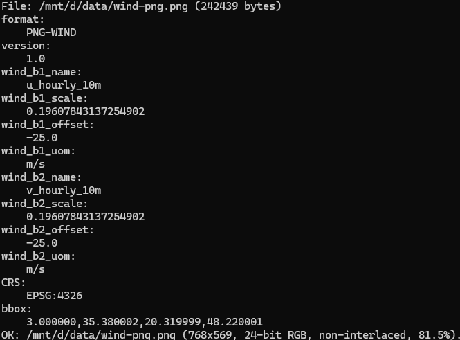
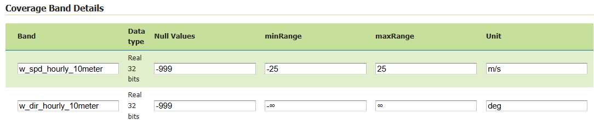

.. _community_png_wind:

PNG-WIND output
===============

The PNG-WIND output format is a GeoServer community module that produces a compact PNG representation of vector wind fields.
The module can be used as output of a WMS GetMap request for a single layer containing 2 raster bands representing either:

- the U and V component of a wind vector field, or
- wind speed and direction

The output encodes the wind information into an RGB PNG Image containing:

- R band: byte-scaled values of the U component
- G band: byte-scaled values of the V component
- B band: a (0-255) validity mask computed on the input bands nodata

In addition to the RGB pixel values, PNG-WIND embeds metadata into the PNG file using PNG ``tEXt`` chunks.
This metadata allows clients to reconstruct the original wind values from the quantized byte representation.

The PNG can be transmitted to web clients and reconstructed for vector field visualization, such as particle-based wind animations.

To request a PNG-WIND output, specify *format=image/vnd.png-wind* in the GetMap request.

Installation
------------

As a community module, the package needs to be downloaded from the `nightly builds <https://build.geoserver.org/geoserver/>`_,
picking the community folder of the corresponding GeoServer series (e.g. if working on the GeoServer main development branch nightly
builds, pick the zip file form ``main/community-latest``).

To install the module, unpack the zip file contents into GeoServer own ``WEB-INF/lib`` directory and
restart GeoServer.

Input Data Requirements
-----------------------
The plugin expects the GetMap request to contain only 1 coverage representing a vector wind field with two bands.
The plugin produces 2 bands representing scaled values of the U and V components of the wind, plus a validity mask.
Layers representing speed and direction are also supported: the two bands will be transformed to U and V and then scaled.
If the two bands are not explicitly named U/V or SPEED/DIRECTION (case-insensitive), 
a heuristic defined in a configuration file is used to infer whether the bands represent U/V components or Speed/Direction.
The style configured for the layer will be ignored.

Encoding and Scaling
====================
Wind components are stored in the output PNG using byte values (0–255).
Because original wind values are usually floating point numbers, the plugin performs linear scaling, using this formula:

Scaling Formula for each component:

.. code-block:: text

   scaled = (255 * (value - min) / (max - min))

Where:

- value = original wind component
- min = minimum expected value
- max = maximum expected value

The result is clamped to the [0,255] byte range.

The minimum/maximum values used for scaling are obtained from the coverage metadata.
These values are defined in the GeoServer layer configuration and represent the expected value range of the band.

   *Coverage Band Details, reporting nodata and min/max values.*

These values can be edited. For example, if the ranges are not available or are infinite numbers, consider editing them to the desired min/max values.
Alternatively, the default min/max values specified in the configuration file will be used when not defined or infinite. The Configuration file will be described in the next sections.

NoData Handling
---------------
A separate mask band is generated internally to track valid pixels.
The 3rd band (validity mask) of the encoded PNG is computed by setting: 

- 0 on input NoData pixels 
- 255 on input valid pixels

In case of unspecified NoData, the 3rd band will be a constant image (255 on all pixels)

The nodata can be specified in the GeoServer layer configuration (in the *Null Values* column of the Coverage Band Details)

Clients should treat pixels where the mask indicates invalid data as missing values.

Metadata Encoding
-----------------
PNG-WIND embeds metadata into the PNG file using PNG ``tEXt`` chunks.
This metadata allows clients to reconstruct the original wind values from the quantized byte representation.

The metadata entries are stored as key/value pairs and include information about the format version,
band scaling parameters, spatial reference system, and geographic extent of the image.

The following fields are written:

- ``format``  
  Identifier of the encoding format. This allows clients to recognize PNG-WIND encoded images.

- ``version``  
  Version of the PNG-WIND encoding specification.

- ``wind_b1_name``  
  Name of the first encoded band (usually the U component).

- ``wind_b1_scale``  
  Scaling factor used to quantize the first band.

- ``wind_b1_offset``  
  Offset (minimum value) used during quantization of the first band.

- ``wind_b1_uom``  
  Unit of measure of the first band.

- ``wind_b2_name``  
  Name of the second encoded band (usually the V component).

- ``wind_b2_scale``  
  Scaling factor used to quantize the second band.

- ``wind_b2_offset``  
  Offset (minimum value) used during quantization of the second band.

- ``wind_b2_uom``  
  Unit of measure of the second band.

- ``CRS``  
  Coordinate reference system of the image, expressed as an EPSG code when available
  (for example ``EPSG:4326``).

- ``bbox``  
  Bounding box of the image expressed as ``minx,miny,maxx,maxy`` in the image CRS.

Clients can reconstruct the original wind component values using the stored scaling parameters.
Given a quantized byte value ``q`` (0–255), the original value can be reconstructed as:

.. code-block:: text

   value = offset + scale * q

Where:

- ``scale`` is the ``wind_b*_scale`` value
- ``offset`` is the ``wind_b*_offset`` value

An example of this metadata can be seen with 
`pngcheck script <https://www.libpng.org/pub/png/apps/pngcheck.html>`_ with -t option to return -tEXt chunks:

.. code-block:: text

   pngcheck -t wind.png

   *PNG-Wind metadata example. 1 tEXt chunk per key.*

Polar to Vector components Transformation (SPEED/DIRECTION to U/V)
------------------------------------------------------------------
PNG-WIND internally represents wind fields using U/V vector components. 
Inputs provided as speed and direction are supported on a best-effort basis through automatic conversion
to transform them to U and V components before encoding, while U and V inputs are retained as is, 
without transformation.

Wind direction may follow two common meteorological conventions:

- FROM — the direction from which the wind originates (meteorological standard)
- TO — the direction toward which the wind is blowing

The convention is controlled in the configuration file (default is "FROM"). The configuration file is described in the next section.

The unit of the direction band can be configured in the Coverage Band Details (either deg or rad). 
If not defined, the default direction unit from the configuration file will be used.

The min/max range used for scaling will be derived from the speed range.

   *Coverage Band Details for speed and direction.*

The speed/direction to U/V transformation uses the following formula (assuming FROM direction convention and degrees)

.. code-block:: text

   u = -speed * sin(direction * π/180)
   v = -speed * cos(direction * π/180)

Configuration file
==================
Band identification heuristic, default min and max values, wind direction convention and unit are defined in a :file:`pngwind.properties` file defined on the 
GEOSERVER_DATA_DIR. If not available, the default configuration file will be created at first need in :file:`$GEOSERVER_DATA_DIR/pngwind.properties`

Here is a sample definition of the :file:`pngwind.properties` file::

  default.min=-25
  default.max=25
  direction.convention=FROM
  direction.unit=DEG
  band.speed.exact=speed,wind_speed,windspeed,ws
  band.speed.contains=spd,wspd,wind_spd,wind_speed
  band.dir.exact=direction,wind_direction,winddir,wd
  band.dir.contains=dir,wdir,wind_dir,wind_direction
  band.u.exact=u,uwnd,ugrd
  band.u.contains=eastward_wind,u_component,_u_
  band.v.exact=v,vwnd,vgrd
  band.v.contains=northward_wind,v_component,_v_

With a default range of [-25;25] m/s the quantization step is around 0.20 m/s.

Administrators can rename bands in the Coverage Band Details section to use the canonical names U and V, or SPEED and DIRECTION.
When different names are used, a heuristic is applied to infer the band types.
The plugin attempts to determine whether each band represents one of the four supported wind components:

- U (east-west component)
- V (north-south component)
- speed
- direction

The band name used in the matching process is taken from the coverage metadata defined in Coverage Band Details section.

For each supported band type, the configuration file defines two matching rules:

- exact: A comma-separated list of names that must exactly match the band name after normalization.
This rule has the highest priority and is typically used for common or canonical band names.

- contains: A comma-separated list of tokens that are considered a match if the band name contains the token.
This allows identifying bands whose names include additional prefixes or suffixes, such as time or level indicators.

Before comparison, band names and tokens are normalized to improve robustness:

- converted to lowercase
- trimmed
- non-alphanumeric characters replaced with underscores

Finally, there is a last heuristic step that check if the 2 band names differ only by 'u' vs 'v'.
For example: hourly_u100m_wind and hourly_v100m_wind. These differ only by 'u' vs 'v' at the 8th char.

Limitations
===========

One Layer with two-band requirement
-----------------------------------
The format can only be used when requesting a single coverage layer. Requests with multiple
layers or layergroup are not supported. Moreover the coverage must contain exactly 
two bands representing the wind components either in vector representation (U and V)
or polar representation (speed and direction).
Datasets containing additional bands are currently not supported.

Quantization accuracy and Byte precision
----------------------------------------
Wind values are quantized to a finite numeric range in order to enable compact transport. 
This introduces a bounded loss of precision, which may result in small deviations 
when values are reconstructed on the client.
Since values are encoded in 8-bit precision, the reconstructed values are approximate.
This is usually acceptable for visualization/animation but may not be suitable for scientific analysis.

Band identification ambiguity
-----------------------------
Automatic band detection heuristic relies on token matching based on a configurable dictionary.
Datasets with unusual band names may require adjusting the properties configuration.

Scope and data constraints
--------------------------
The PNG-WIND format is limited to requests involving a single raster layer with exactly two wind-related bands.
It is not intended to replace full scientific data formats or to support complex analytical workflows 
requiring lossless precision, multi-variable coupling, or advanced vector operation.
PNG-WIND is designed for visualization, not for lossless transport of scientific data.
Applications requiring full numeric precision should not use this format.

Vector reprojection effects
---------------------------
When wind data is requested in a coordinate reference system different from the source,
the raster grid is reprojected but wind vectors are not explicitly rotated to compensate
for projection-induced angular distortion. As a result, wind directions may exhibit small
angular inaccuracies, particularly at high latitudes or over large map extents. 
This approximation is commonly accepted in visualization workflows and may be revisited 
in future enhancements as an optional, vector-aware reprojection step.