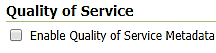
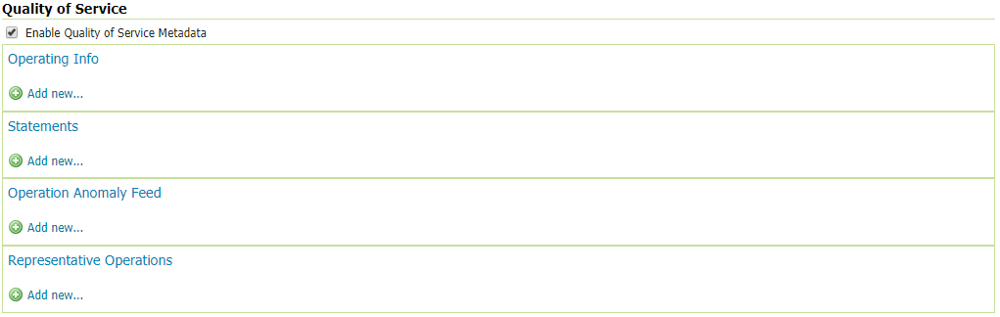
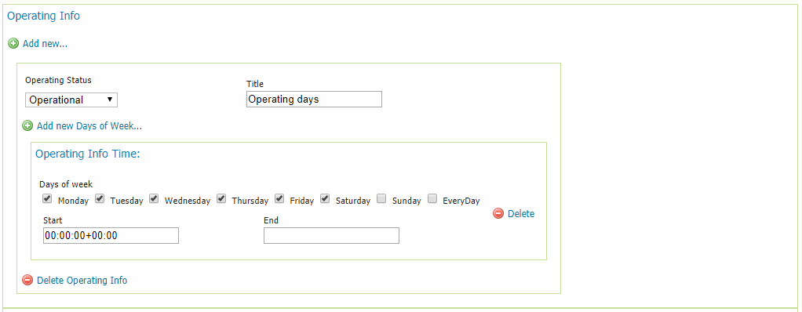
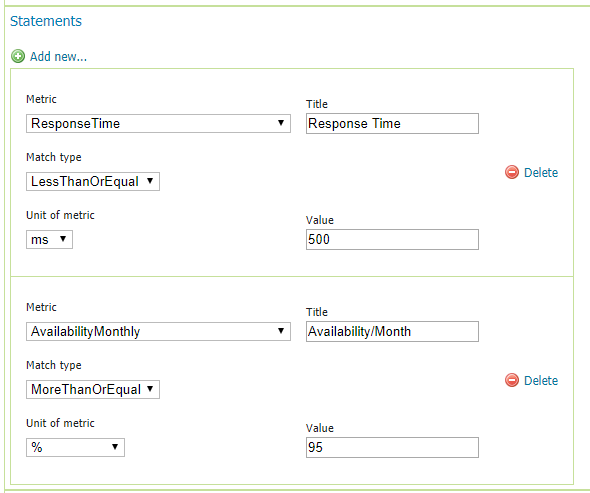
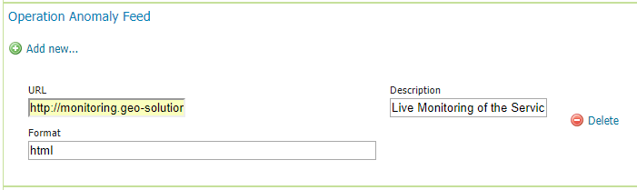
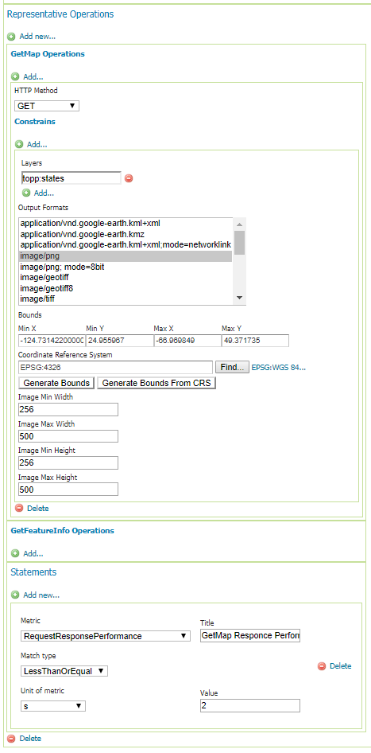

.. _qose-module:

Quality of Service and Experience Module (QoSE)
===============================================

The OGC standards for the ``Quality of Service and Experience (QoSE)`` module aim to improve the quality of the Web Services and APIs, including factors 
like availibility, capacity  and performance by using well-defined metrics in order to provide comparable QoS measurements. The declared metadata in the Quality of Service and Experience  
contribute to get a complete picture of the Quality of Service of the entire Spatial Data Infrastructure, and more effectively maintain high Quality of Experience for its end users.

Installing the Plug-in
----------------------

As a community module, the package needs to be downloaded from the nightly builds, picking the community folder of the corresponding GeoServer series (e.g. if working on GeoServer master nightly builds, 
pick the zip file form master/community-latest). The module is only supported in GeoServer 2.15 and later on. 

To install the module, unpack the zip file contents into GeoServer own WEB-INF/lib directory and restart GeoServer.

Configuring QoSE
----------------

After the installation of the QoSE Plug-in, the WMS and WFS settings will show a configuration section for QoSE. 

	  
Once you enable the checkbox in the figure above, four additional sections will be shown.

	  
Operating Info
^^^^^^^^^^^^^^

The Operating Info section allow the user to define a schedule of the Operating Status of the Service. Many schedules with different Operating Status can be added. Specifically, the Operating Status menu 
list contains three options:

* :guilabel:`Operational:` The service or endpoint can be expected to function reliably and return correct and up-to-date information according to it's service and dataset descriptions.
* :guilabel:`PreOperational:` The service or endpoint may be under maintenance or down in the scheduled time.
* :guilabel:`NonOperational:` The service may be unavailable or unstable. 

In the Operating Info Time, the user can set the days of the week and the Start/End time with the following format; hours:minutes:seconds+timezone (e.g. 01:00:00+03:00 or 09:00:00-04:00). 

.. note:: Title, Start and End time are mandatory fields, and the user can add multiple time parts.

	  
Statements
^^^^^^^^^^

Through this section, the user can declare several performance statements of the service using various metrics such as  the performance, the availibility and the capacity of the service.

Operation Anomaly Feed
^^^^^^^^^^^^^^^^^^^^^^

The user can also provide the module with external resources or files that contain further info on the operation anomalies. For example, a calendar that indicates maintenance periods, downtimes or network 
slowness or a Log file.    

.. note:: All the fields are mandatory. The URL field can accept filenames or relative/absolute URLs.

Representative Operations
^^^^^^^^^^^^^^^^^^^^^^^^^

In this section, the user can set the parameters of an operation such as a GetMap or GetFeatureInfo request to auto-configure external monitoring tools. Then, as a statement can 
declare the expected performance of the service for the latter monitored operation. 

Once you have finished to set all the desired operations, you can click on submit.   

The module will inject the settings in the XML GetCapabilities file of the service.

.. code-block:: xml

   <qos:QualityOfServiceStatement>
        <qos:Metric xlink:href="http://def.opengeospatial.org/codelist/qos/metrics/1.0/metrics.rdf#ResponseTime" xlink:title="Response Time"/>
        <qos:LessThanOrEqual uom="ms">500</qos:LessThanOrEqual>
      </qos:QualityOfServiceStatement>
      <qos:QualityOfServiceStatement>
        <qos:Metric xlink:href="http://def.opengeospatial.org/codelist/qos/metrics/1.0/metrics.rdf#AvailabilityMonthly" xlink:title="Availability/Month"/>
        <qos:MoreThanOrEqual uom="%">95</qos:MoreThanOrEqual>
      </qos:QualityOfServiceStatement>
      <qos:RepresentativeOperation>
        <qos-wms:GetMapOperation>
          <ows:DCP>
            <ows:HTTP>
              <ows:Get/>
            </ows:HTTP>
          </ows:DCP>
          <qos-wms:RequestOption>
            <qos:AreaConstraint srsName="EPSG:4326">
              <qos:LowerCorner>-124.73142200000001 24.955967</qos:LowerCorner>
              <qos:UpperCorner>-66.969849 49.371735</qos:UpperCorner>
            </qos:AreaConstraint>
            <qos:RequestParameterConstraint name="LayerName">
              <ows:AllowedValues>
                <ows:Value>topp:states</ows:Value>
              </ows:AllowedValues>
            </qos:RequestParameterConstraint>
            <qos:RequestParameterConstraint name="CRS">
              <ows:AllowedValues>
                <ows:Value>EPSG:4326</ows:Value>
              </ows:AllowedValues>
            </qos:RequestParameterConstraint>
            <qos:RequestParameterConstraint name="OutputFormat">
              <ows:AllowedValues>
                <ows:Value>image/png</ows:Value>
              </ows:AllowedValues>
            </qos:RequestParameterConstraint>
            <qos:RequestParameterConstraint name="ImageWidth">
              <ows:AllowedValues>
                <ows:Range>
                  <ows:MinimumValue>256</ows:MinimumValue>
                  <ows:MaximumValue>500</ows:MaximumValue>
                </ows:Range>
              </ows:AllowedValues>
            </qos:RequestParameterConstraint>
            <qos:RequestParameterConstraint name="ImageHeight">
              <ows:AllowedValues>
                <ows:Range>
                  <ows:MinimumValue>256</ows:MinimumValue>
                  <ows:MaximumValue>500</ows:MaximumValue>
                </ows:Range>
              </ows:AllowedValues>
            </qos:RequestParameterConstraint>
          </qos-wms:RequestOption>
        </qos-wms:GetMapOperation>
        <qos:QualityOfServiceStatement>
          <qos:Metric xlink:href="http://def.opengeospatial.org/codelist/qos/metrics/1.0/metrics.rdf#RequestResponsePerformance" xlink:title="GetMap Responce Performance for layer States"/>
          <qos:LessThanOrEqual uom="s">2</qos:LessThanOrEqual>
        </qos:QualityOfServiceStatement>
      </qos:RepresentativeOperation>
      <qos:OperationAnomalyFeed xlink:href="http://monitoring.geo-solutions.it/resource/65?lang=en">
        <ows:Abstract>Live Monitoring of the Service</ows:Abstract>
        <ows:Format>html</ows:Format>
      </qos:OperationAnomalyFeed>
    </qos-wms:QualityOfServiceMetadata>

.. note:: The module works only for the latest versions of WMS (i.e. 1.3.0) and WFS (i.e. 2.0.2 later on) services.

