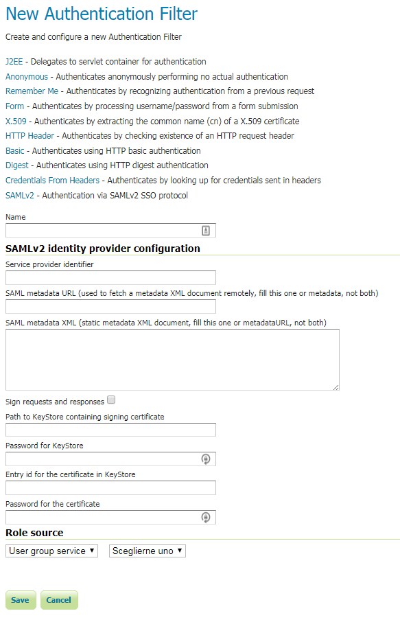
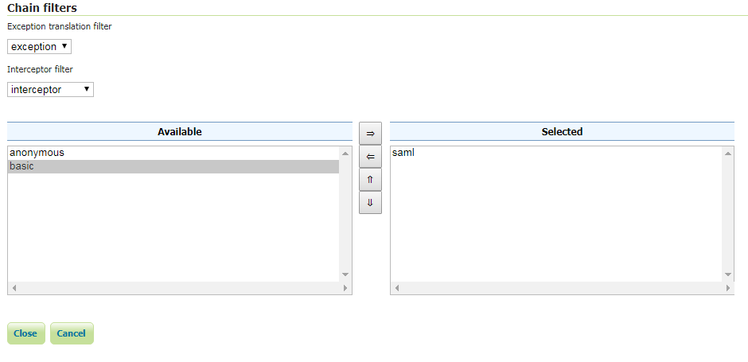
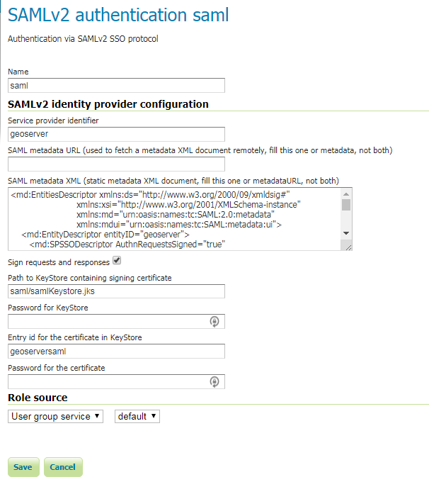
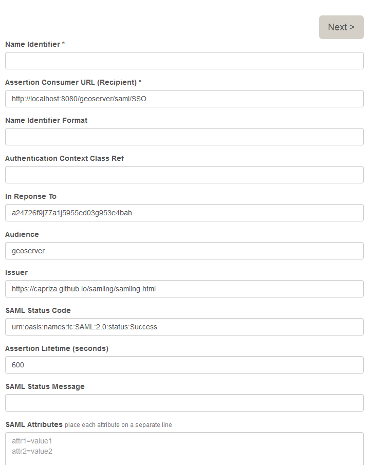
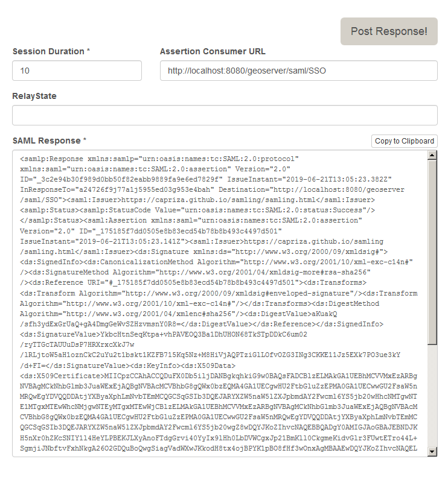

.. _saml:

SAMLv2 Authentication Filter
================================

This plugin adds to GeoServer the support for SAML based Single Sign On (SSO), a process that 
allows users to authenticate themselves against an external Identity Provider (such as OneLogin) 
rather than obtaining and using a separate username and password handled by GeoServer.

The IdP has to be configured to use GeoServer as a Service Provider (SP). GeoServer will be assigned
a unique identifier (entityId) in the IdP. This will be used to match the GeoServer configuration with
the IdP one.

Configuring the SAML Authentication Filter
----------------------------------------------

1. Start GeoServer and login to the web admin UI as the admin user.
2. Click the Authentication link located under the Security section of the navigation sidebar.
  
.. figure:: images/saml01.png
   :align: center

3. Scroll down to the Authentication Filters panel and click the Add new link.

  
.. figure:: images/saml02.png
   :align: center

4. Click the SAMLv2 link.

  

   

5. Fill in the fields of the settings form as follows; you can use GeoServer role sources to assign
a specific group or role to the SAML user.

.. list-table::
   :header-rows: 1

   * - Parameter
     - Value
   * - Name
     - any unique name assigned to this filter
   * - Identity provider identifier
     - The named assigned to GeoServer by the IdP (if you are using OneLogin, this is the same value of Audience field on OneLogin configuration panel)
   * - SAML metadata URL
     - If the IdP has an entry point to download the Metadata needed to configure GeoServer, put the URL here (if you are using OneLogin, copy the Metadata URL field from the OneLogin configuration panel)
   * - SAML metadata XML
     - If the IdP does not have an entry point to download the Metadata needed to configure GeoServer, you have to fill this field with a valid SAMLv2 metadata XML, describing both the IdP and the SP properties
   * - Sign requests and responses
     - Enables signing requests and validating responses signatures (this requires that the AuthnRequestsSigned 
   * - Path to KeyStore containing signing certificate
     - Either a relative path (in the data directory) or an absolute path to a java keystore file where the certificate for the local signature is stored (required if signing is enabled). Here some documentation on how to create these certificates: https://docs.spring.io/autorepo/docs/spring-security-saml/1.0.x-SNAPSHOT/reference/htmlsingle/#configuration-key-management-private-keys
   * - Password for KeyStore
     - Password needed to open the above keystore
   * - Entry id for the certificate in KeyStore
     - alias (id) of the certificate entry in the keystore
   * - Password for the certificate
     - Password needed to use the certificate
   * - Role source
     - role source used to assign roles to users authenticated by the SAMLv2 IdP, it can be Request header (to use an header if the SSO infrastructure adds them to GeoServer requests), a UserGroup service or a Role service 

Some documentation on the SAMLv2 protocol can be found here: https://en.wikipedia.org/wiki/SAML_2.0, while specific info on the Metadata XML is here: https://en.wikipedia.org/wiki/SAML_2.0#SAML_2.0_Metadata
     
6. Update the filter chains by adding the new SAMLv2 filter.

.. figure:: images/saml04.png
   :align: center
   
7. Select the SAMLv2 Filter for each filter chain you want to protect with the IdP (for example web)

Using OneLogin as IdP
----------------------
The first thing you will need is an account in OneLogin: https://www.onelogin.com/ that will handle the sign-in
process and will eventually provide the authentication credentials of your users to GeoServer.

GeoServer users authenticated through OneLogin are handled from OneLogin and any change performed on the
account is used by GeoServer. The only user data that is necessary for GeoServer is a unique identifier for each user.

User's email is used by default as a unique identifier for each user. GeoServer does not store passwords.

Actually GeoServer is not present within the OneLogin application catalog so we can use the OneLogin SAML test connector.
For more details about configuring the SAML Test Connector follow the guide at:

    https://support.onelogin.com/hc/en-us/articles/202673944-How-to-Use-the-OneLogin-SAML-Test-Connector
    
In the example we assume that GeoServer URL is http://localhost:8080/geoserver, if you have a specific domain 
for geoserver use it instead.

On the SAML Test Connector (IdP) configuration page, use the following values as parameters:

.. list-table::
   :header-rows: 1

   * - Parameter
     - Value
   * - RelayState
     - empty
   * - Audience
     - GeoServer
   * - Recipient
     - http://localhost:8080/geoserver/saml/SSO
   * - ACS URL Validator
     - ^http:\/\/localhost:8080\/geoserver\/saml\/SSO$
   * - ACS URL
     - http://localhost:8080/geoserver/saml/SSO
   * - Single Logout URL
     - http://localhost:8080/geoserver/saml/SingleLogout

Then, write down the Metadata URL you found in the ``Issuer URL`` field of the SSO Configuration page:

.. figure:: images/onelogin01.png
   :align: center

Testing with OneLogin
---------------------

1.	Navigate to the GeoServer home page and log out of the admin account.

2.	Try to login again, you should be able now to see the external OneLogin form.

.. figure:: images/onelogin02.png
   :align: center
   
3.	You can manage users using OneLogin panel located at https://admin.us.onelogin.com/users

Testing with SAMLING
---------------------
SAMLING is a Servless SAML IDP that can easily be used to test the GeoServer SAMLv2 authentication filter.

You can configure a new SAMLv2 authentication filter, as in the following screenshot.

In particular, you have to create a JKS keystore, using the keytool command, and store it in the geoserver data dir, in a saml subfolder (choose a proper password for the keystore and another one for the certificate)
 
.. highlight:: bash

::

  keytool -genkeypair -alias geoserversaml -keypass <certificate_password> -keystore samlKeystore.jks

Then use the following metadata XML:

.. highlight:: xml

::

    <md:EntitiesDescriptor xmlns:ds="http://www.w3.org/2000/09/xmldsig#"
                             xmlns:xsi="http://www.w3.org/2001/XMLSchema-instance"
                             xmlns:md="urn:oasis:names:tc:SAML:2.0:metadata"
                             xmlns:mdui="urn:oasis:names:tc:SAML:metadata:ui">
        <md:EntityDescriptor entityID="geoserver">
           <md:SPSSODescriptor AuthnRequestsSigned="true" WantAssertionsSigned="true" protocolSupportEnumeration="urn:oasis:names:tc:SAML:2.0:protocol">
              <md:KeyDescriptor use="signing">
                 <ds:KeyInfo>
                    <ds:X509Data>
                       <ds:X509Certificate>__SELF_SIGNED_CERTIFICATE</ds:X509Certificate>
                    </ds:X509Data>
                 </ds:KeyInfo>
              </md:KeyDescriptor>
              <md:AssertionConsumerService
                 Binding="urn:oasis:names:tc:SAML:2.0:bindings:HTTP-POST"
                 Location="http://localhost:8080/geoserver/saml/SSO"
                 index="0" />
              <md:AttributeConsumingService index="1">
                 <md:RequestedAttribute FriendlyName="mail"
                    Name="urn:oid:0.9.2342.19200300.100.1.3"
                    NameFormat="urn:oasis:names:tc:SAML:2.0:attrname-format:uri"
                    isRequired="true" />
                 <md:RequestedAttribute FriendlyName="eduPersonPrincipalName"
                    Name="urn:oid:1.3.6.1.4.1.5923.1.1.1.6"
                    NameFormat="urn:oasis:names:tc:SAML:2.0:attrname-format:uri"
                    isRequired="true" />
              </md:AttributeConsumingService>
           </md:SPSSODescriptor>
        </md:EntityDescriptor>
        <md:EntityDescriptor entityID="https://capriza.github.io/samling/samling.html"
                             xmlns:ds="http://www.w3.org/2000/09/xmldsig#"
                             xmlns:xsi="http://www.w3.org/2001/XMLSchema-instance"
                             xmlns:md="urn:oasis:names:tc:SAML:2.0:metadata"
                             xmlns:mdui="urn:oasis:names:tc:SAML:metadata:ui">
          <md:IDPSSODescriptor WantAuthnRequestsSigned="false" protocolSupportEnumeration="urn:oasis:names:tc:SAML:2.0:protocol">
            <md:KeyDescriptor use="signing">
              <ds:KeyInfo xmlns:ds="http://www.w3.org/2000/09/xmldsig#">
                <ds:X509Data>
                  <!-- IDP certificate -->
                  <ds:X509Certificate>MIICpzCCAhACCQDuFX0Db5iljDANBgkqhkiG9w0BAQsFADCBlzELMAkGA1UEBhMC
    VVMxEzARBgNVBAgMCkNhbGlmb3JuaWExEjAQBgNVBAcMCVBhbG8gQWx0bzEQMA4G
    A1UECgwHU2FtbGluZzEPMA0GA1UECwwGU2FsaW5nMRQwEgYDVQQDDAtjYXByaXph
    LmNvbTEmMCQGCSqGSIb3DQEJARYXZW5naW5lZXJpbmdAY2Fwcml6YS5jb20wHhcN
    MTgwNTE1MTgxMTEwWhcNMjgwNTEyMTgxMTEwWjCBlzELMAkGA1UEBhMCVVMxEzAR
    BgNVBAgMCkNhbGlmb3JuaWExEjAQBgNVBAcMCVBhbG8gQWx0bzEQMA4GA1UECgwH
    U2FtbGluZzEPMA0GA1UECwwGU2FsaW5nMRQwEgYDVQQDDAtjYXByaXphLmNvbTEm
    MCQGCSqGSIb3DQEJARYXZW5naW5lZXJpbmdAY2Fwcml6YS5jb20wgZ8wDQYJKoZI
    hvcNAQEBBQADgY0AMIGJAoGBAJEBNDJKH5nXr0hZKcSNIY1l4HeYLPBEKJLXyAno
    FTdgGrvi40YyIx9lHh0LbDVWCgxJp21BmKll0CkgmeKidvGlr3FUwtETro44L+Sg
    mjiJNbftvFxhNkgA26O2GDQuBoQwgSiagVadWXwJKkodH8tx4ojBPYK1pBO8fHf3
    wOnxAgMBAAEwDQYJKoZIhvcNAQELBQADgYEACIylhvh6T758hcZjAQJiV7rMRg+O
    mb68iJI4L9f0cyBcJENR+1LQNgUGyFDMm9Wm9o81CuIKBnfpEE2Jfcs76YVWRJy5
    xJ11GFKJJ5T0NEB7txbUQPoJOeNoE736lF5vYw6YKp8fJqPW0L2PLWe9qTn8hxpd
    njo3k6r5gXyl8tk=</ds:X509Certificate>
                </ds:X509Data>
              </ds:KeyInfo>
            </md:KeyDescriptor>
    <md:NameIDFormat>urn:oasis:names:tc:SAML:1.1:nameid-format:emailAddress</md:NameIDFormat>
            <md:SingleSignOnService Binding="urn:oasis:names:tc:SAML:2.0:bindings:HTTP-Redirect" Location="https://capriza.github.io/samling/samling.html"/>
            <md:SingleLogoutService Binding="urn:oasis:names:tc:SAML:2.0:bindings:HTTP-Redirect" Location="https://capriza.github.io/samling/samling.html"/>
          </md:IDPSSODescriptor>
        </md:EntityDescriptor>
    </md:EntitiesDescriptor>
   
Finally, properly fill in all the fields in the filter configuration form (in particular the passwords you choose for the store and certificate).

2. Check that the filter chain where the SAML filter is used does not include the anonymous filter:

3.	Try to login again, you should be able now to see the SAMLING login form.

   
4.	Enter a username of your choice (e.g. samluser) in the Name Identifier field, then click on the Next button.

5.	Click on the Post Response! button, and you will be redirected to GeoServer, and logged in.

