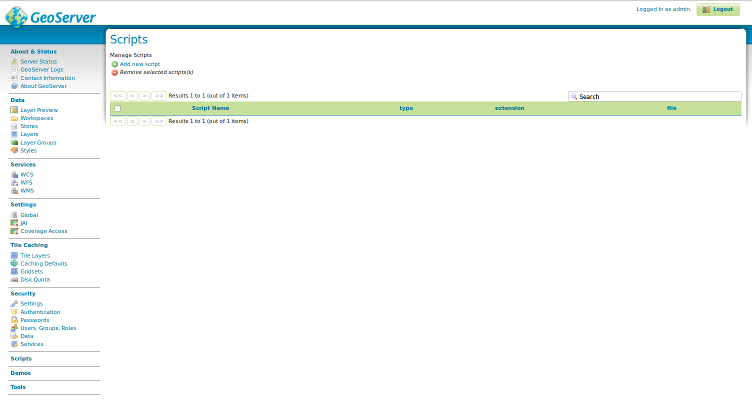
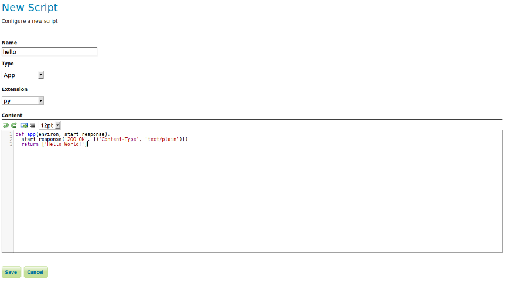

.. _scripting_ui:

Scripting Web User Interface
============================

After successful installation you should see a Scripts menu item:

For adding new script click "Add new script":

**Input parameters:**

**Name**— The name of the script file (should be added without extension);

**Type**— Script extension point, see :ref:`scripting_overview` and :ref:`scripting_hooks`;

**Extension**—  The file extension for the scripting language of your choice;

**Content**— Your script, for examples, see :ref:`scripting_hooks` and :ref:`scripting_reference`;

After saving a script you should see the created file path relative to data directory root.

.. figure:: images/added_page.png