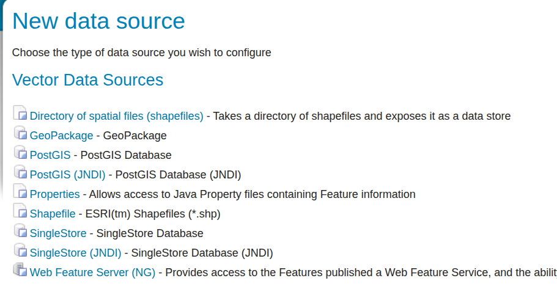
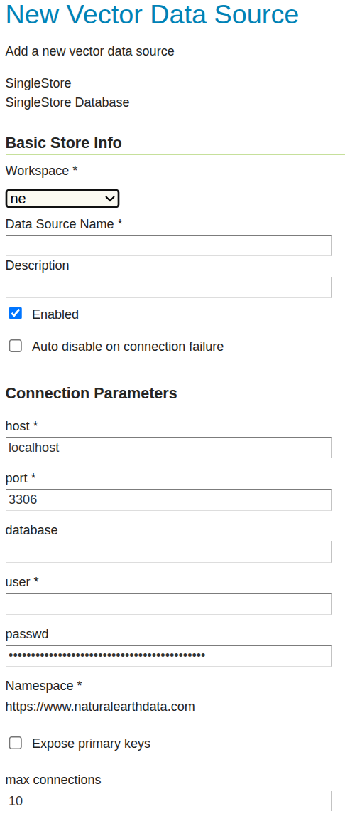
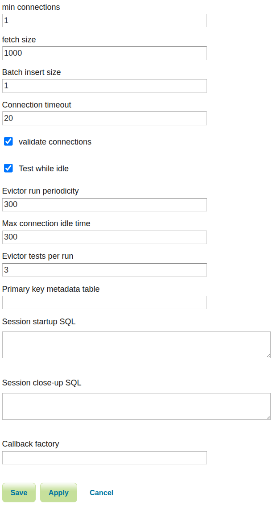

.. _data_singlestore:

SingleStore
===========

.. warning:: Currently the SingleStore extension is a community module. While still usable, do not expect the same reliability as with supported extensions.

`SingleStore <https://www.singlestore.com>`_ is an open source relational database with some `limited spatial functionality <https://docs.singlestore.com/cloud/developer-resources/functional-extensions/working-with-geospatial-features>`_.
In particular, it supports only ``GEOGRAPHY`` data types, does not support multipart geometries,
and has a specialized ``GEOGRAPHYPOINT`` type that is used to store points with higher performance than the
generic GEOGRAPHY type. Spatial functionality is limited to simple search operations, such as
intersects, contains, and within distance.

.. _singlestore_install:

Installing the SingleStore extension
------------------------------------

#. Download the singlestore community module from :download_community:`singlestore`
   
   .. warning:: As a community module, it can only be found in community nightly builds, and not in the official GeoServer releases. Make sure to match the version of the extension to the version of the GeoServer instance!

#. Extract the contents of the archive into the :file:`WEB-INF/lib` directory of the GeoServer installation.

Adding a SingleStore database
-----------------------------

Once the extension is properly installed ``SingleStore`` will show up as an option when creating a new data store.

   *SingleStore in the list of data sources*

Configuring a SingleStore data store
------------------------------------

   *Configuring a SingleStore data store*

.. list-table::
   :widths: 20 80

   * - ``host``
     - The SingleStore server host name or ip address.
   * - ``port``
     - The port on which the SingleStore server is accepting connections.
   * - ``database``
     - The name of the database to connect to. Can also contain a suffix with a connection URL query, such as `mydbname?useSSL=false`
   * - ``user``
     - The name of the user to connect to the SingleStore database as.
   * - ``password``     
     - The password to use when connecting to the database. Left blank for no
       password.
   * - ``max connections`` ``min connections`` ``validate connections``
     - Connection pool configuration parameters. See the 
       :ref:`connection_pooling` section for details.

